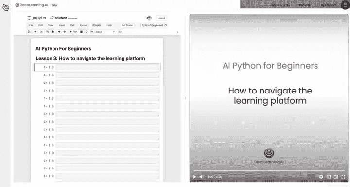
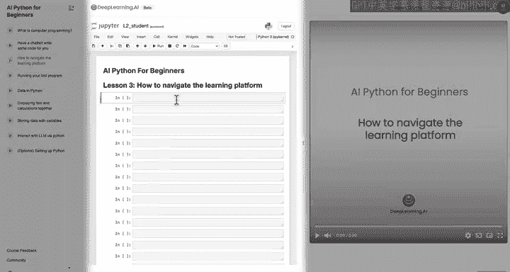
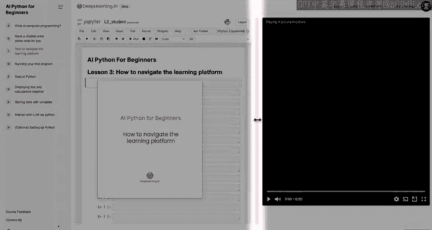
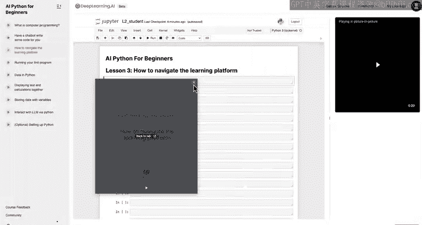
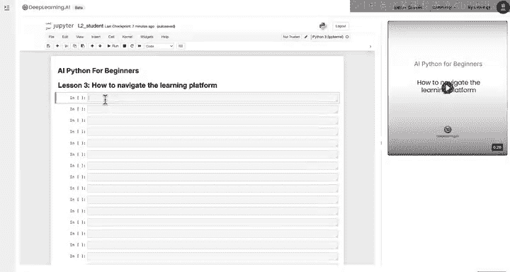
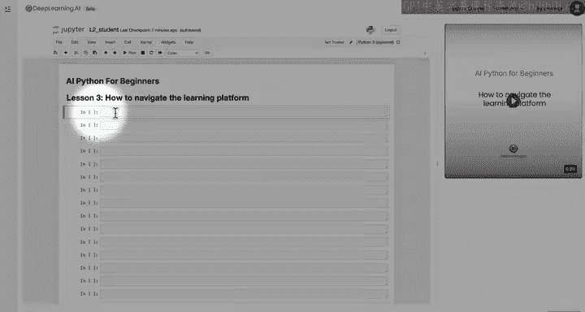
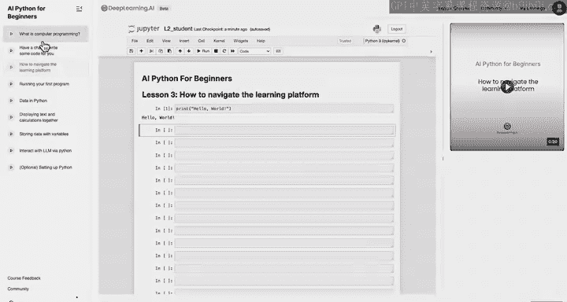
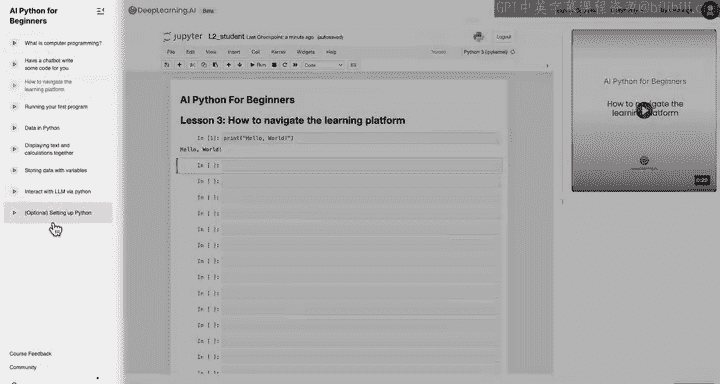
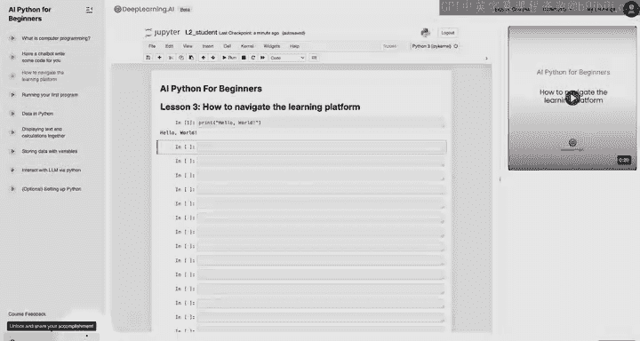
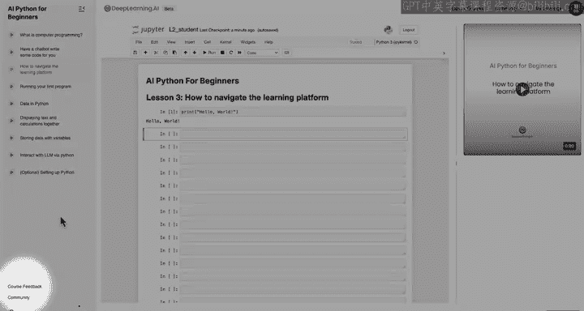

#  004：学习平台介绍 🖥️

在本节课中，我们将了解本课程将使用的编程环境——Jupyter Notebook。我们将学习其界面布局、核心功能以及如何运行代码。

## 界面概览

上一节我们介绍了如何使用聊天机器人获取代码。本节中，我们来看看实际运行代码的编程环境。在接下来的课程中，你会看到一个类似下图的界面。我想重点介绍几个主要部分。

*   **左侧**是导航窗格，可以像这样关闭或重新打开。
*   **中间区域**是你编写和运行代码的地方。
*   **右侧**是视频播放器。

## 平台功能

我将快速介绍这个学习平台的几个功能。你可以随时暂停视频进行休息、思考或试验代码。

以下是平台提供的一些控制选项：

*   你可以通过设置控制视频播放速度。
*   你可以将视频切换到画中画模式。
*   中间的分页栏可以调整编码区域与视频播放器的大小比例。
*   这个小箭头是另一种触发画中画的方式。点击它，视频会弹出为画中画；再次点击，视频会回到原处。

现在，让我们关闭左侧导航窗格，专注于中间的编码环境。

## Jupyter Notebook 环境

这个编码环境叫做 **Jupyter Notebook**。它是许多专业程序员和数据科学家日常使用的工具。不过别担心，我们会一步步学习如何使用这些工具。

你可能还记得，在上节课中我们使用了聊天机器人。点击这个聊天按钮可以将其弹出。

好的，聊天机器人显示了代码。现在，我将点击这个按钮来复制代码，然后关闭聊天机器人。

如果我想运行这段代码，我会来到这个编码环境，点击光标位置，然后按下 `Command + V`（Mac）或 `Ctrl + V`（Windows）来粘贴刚从聊天机器人复制的代码。

现在，我来介绍 Jupyter Notebook 中可能是最重要的一个命令：**`Shift + Enter`**。

按住 `Shift` 键，然后按下 `Enter` 键，它就会运行这行代码，并输出“Hello World”。

在下一课中，我们将进行更多关于如何运行代码的练习，就像我刚才演示的那样。我邀请你尝试自己复制粘贴一些代码，然后用 `Shift + Enter` 运行。

## 注意事项与课程进度

有一点需要注意：这个平台只会保存你两个小时的工作。如果你在课程结束前停止，并在超过两小时后回来完成，笔记本将会重置，你需要从头开始并重新运行所有单元格。不过这也没关系。

这门短期课程包含多个不同的视频或课程，它们显示在左侧的导航栏中。我建议你按顺序一次学习一个课程。

当你完整看完每个视频后，对应的课程旁边会出现一个绿色的对勾。当所有这些都变成对勾，或者进度变成100%时，就表示你完成了本课程。

我也非常希望获得你对本课程的任何反馈，你可以点击左下角的“课程反馈”链接与我们分享。

## 总结

本节课中我们一起学习了本课程使用的学习平台。我希望你记住了最重要的命令：**`Shift + Enter`**。让我们进入下一课，开始运行你自己的计算机程序。