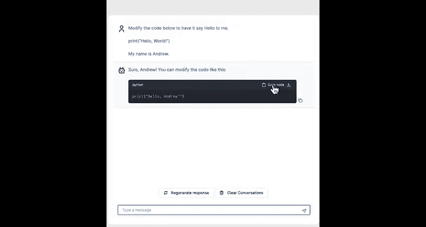
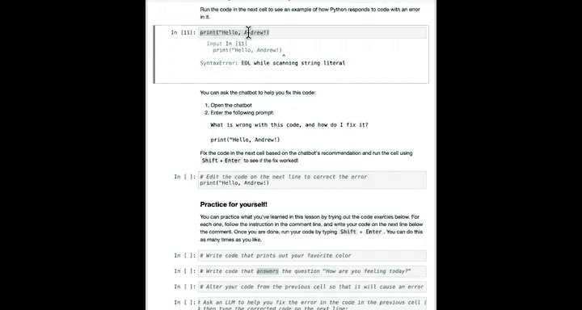
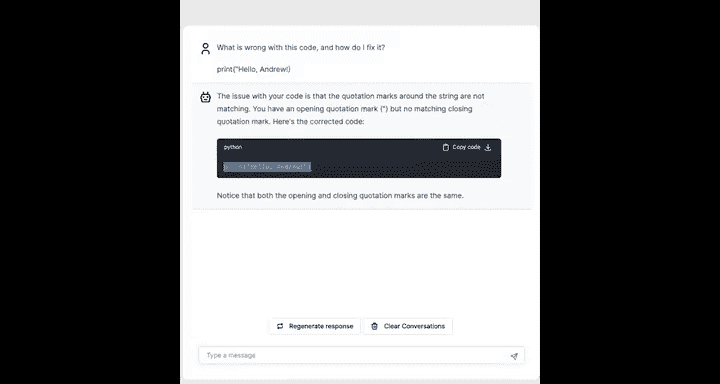
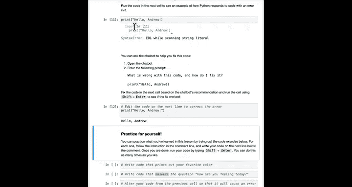
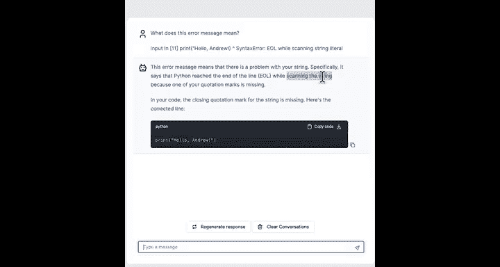
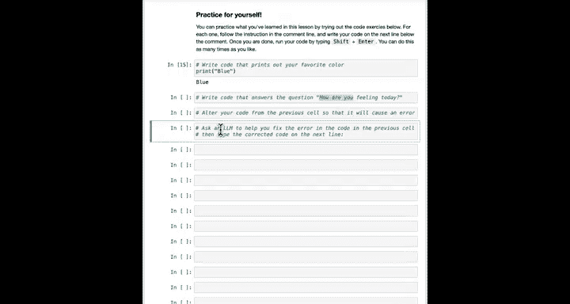

#  005：运行你的程序 🚀


在本节课中，我们将学习如何实际运行Python代码，而不仅仅是观看演示。你将亲手在Jupyter笔记本环境中执行代码，并学习如何利用聊天机器人来编写和调试简单的程序。

学习编程与学习一门新的人类语言有相似之处。你可以听老师讲解如何说法语或西班牙语，但除非你亲自开口练习，否则能真正掌握的内容是有限的。学习使用编程语言也是如此。仅仅观看他人操作是不够的，在合适的时机暂停视频，亲自尝试运行代码，这对你的学习至关重要。

## 运行你的第一行代码


在Jupyter笔记本区域，你需要做的第一件事是使用鼠标点击包含 `print("Hello world")` 的代码单元格，然后运行该命令。

现在，请按 `Shift + Enter` 键。计算机会打印出“Hello world”。如果你刚刚成功运行了这行代码，那么恭喜你！你已经加入了数百万通过运行这行代码开启编程冒险之旅的行列。

## 使用聊天机器人编写程序

接下来，我们将看看如何使用聊天机器人来编写稍微复杂一点的程序。我将首先演示一系列操作，然后请你暂停视频，自己完成相同的步骤。

我将打开聊天机器人，然后输入以下提示词：
```
修改下面的代码，让它向我问好。这是我的代码：
print("Hello world")
我的名字是Andrew。
```

我们希望代码不是向“世界”问好，而是向你个人问好。让我来演示一下。

1.  点击底部的聊天按钮，弹出聊天机器人窗口。
2.  输入上述提示词。请注意，请将我的名字“Andrew”替换成你自己的名字。
3.  聊天机器人可能会回复类似这样的代码：`print("Hello Andrew")`。
4.  点击按钮复制这段代码。
5.  将其粘贴到Jupyter笔记本的单元格中，然后按 `Shift + Enter` 运行。



现在，代码会说：“Hello, Andrew”。

如果你想从视频中复制文本到聊天机器人，这也是可以的。你可以高亮显示文本，然后使用 `Command+C` (Mac) 或 `Ctrl+C` (Windows) 复制，再粘贴到聊天机器人中。

现在，请你暂停视频，尝试让聊天机器人修改代码，让它向你问好，然后将代码粘贴到单元格中，让你的计算机向你打招呼。

## 添加注释

在代码中，你可能会看到以 `#` 号开头的一行文本，这被称为“注释”。

例如，一个单元格中可能包含：
```python
# 这是一个注释，计算机将忽略它
print("这是一个打印语句")
```

如果你点击这个单元格并按 `Shift + Enter` 运行，计算机会打印出“这是一个打印语句”，而完全忽略注释行。作为开发者，我们有时会写一些注释文本，用来提醒自己或让其他阅读代码的人了解代码的用途。注释是包含在程序中的一种文本类型，计算机会忽略它。

现在，让我们看一个更复杂的Jupyter笔记本单元格（我们称每个这样的输入框为一个“单元格”），看看它会做什么。

以下是一个示例单元格的内容：
```python
# 第一行是注释
# 第二行也是注释
# 第三行还是注释
print("Hello, Andrew")
# 另一个注释跟在打印命令后面
print("How's your day going?")
```

这个单元格有六行，但只有两行是命令（`print`语句），另外四行是注释。当我运行这个单元格时，它会打印：
```
Hello, Andrew
How's your day going?
```
而所有的注释都会被忽略。

再次请你暂停视频，点击进入Jupyter笔记本单元格，按 `Shift + Enter` 亲自查看结果。如果你有灵感，可以自由修改这个单元格，例如添加另一行注释（如 `# blah blah blah`），然后运行它，你会发现这些额外的注释行同样被忽略了。

## 处理错误（调试）

在编程时，我们所有人都会经常犯错误。我会打错字，在编码时会出错，这是编程中非常正常的一部分。以下是一段包含错误的代码，我们称代码中的错误为“Bug”。当你运行包含错误或Bug的代码时，有时会收到像这样的错误信息。有时我看到错误信息会想：“天啊，我完全不知道这是什么意思。”幸运的是，你可以询问聊天机器人如何修复代码。

让我们拿这段有Bug的代码，让聊天机器人为我们修复它。我将清除聊天记录，然后询问它：“这段代码有什么问题？我该如何修复它？” 然后它给出了解释：代码的问题是字符串的引号不匹配。并提供了修正后的代码：`print("Hello, Andrew")`。

我可以回到我的笔记本，编辑代码，或者直接粘贴正确的答案，然后运行它，这样就能修复问题。



在编程中查找和修复错误（也称为查找和修复Bug）的方式，因为聊天机器人的出现而发生了真正的改变。因为对于许多至少是简单的错误（比如我们这里的小拼写错误），聊天机器人非常擅长发现哪里出了问题。



如果你有兴趣，也可以使用聊天机器人向你解释错误信息。例如，你可以问它：“这个错误信息是什么意思？” 然后粘贴我们看到的错误信息。它实际上会对发生的情况给出相当不错的解释。现在，你可能不知道其中一些术语是什么意思，比如什么是“字符串”，或者“扫描字符串”是什么意思。在这门短期课程结束时，你将学会很多词汇，例如Python中的“字符串”是什么，这将帮助你理解此类信息。

## 练习



这几乎将我们带到了本课的结尾。在你观看完这个视频之后，在进入下一课之前，我希望你完成一些小的练习。

例如，尝试写一个打印语句，输出你最喜欢的颜色。我会做第一个示范：`print("Blue, that is my favorite color.")` 蓝色也是我儿子最喜欢的颜色（不是我女儿的）。

以下是你可以进行的练习：



*   **练习打印语句**：编写并运行`print`语句，让它输出“你今天感觉如何？”。
*   **故意制造错误**：我们都编写过有错误或Bug的代码。有时你甚至可以有意识地这样做，然后看看是否能通过聊天机器人修复错误。

我希望你在这些练习中玩得开心。当你完成后，让我们进入下一课，我们将开始讨论“数据”，这是AI以及Python程序的关键组成部分。我们下个视频见。

---



**本节课总结**：在本节课中，我们一起学习了如何在Jupyter笔记本中运行Python代码，包括执行简单的`print`语句。我们探索了如何使用聊天机器人来生成和修改代码，了解了代码中“注释”的作用。我们还初步接触了编程中常见的“错误”（Bug），并学习了如何利用聊天机器人来帮助理解和修复这些错误。最重要的是，你亲自动手进行了实践，这是学习编程不可或缺的一步。