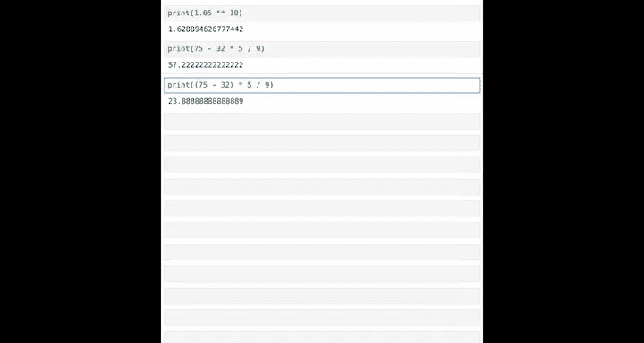
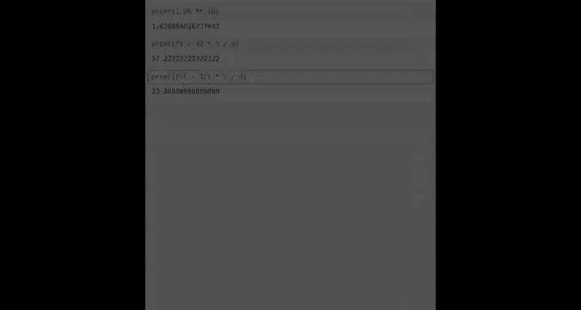

#  007：数据与基础运算

在本节课中，我们将要学习Python编程中两个最核心的概念：**数据**和**基础运算**。我们将了解什么是数据，Python如何处理不同类型的数据，以及如何利用Python进行基本的数学计算。


## 什么是数据？

你可能听说过数据对于计算机编程和人工智能非常重要。数据是信息的载体。以下是日常生活中可能遇到的数据例子：如果你在网上搜索你国家的人口密度地图，那就是数据，它显示了特定区域的人口分布。如果你查看城市的每周天气状况，显示每日温度的数字也是数据。如果你查看股票价格的高低点，那些数字同样是数据。

## Python能处理的数据类型

Python或其他计算机程序可以处理特定类型的数据。其中一种数据类型是**文本数据**。例如，“a”是一个文本片段，“egg”是一个文本片段，“我最喜欢的活动是徒步旅行”也是一个文本片段。Python可以打印文本，并且我们稍后会看到，它还可以对文本进行其他操作。

程序员也可以处理和操作**数字**，比如圆周率π（3.14）或其他数字。你可能听说过计算机处理的其他数据类型包括**表格数据**（如电子表格）、**图片**以及**音频**。计算机中几乎所有数据最终都会转化为文本或数字。

事实证明，图像是由像素组成的。计算机存储图像的方式是存储大量数字，这些数字可能表示每个像素显示多少红色、绿色或蓝色（三原色）。声音在计算机中也是存储为大量数字。声音是由空气压力的快速变化产生的，计算机通过将这些不同的空气压力测量值存储为一堆数字来存储声音。

因此，我们将要处理的两种最重要的数据类型是**文本**和**数字**。

## 文本数据：字符串

在Python中，文本被称为**字符串**。单词“string”来源于将“Hello world”视为一串字母的想法。要在Python中指定一个字符串，以下是关键组成部分：我们使用**双引号**来标记字符串的开始和结束，文本则位于这些引号之间。

从技术上讲，Python中的字符串是任何由双引号括起来的文本、数字或符号字符的组合。在这个字符串中，引号之间的所有内容都是字符串的一部分，包括空格。

以下是一些可以在Python中存储的字符串示例：
*   `"Hello world"`
*   `"我最喜欢的饮料是拿铁"`
*   `"😊"` （一个有趣的表情符号）
*   `"2.99"` （作为字符串存储的2.99）

我稍后会分享，将2.99作为字符串存储与作为数字存储有什么区别。

现在，事实证明Python还有另一种存储字符串的方式。如果你使用**三引号**，那么你可以存储一个**多行字符串**，即包含换行符的字符串。

以下是一个多行字符串的例子：
```python
print("""Hello
world""")
```
我使用三引号，并在中间插入一个换行。如果我运行这段代码，你会看到所有这些空格实际上都是那个多行字符串的一部分。所以如果你不想要所有这些空格，你必须像这样运行它。请随时编辑代码并尝试。

相比之下，如果你尝试用单引号来写这个，将会生成一个错误信息。让我现在展示一下，因为这里有一个换行符，所以Python认为这是两行代码，第一行是带有关闭引号的`print(“Hello`，然后它试图运行这第一行，因此出现错误。而如果使用三引号，Python就知道你正在尝试写一个多行字符串，这不会产生错误。

## 检查数据类型

事实证明，Python允许你检查特定数据的类型。你已经见过这段代码`print(“Hello world”)`。`print`是一个函数或命令。我想向你展示一个不同的函数，即`type`函数。

如果你告诉Python `type(“Hello world”)`，那么它将输出`str`，这告诉你这是一个字符串。所以，`type(“Andrew”)`输出字符串`str`，因为这里的“Andrew”是一个字符串。

如果你对一个多行字符串这样做，它也是一个字符串。它与字符串“Andrew”的类型完全相同，只是字符串中包含的文本片段不同。

现在，如果我询问`type(“2.99”)`，这是一个字符串。现在让我做点不同的事情，我要说`type(100)`，结果是`type(100)`，这是一个数字，具体来说是一种称为**整数**的数字类型，意味着是没有小数部分的数字。

相比之下，`type(2.99)`的结果是`float`。**浮点数**是Python存储或表示数字的另一种方式，但是带有小数部分的数字。

因此，Python有两种主要的方式来存储/表示数字：**整数**和**浮点数**。
*   **整数**表示没有小数点的数字，如`42`、`100`、`-90`。
*   **浮点数**在小数点后有数字，如`3.14`、`2.99`、`-0.03`等。

请随时暂停视频，输入你自己的不同数字，并对它们运行`print`或`type`，看看得到什么结果。

## 使用Python作为计算器

我经常使用Python的一种方式是作为计算器。如果你想做加法，比如2加6，你实际上可以写一个Python命令：`print(2 + 6)`，或者`print(57 - 40)`，或者乘法和除法。

我在Python中这样做的原因是，如果我试图将所有数字相加并犯了错误，我可以回去编辑其中一个数字，并让Python重新进行计算。例如，如果我经营一家销售柠檬水的生意，我想汇总过去12个月的销售额，我可能会输入这样的内容并让它打印出总和。

但是，如果我发现实际上打错了字，我可以回去说：“哦，是的，在三月份，我们不是卖了43个单位，实际上是卖了45个单位。”然后只需编辑它，就能得到像这样的更新答案。因此，我发现使用Python比使用我个人手持计算器更方便，可以回去编辑这些计算。

到目前为止，我们只做了算术运算。事实证明，如果你有其他事情想做，比如你在银行账户里有存款，年利率为5%，你想知道10年后你有多少钱，那么你需要计算`1.05`的`10`次方。但如果你不确定如何操作，你可以去聊天机器人那里询问如何计算`1.05`的`10`次方。如果你这样做，它会显示这个答案，即使用**双星号运算符**：`1.05 ** 10`，结果是大约`1.62`。所以，你每有1美元，10年后最终会得到1.62美元。

## 运算顺序

在Python中操作数字时，需要注意的一点是**运算顺序**。如果你要将温度从华氏度转换为摄氏度，那么你必须先从华氏温度中减去32，然后乘以5/9。

所以，如果是75华氏度，你想把它转换为摄氏度。如果你写这段代码：
```python
print(75 - 32 * 5 / 9)
```
那么Python会先执行乘法，这将导致错误的答案。因此，像这样使用括号可以告诉Python你希望以什么顺序执行这些操作。运算顺序与普通数学相同，即先乘除后加减。

这就是为什么这段代码会生成从华氏度到摄氏度的错误转换，而这段代码：
```python
print((75 - 32) * 5 / 9)
```
会生成正确的转换，其中75华氏度等于23.889摄氏度。

## 总结

本节课中我们一起学习了Python中的数据类型，以及如何将Python用作计算器。这本身就是一个非常强大的工具。在进入下一个视频之前，我鼓励你尝试笔记本末尾的练习，以巩固所学内容。请始终记住，在学习代码时，你可以随时向聊天机器人寻求帮助。养成向聊天机器人提问的习惯是非常有用的。





在下一个视频中，我们将学习Python中一种关键的打印技术，称为**F字符串**，这将允许你一起打印字符串和数字。请尝试这些练习，我们下个视频再见。