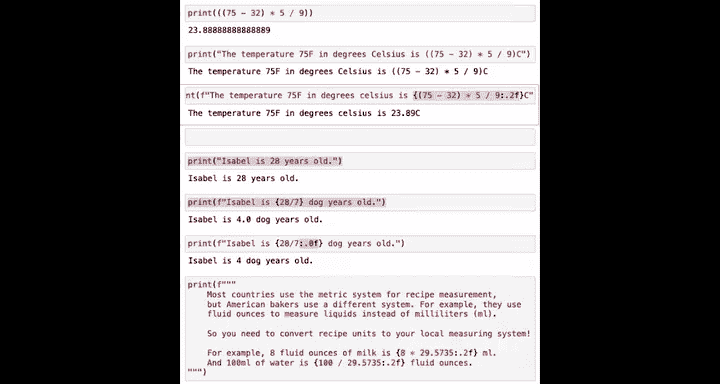

#  008： 结合文本与计算 📝➗


在本节课中，我们将要学习如何将文本数据（字符串）与我们已掌握的数值计算结合起来，并通过 `print` 命令一并显示出来。为了实现这一目标，我们将重点介绍 Python 中一个非常实用的工具：**F-字符串**。

## 回顾与问题引入


上一节我们介绍了字符串、整数和浮点数，以及如何使用 `print` 命令显示数据和进行基础计算。例如，我们可以用 Python 作为计算器，将 75 华氏度转换为摄氏度：

```python
print((75 - 32) * 5 / 9)
```

但如果我们希望打印出更完整的句子，比如“温度 75 华氏度等于 xx 摄氏度”，直接运行以下命令会如何？

```python
print("温度 75 f in degrees Celsius is", (75 - 32) * 5 / 9)
```

运行后，输出会是：“温度 75 f in degrees Celsius is 23.88888888888889”。这虽然包含了答案，但文本和数字是分开的。如果我们希望将计算**结果**直接嵌入到句子中，就需要用到 **F-字符串**。

## 什么是 F-字符串？

F-字符串，即**格式化字符串**，是 Python 中用于将表达式嵌入字符串字面量的一种简洁方法。它通过在字符串前加前缀 `f` 或 `F` 来创建。

以下是其基本用法：

```python
print(f"温度 75 华氏度等于 {(75 - 32) * 5 / 9} 摄氏度。")
```

运行这段代码，输出为：“温度 75 华氏度等于 23.88888888888889 摄氏度。”。可以看到，花括号 `{}` 内的计算表达式被其**结果值**替换了。

## F-字符串的工作原理

为了更好地理解，我们来对比一下普通字符串和 F-字符串的处理过程。

*   **普通字符串**：`print("Isabel is 20 years old.")`。Python 的 `print` 函数识别括号内的字符串，并原样输出每一个字符。
*   **F-字符串**：`print(f"Isabel is {20 / 7} dog years old.")`。Python 会：
    1.  识别这是一个以 `f` 开头的格式化字符串。
    2.  查找字符串中的花括号 `{}`。
    3.  计算花括号内的表达式（此处为 `20 / 7`，结果是 `2.857...`）。
    4.  将计算结果转换为字符串，并替换掉原来的花括号及内部表达式。
    5.  最终输出替换后的完整字符串：“Isabel is 2.857142857142857 dog years old.”

## 控制输出格式

有时我们希望对嵌入的计算结果进行格式化，例如只保留整数或指定位数的小数。

例如，上面的狗年龄例子输出为 `2.857...`。如果我们希望输出为整数（四舍五入），可以向花括号内的表达式添加格式说明符。

原始代码：
```python
print(f"Isabel is {20 / 7} dog years old.")
```

通过向 AI 助手（如课程中的聊天机器人）提问：“如何修改代码以输出不带小数位的整数？”，我们可以获得帮助。修改后的代码可能如下：

```python
print(f"Isabel is {20 / 7:.0f} dog years old.")
```

输出变为：“Isabel is 3 dog years old。”。

格式说明符 `:.0f` 表示将数字格式化为浮点数，并保留 0 位小数。同理：
*   `:.1f` 会保留一位小数。
*   `:.2f` 会保留两位小数。

**核心要点**：你无需死记硬背这些格式语法。重要的是掌握**如何利用工具（如 AI 助手）来帮助你实现特定的代码修改需求**。

## 多行 F-字符串

F-字符串也可以用于多行文本，只需使用三引号 `"""` 定义字符串即可。

以下是一个将美制与公制单位进行转换的例子：

```python
print(f"""
美制与公制单位转换：
8 液体盎司的牛奶等于 {8 * 29.5735:.2f} 毫升。
500 毫升的水等于 {500 / 29.5735:.2f} 液体盎司。
""")
```

输出结果为：
```
美制与公制单位转换：
8 液体盎司的牛奶等于 236.59 毫升。
500 毫升的水等于 16.91 液体盎司。
```

## 本节总结与展望

本节课中我们一起学习了 **F-字符串** 的用法。它通过在字符串前加 `f` 前缀，并使用花括号 `{}` 包裹表达式，能够将计算的结果直接、整洁地嵌入到文本中输出，极大地提升了代码输出结果的可读性。

你可能已经注意到，虽然 F-字符串解决了问题，但当计算公式较复杂时，直接将其写在花括号内会使字符串看起来有些杂乱（例如 `f"温度 {(75 - 32) * 5 / 9} 摄氏度"`）。在下一节课中，我们将介绍编程中一个非常核心的概念：**变量**。使用变量可以存储中间计算结果，让 F-字符串（乃至整个代码）变得更加清晰易读，也更容易维护。



课后，请务必尝试 Jupyter Notebook 底部的练习题，实践使用 F-字符串，让你的代码能够以格式优美的形式输出数学计算结果。