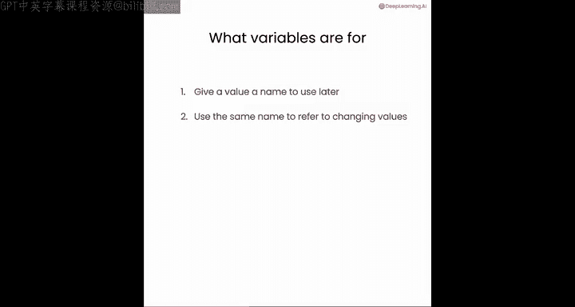
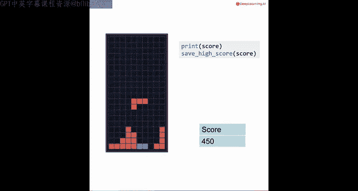
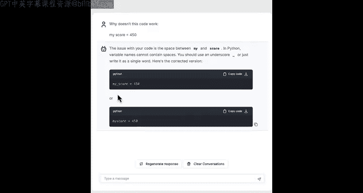
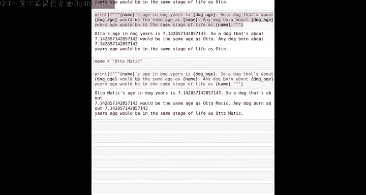

#  009： 变量与F-strings 🐍

在本节课中，我们将要学习计算机编程中的一个核心概念：**变量**。我们将了解变量是什么、如何创建和使用它们，以及如何将变量与F-strings结合来生成动态文本。掌握这些知识是编写高效、灵活程序的基础。

## 什么是变量？

在计算机编程中，变量是一个与数据存储和处理方式相关的基本概念。

让我们来看看这意味着什么。

请按照我的顺序，从上到下运行本课中的每一个代码单元格。

这一点很重要。如果你不按相同顺序运行每个代码单元格，可能会出现意外的错误。

## 创建与使用变量

让我用一个代码片段开始说明。我将输入 `age = 28`。

这行代码的作用是创建一个变量，并将值 `28` 存储到其中。所以现在如果我输入 `print(age)`，你猜会发生什么？它会打印出数字 `28`。

让我们详细看看刚才发生了什么。通过代码行 `age = 28`，你是在告诉Python创建一个空间（你可以把它想象成一个空盒子）来存储数字 `28`。因此，每当我使用这个变量 `age` 时，Python就知道我指的是 `28`。

现在，我可以决定改变 `age` 存储的内容。如果我有一行代码写着 `age = 5`（我女儿的年龄），那么这行代码的意思是：忘记我们之前存储在盒子里的旧值 `28`，把它清除掉，然后把新值 `5` 存储到这个盒子里。所以现在 `age` 等于 `5`。

用代码来说明这一点。此刻，`age` 等于 `28`，但接下来我会输入 `age = 5`，然后输入 `print(age)`。`age` 现在已经被数字 `5` 替换了。

## 变量的数据类型

变量可以用来存储字符串或数字。

在我们看到的例子中，我们将值 `28` 赋给了 `age`。或者，你可以有一个名为 `name` 的变量，并给它赋一个字符串值，比如 `"Otto"`。或者，如果你有一个游戏，你可以创建一个名为 `no_height` 的变量，并保存数字 `12.7`。

让我们看看这在代码中是如何工作的。我将输入 `name = "Otto"` 和 `no_height = 12.7`。如果我使用一个F-string来打印变量 `age`，这将打印出 `age 5`。类似地，既然我已经将 `name` 设为 `"Otto"`，将 `no_height` 设为 `12.7`，我就可以打印 `name Otto no_height 12.7`。

## 变量命名规则

在定义变量时，使用完全相同的名称很重要。

所以，如果我把 `no_height` 改成 `No_Height`，这将无法工作，会生成一个错误信息。因此，我必须使用完全相同的名称才能正确。将字母从小写切换为大写会混淆Python。

## 变量的常见用途

变量可以用来给一个值（比如某人的年龄）起个名字，以便在后面一个或多个地方使用。

变量的另一个常见用途是使用相同的名称来引用一个会变化的值。

例如，如果你在玩俄罗斯方块游戏，你的分数可能从零开始。但玩了一会儿之后，你的分数变成了50，然后是150，然后是450。游戏结束后，你保存了最高分来纪念你玩俄罗斯方块的成就。

在这个例子中，你的分数可能从零开始，但之后你在游戏中又获得了50分，我们可以设置 `score = score + 50`。这意味着：取 `score` 的旧值，给它加上50，然后使用赋值运算符 `=` 告诉计算机，请用 `score` 的新值（即 `score + 50`）替换旧值。

现在，如果你再获得100分，你将取 `score` 的旧值（即50），加上100，然后将结果存储到标签为 `score` 的盒子里。所以现在你的分数是150。如果你在游戏中再获得300分，现在 `score` 就是450。如果你打印你的最终分数 `print(score)`，这将打印出450。

## 变量命名注意事项

现在，关于变量名的一些注意事项。如果你尝试 `my score = 450`，这只会生成一个错误信息，因为变量名不能包含空格。如果你想要一个空格，可以使用下划线 `_` 来代替，像这样 `my_score`，这样就能工作。

如果我没有告诉你这一点，你也可以从聊天机器人那里找到答案。你可以问：“为什么这段代码 `my score = 450` 不工作？” 然后它会告诉你，你可以放一个下划线，或者直接去掉空格。

## 一个实用的例子：计算狗狗年龄

让我们看一个有趣的狗狗年龄计算的例子。

假设我们的朋友Otto是49岁。如果你想计算他的“狗狗年龄”（按人类年龄除以7算），你会打印 `49 / 7`，结果是7。如果你想打印出Otto的狗狗年龄，你可以这样做：`print(f"Otto's dog age is {49/7}.")`，这将输出 `Otto's dog age is 7.0.`。

我可以定义变量 `dog_age = 49 / 7`。现在 `dog_age` 将等于七。这变得方便的地方在于，如果我想写一段多次引用Otto狗狗年龄的文本。在没有变量之前，你可以这样写，但需要多次重复写 `49/7` 有点烦人。而且，如果Otto长大了一岁，我们需要在代码中多处将 `49` 改为 `50`。

实际上有一个更好的方法，就是使用这段代码，只计算一次 `dog_age`，然后打印出相同的结果。如果Otto年龄增长了一岁，你只需设置 `dog_age = 50 / 7`。然后，如果我重新运行这段代码，它现在会在所有不同的地方更新。

所以，通过定义一次变量，你可以在多个地方使用它。这就是为什么变量有助于使计算机程序更加高效。

你甚至可以更改名字 `Otto`。如果你决定用他的姓氏来称呼他，比如 `Otto Matic`，那么你可以重新运行这段代码，然后这个名字就会在所有三个地方打印出来。Otto，Maddie，希望你们听懂了这个笑话。

## F-strings 与变量如何协同工作

为了详细说明F-strings和变量如何一起工作，这是我们刚才的一个例子，其中 `dog_age` 是7。

所以，当Python在花括号 `{}` 中找到 `dog_age` 时，这会导致它去查找一个名为 `dog_age` 的盒子。在那里它找到了数字 `7.0`，然后用 `7.0` 替换了F-string中的那部分。对于另外两个地方也是如此，这就是为什么它随后打印出了你在代码中看到的字符串。

你在这里看到的这种F-string模式——你有一些文本，并插入一个变量的值来定制字符串——事实证明，这种模式对于定制提示词非常有用，然后你可以通过Python程序将其传递给AI大语言模型。

## 练习与下一步

所以，请花些时间通过尝试下面的练习来练习一起使用F-strings和变量。与聊天机器人交流，帮助你解决可能遇到的任何问题。当你准备好后，请在下一个视频中与我一起，更深入地了解如何使用F-strings为大型语言模型构建提示词。

## 总结

本节课中，我们一起学习了：
1.  **变量**是存储数据的“命名盒子”，使用 `变量名 = 值` 的语法创建。
2.  变量可以存储不同类型的数据，如数字和字符串。
3.  变量名需遵循规则（如不能包含空格），且区分大小写。
4.  变量的核心价值在于**一次定义，多处使用**，并能方便地更新值，使代码更高效、易维护。
5.  **F-strings**（格式字符串）允许我们将变量值直接嵌入到字符串中，语法为 `f"一些文本 {变量名}"`。
6.  这种组合是动态生成文本（包括给AI模型的提示词）的强大工具。

通过掌握变量和F-strings，你已经为编写更复杂、更智能的Python程序打下了坚实的基础。