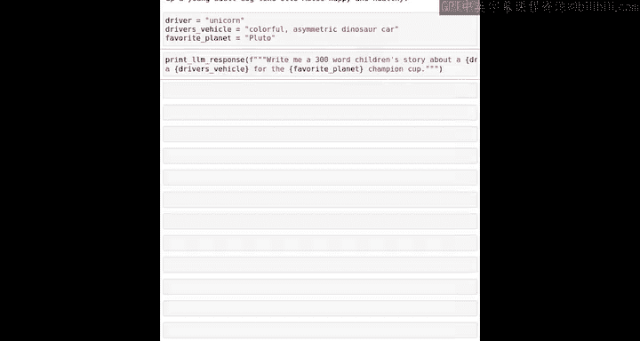

#  010：使用变量构建LLM提示词

在本节课中，我们将学习如何结合变量和F字符串来定制和快速更新字符串，并进一步探索如何将这一模式扩展到创建提示词，以便在Python程序中与AI模型进行交互。

## 概述：从静态字符串到动态提示词

上一节我们介绍了如何使用变量和F字符串来动态生成字符串。本节中，我们来看看如何利用这一技巧，构建能与大型语言模型交互的提示词。


## 导入辅助函数

首先，我们需要导入一个辅助函数，以便通过Python代码直接与大型语言模型交互。请按顺序从上到下运行代码单元格。

```python
from helper_functions import print_llm_response
```


不必过于担心这行代码的具体细节。它的作用是加载一个函数，让你能够通过Python代码直接调用大型语言模型。

## 调用语言模型

要使用这个函数，你可以输入 `print_llm_response`，然后在括号内输入你的提示词。

```python
print_llm_response("What is the capital of France?")
```

这段代码实际上调用了ChatGPT，并返回了答案：“The capital of France is Paris”。

括号内的字符串就是**提示词**，它与你在ChatGPT等聊天机器人网页界面中直接输入的文本是同一类型。

## 构建动态提示词

现在，你可以运用目前学到的所有Python编程知识，构建包含变量的复杂提示词，然后通过这段代码将其传递给大型语言模型。

以下是一个有趣的例子。我们可以用变量来构建一个关于宠物年龄的提示词。

```python
dog_age = 21 / 7  # 计算结果为3
print_llm_response(f"If a dog is {dog_age} years old in human years, what kind of personality might it have?")
```

通过使用变量构建F字符串，再将其传递给聊天机器人，你可以得到非常有趣且富有深度的回答。

## 调试与错误修复

现在，让我们看几个使用变量的例子，并了解一些常见的错误及其修复方法。

假设我们要写一个儿童故事，其中包含驾驶员、车辆和星球等变量。

```python
driver = "unicorn"
vehicle = "a colorful asymmetric dune car"
planet = "Pluto"
print_llm_response(f"Write a children's story about a {driver} racing in {vehicle} on the planet {planet}.")
```

这段代码存在几个错误。我鼓励你暂停视频，看看是否能发现其中的问题。

以下是修复过程：
1.  变量名中不能有空格或撇号。应使用下划线，例如 `driver_vehicle`。
2.  在F字符串的 `{}` 内部不能有空格。
3.  需要确保所有括号和引号都正确闭合。

修复后的代码如下：



```python
driver = "unicorn"
vehicle = "a colorful asymmetric dune car"
planet = "Pluto"
print_llm_response(f"Write a children's story about a {driver} racing in {vehicle} on the planet {planet}.")
```


运行后，语言模型就会生成一个约300字的儿童故事。

我鼓励你尝试插入不同的驾驶员、车辆，自己运行代码，获得属于你自己的儿童故事。

## 课程总结与练习

本节课即将结束。请查看Jupyter笔记本末尾的练习题，以练习你的代码编写和调试技能。和之前一样，如果遇到困难，请记住你可以使用聊天机器人来帮助你完成这些练习。

在本节课中，我们看到了几个函数：`print`、`print_llm_response`，在之前的视频中还看到了 `type`。在下一个视频中，我们将更深入地探讨函数：它们是什么以及如何使用它们。下个视频见。