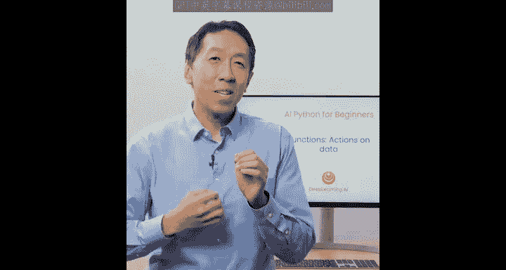
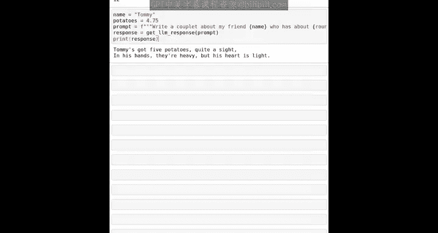

#  011：函数 🧩

在本节课中，我们将要学习Python编程中一个非常核心的概念：函数。函数就像是大型程序中的迷你程序，用于执行特定的任务。通过函数，我们可以对数据进行操作，或者与世界进行交互。让我们开始深入了解。

## 什么是函数？

在上一节课中，我们接触了来自辅助函数的命令。现在，让我们更深入地探讨函数的工作原理。

函数允许你对数据采取行动或在现实世界中执行操作。你已经在本课程中遇到并使用过几个不同的Python函数。

第一个是 `print` 函数，你可以用它来向屏幕显示文本，例如一个有趣的表情。

😊

在之前的视频中，你看到了一个更复杂的函数 `print_OEMM_response`。这个函数接收一个字符串作为输入（例如你的提示“法国的首都是什么”），通过互联网将其发送给一个大语言模型，然后将AI的响应显示在屏幕上。

实际上，你还见过另一个函数：`type` 函数。它可以告诉你一个值或变量的数据类型，例如字符串、浮点数或整数。

所以，你看到了 `print`、`print_own_response` 和 `type`。这些都是我们在课程中使用的函数。在本节课中，我想更深入地探讨函数的具体工作原理。

## 函数的输入与输出

Python中有一个叫做 `len` 的函数，它代表长度。如果你输入 `len("Hello world")`，它会将字符串“Hello world”作为输入，并计算其长度，具体来说是字符串中包括标点和空格在内的字符数量。

然后当我打印出结果时，会显示 `12`。

这是另一个Python函数的例子：`round`。它接收一个数字，比如 `42.17`，并将其四舍五入到最接近的整数。如果我们打印 `round(42.17)` 的结果，会得到 `42`。

函数的一个常见用途是执行数据计算并返回某个值。例如，`len` 函数接收输入数据，计算字符数，然后返回答案。或者 `round(42.17)` 计算42.17四舍五入后的值，然后返回 `42`。

有时函数用于执行一个动作，例如显示一条信息。所以 `print("Hello world")` 接收字符串“Hello world”并将其显示出来。

## 函数调用详解

让我们仔细看看当你对“Hello world”调用 `len` 函数时具体发生了什么。

`len` 是函数的名称。当你调用一个函数时，你使用括号来给它数据。在这个例子中，字符串“hello world”就是你提供给 `len` 函数的数据。你提供给函数的数据在术语上被称为**参数**。如果你好奇为什么叫参数，可以去问聊天机器人。

当一个函数返回一个数字（比如 `12`）时，我们说函数**返回**了这个结果。

我们也看到了 `print` 函数，它显示你提供的内容。`print` 是函数名，我们照常使用括号，括号内是参数，也就是提供给 `print` 函数的数据字符串“hello world”。

## 使用函数返回值

到目前为止，在我们使用的例子中，我们是从函数获取结果然后立即打印出来。

😊

但是，你不必立即打印出函数的结果。我可以定义一个变量 `string_length = len("Hello world")`，然后我们可以打印 `string_length`，这将打印出 `12`。

所以在我刚刚运行的代码中，你看到了这个命令 `string_length`，这是我们正在创建的一个新变量的名称，也就是一个存放数据的新盒子。赋值运算符 `=` 然后 `len("Hello world")` 返回数字 `12`，所以这表示将变量 `string_length` 设置为等于 `12`，也就是把数字 `12` 放入标记为 `string_length` 的盒子中。

在你把 `12` 放入这个盒子之后，如果你随后打印 `string_length`，它将打印出数字 `12`。

## 一个更复杂的例子

这里有一个更复杂的例子。

我将设置 `name` 为“Tommy”。😮
设置 `potatoes = 4.75`。

然后我将写一个提示，这是一个 f-string：
`f"写一首关于我的朋友 {name} 的对句诗，他大约有 {round(potatoes)} 个土豆。"`

然后 `response = get_response(prompt)`。

并打印响应。

这里的 `get_response` 是一个我们之前没有使用过的新函数，但它所做的与 `print_element_response` 完全相同，只是它不打印出响应，而是（在这种情况下）调用ChatGPT，获取响应，并将其作为一个值返回，然后我们将其存储在这个变量 `response` 中。

😊

这将创建提示：“写一首关于我的朋友 Tommy 的对句诗，他大约有5个土豆。” 然后要求AI写一首对句诗。

希望这能让你了解如何使用变量将更复杂的计算串联起来。事实上，对于使用生成式AI编写软件的开发者来说，这种编程模式是你经常会看到的：你有一些变量，构建一个提示，调用大语言模型，获取响应，然后在该响应的基础上做其他事情。

😊

## 课程总结与展望

以上就是本课的全部内容，祝贺你并为你完成这个简短课程的努力点赞！

你已经学习了Python的基础知识，包括数据类型、如何进行数学运算、变量、如何使用函数，以及如何使用Python代码与大语言模型进行交互。

看完这个视频后，请务必尝试Jupyter笔记本底部的额外练习，因为只有通过练习，你才能真正学习并熟练使用Python。

请记住，任何时候如果你遇到困难，都可以咨询聊天机器人寻求帮助或建议，它是一个非常有用的解决问题的伙伴。

当你完成这些后，我希望你能加入我的下一个课程，学习更强大的Python功能。你将学习如何让计算机一遍又一遍地做同样的事情，以及如何根据计算机看到的数据让它采取不同的行动。

😊

随着你不断学习，我相信你会享受用Python和AI做越来越多令人惊叹的事情。

再次祝贺你完成本课程，期待在下一门课程中见到你。

😊