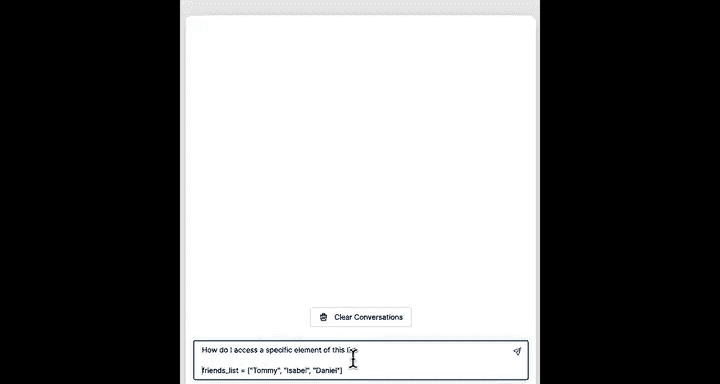
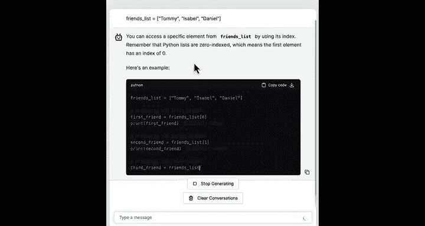
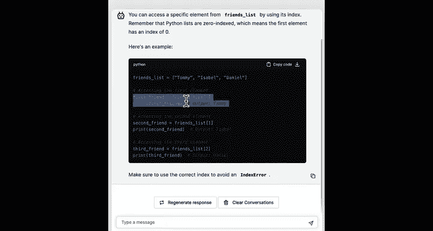
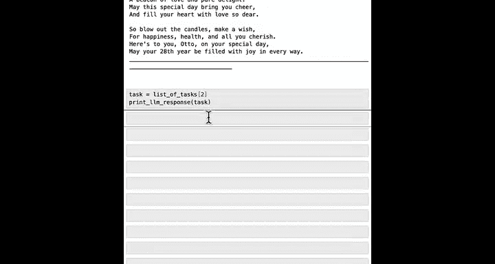
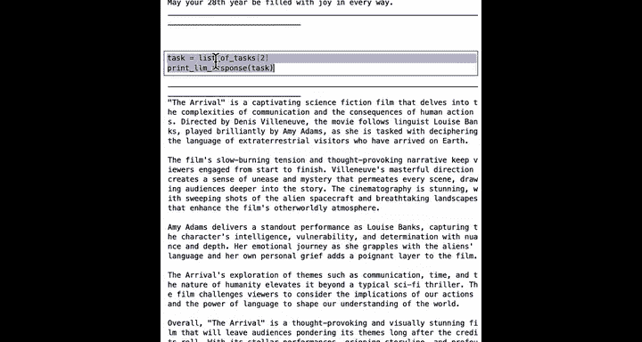

#  013：使用列表管理任务 🗂️

在本课程中，你将学习如何用Python代码自动化任务，处理重复性工作，并让程序有时为你做出决策。

在之前的课程中，你处理的数据始终是单个项目，例如一个名字、一个年龄或其他单一数据。但Python有一种称为“列表”的功能，可以将多个数据片段存储在一起。这确实能让Python更轻松地为你执行重复性任务。


## 创建你的第一个列表

上一节我们介绍了单一数据，本节中我们来看看如何使用列表来存储多个数据。

让我们看看如何在Python中使用列表。首先导入我们将在本笔记本中使用的一些函数。

```python
# 导入必要的函数
from utils import get_completion, print_response
```

现在，假设我想为我的三位朋友写一首诗。以下是我们如何使用大语言模型来实现。

我将设置变量 `name` 为我的三位朋友中的第一位朋友的名字，即 Tommy。然后，使用你在上一课程中学到的 f-string 来构建提示词。

```python
name = "Tommy"
prompt = f"""Write a full-line birthday poem for my friend {name}.
The poem should rhyme and start with the first letter of my friend's name."""
print_response(get_completion(prompt))
```

运行后，我们得到了一首给Tommy的诗。这很酷。

现在，我想为三位朋友都写诗。如果我想继续为第二位朋友写，我需要将变量 `name` 设置为 Isabel，然后再次运行提示词。最后，为第三位朋友 Daniel 重复此过程。

你看到了吗？写三首诗的过程有点重复。我必须在这里设置三次不同的名字值，然后运行提示词并打印响应三次。事实证明，在Python中使用列表可以让你同时存储所有三位朋友的名字，最终为你提供一种更高效的方式来生成这三首诗。

## 列表的结构与访问

以下是创建第一个列表的方法。

```python
friends_list = ["Tommy", "Isabel", "Daniel"]
```

这段代码创建了一个名为 `friends_list` 的新变量，它存储了三个数据片段：Tommy、Isabel 和 Daniel。

你可以将列表想象成一组小盒子或卡片，如下图所示，每个盒子可以容纳一个数据片段。`friends_list` 就像一个小拖车，将这三张卡片组装在一起。


每张卡片还有一个与之关联的数字，即 0、1 和 2。虽然人们通常从 1 开始计数，但计算机和Python编程语言喜欢从 0 开始计数。因此，第一张卡片（Tommy）的编号是 0，第二张（Isabel）是 1，第三张（Daniel）是 2。当你想要引用列表中的特定项目（有时称为元素）时，这些数字很重要。

让我们回顾一下创建列表所需的确切代码：
*   `friends_list` 是列表的名称。
*   等号表示将 `friends_list` 设置为等于右侧的列表。
*   方括号 `[` 和 `]` 表示列表的开始和结束。
*   中间是列表的元素或项目，用逗号分隔。

你可以使用 `type()` 函数查看 `friends_list` 的类型，它会返回 `list`。你也可以使用 `len()` 函数来获取列表的长度。

```python
print(type(friends_list))  # 输出: <class 'list'>
print(len(friends_list))   # 输出: 3
```

现在我们已经创建了一个同时存储三位朋友名字的列表，我可以创建一个像这样的提示词：

```python
prompt = f"Write a full-line birthday poem for my friends {friends_list}"
print(prompt)
```

这会生成提示词：“Write a full-line birthday poem for my friends ['Tommy', 'Isabel', 'Daniel']”。大语言模型足够智能，能够理解这个提示词并写出三首诗。

## 访问和修改列表元素

上一节我们创建了列表，本节中我们来看看如何访问和修改其中的特定元素。

要访问 `friends_list` 中的一个特定元素，例如第一个朋友的名字，我们可以询问AI助手。



它告诉我们：



你可以通过 `friends_list[0]` 访问第一个朋友（Tommy），`friends_list[1]` 访问 Isabel，`friends_list[2]` 访问 Daniel。


```python
# 访问列表元素
print(friends_list[0])  # 输出: Tommy
print(friends_list[1])  # 输出: Isabel
print(friends_list[2])  # 输出: Daniel
```

请注意，我们使用的是方括号 `[]`，而不是圆括号 `()`。如果使用圆括号，会导致错误。遇到错误是编码过程中的正常部分，你可以随时将错误信息复制到聊天机器人中，让它以更易于理解的方式向你解释。



如果你尝试访问不存在的元素，例如 `friends_list[3]`，Python会报错“list index out of range”，因为索引3超出了列表的范围（只有索引0、1、2）。

Python还提供了一些很好的工具来修改列表中的元素，你可以添加、删除、编辑项目等。

以下是向列表添加元素的方法：

```python
friends_list.append("Otto")
print(friends_list)  # 输出: ['Tommy', 'Isabel', 'Daniel', 'Otto']
```

`append` 方法将新元素添加到列表的末尾。我鼓励你暂停视频，尝试在这个包含四位朋友的列表后再添加一个名字。

除了添加元素，你也可以删除元素。假设你使用列表来跟踪需要发送生日贺卡的朋友，而Tommy已经过完生日，你已发送贺卡，那么可以将其从列表中移除。

```python
friends_list.remove("Tommy")
print(friends_list)  # 输出: ['Isabel', 'Daniel', 'Otto']
```

请你自己尝试修改代码，从列表中移除其他名字并打印出来，看看是否得到了正确的结果。

## 列表存储多种数据类型

到目前为止，我们一直使用列表来存储字符串或人名。实际上，列表也可以存储其他类型的数据。

例如，如果你想存储朋友的年龄，可以有一个包含三个数字（整数）的列表。

```python
ages_list = [25, 30, 28]
print(ages_list)  # 输出: [25, 30, 28]
```

在本课程后面，我们将使用Python来帮助我们对要执行的任务进行优先级排序。

以下是一段较长的代码，创建了一个任务列表：

```python
list_of_tasks = [
    "Compose a brief email to my boss explaining I'll be late for tomorrow's meeting.",
    "Write a birthday poem for Otto.",
    "Write a review of the movie The Arrival."
]
```

这创建了一个包含三个字符串的列表，每个字符串都是一项任务。在Python中，你可以将列表分布在多行代码上，这比将所有内容放在一行中更容易输入和阅读。

事实上，`list_of_tasks` 中的每一项都是你可以要求大语言模型做的事情。

我们可以这样做：

```python
task = list_of_tasks[0]
print_response(get_completion(task))
```

这会生成给老板的邮件。如果我想处理下一项任务，可以设置 `task = list_of_tasks[1]`，依此类推。

通过编写这三段代码，我们依次将 `task` 设置为 `list_of_tasks[0]`、`list_of_tasks[1]`、`list_of_tasks[2]`，并打印出对这些任务的LLM响应，从而处理了这个待办事项列表中的不同元素。

但这仍然有点重复。我们必须手动输入并运行这段代码三次，以分别处理列表中的每个元素。事实上，如果你的待办事项列表有10项或20项，手动输入并运行这段代码20次会有点烦人和重复。

在下一个视频中，你将学习一种更好的方法来实现这一点——**循环**。这是一种告诉Python为你反复执行任务的方式。



让我们进入下一个视频，看看它的实际应用。



---

**总结**


在本节课中，我们一起学习了Python列表的核心概念。我们了解了如何创建列表来存储多个数据项，如何通过索引访问列表中的特定元素，以及如何使用 `append()` 和 `remove()` 等方法修改列表内容。我们还看到列表可以存储不同类型的数据，并初步体验了如何利用列表来管理待办任务。虽然手动处理列表中的每个项目是可行的，但效率不高，这为我们下一课学习更强大的循环结构做好了铺垫。