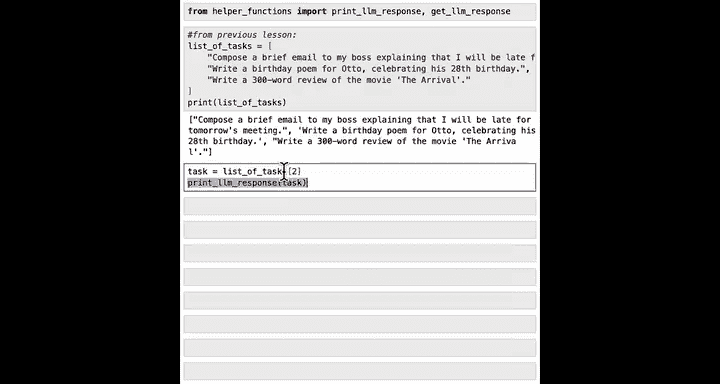
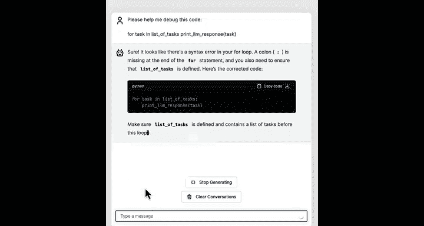
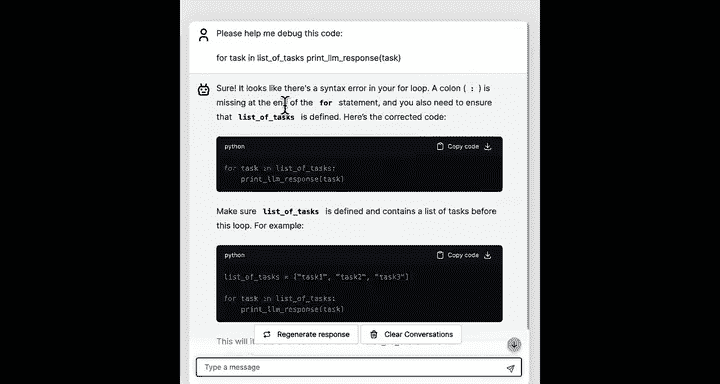
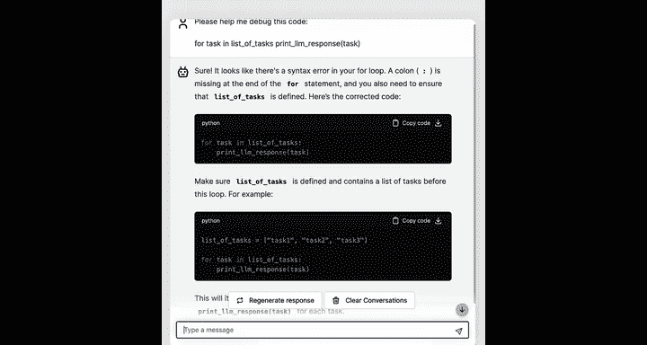
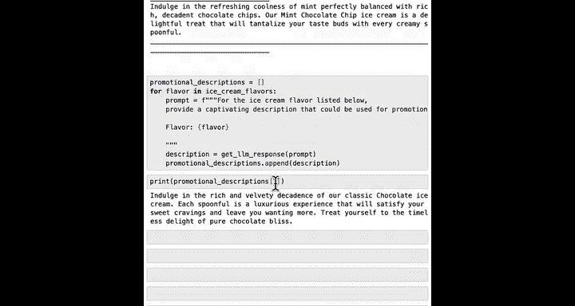

#  014：使用for循环重复任务 🚀

在本节课中，我们将学习编程中一个非常重要的概念：**for循环**。这是一种在许多编程语言中都存在的特殊代码模式或命令，它允许你告诉计算机以自动化的方式，对列表中的每一项重复执行操作，而无需一遍又一遍地重写代码。


## 什么是for循环？ 🔄


上一节我们介绍了列表的概念，本节中我们来看看如何高效地处理列表中的每一个元素。


for循环让你能够为列表中的每个元素重复执行一组命令。如果你有一个包含许多数据项的列表，for循环可以让你告诉计算机对第0项、第1项、第2项……直到列表中的所有项，都执行相同的操作。

## for循环的基本语法 📝

以下是使用for循环的代码结构：



```python
for task in list_of_tasks:
    print(get_llm_response(task))
```

用通俗的语言解释，这段代码的意思是：对于`list_of_tasks`中的每一个`task`，都打印出对该任务的LLM响应。

这段代码等同于手动编写以下多行代码：
```python
print(get_llm_response(list_of_tasks[0]))
print(get_llm_response(list_of_tasks[1]))
...
```

让我们详细解析这段代码的每一部分：
*   `for`：这是一个for命令或语句的开头。
*   `task`：这是你为变量定义的名称，它将依次取值为`list_of_tasks[0]`、`list_of_tasks[1]`、`list_of_tasks[2]`等等。因此，`task`将轮流成为`list_of_tasks`中不同元素的值。
*   `in`：这是另一个特殊的Python关键字。
*   `list_of_tasks`：这是我们要遍历的、包含元素的列表。
*   `:`：我们使用冒号来告诉Python，我们希望对列表中每一项运行的命令从哪里开始。
*   `print(get_llm_response(task))`：这是它将在列表每个元素上重复执行的命令。

这段代码的一个特殊部分是这里有四个空格。在编程中，我们称之为**缩进**。这意味着`print(get_llm_response(task))`这行代码被缩进或向右移动了四个空格。按照惯例，Python程序员使用四个空格，建议你遵循这个惯例。

## 实践for循环 💻

让我们看一个实际的代码示例。假设我们已经像上节课那样加载了一些辅助函数，并且有一个任务列表。

```python
list_of_tasks = ["Write a poem", "Draft a birthday message", "Summarize a review"]
```

现在，我们可以使用for循环自动化处理：

```python
for task in list_of_tasks:
    print(task)
```

运行这段代码，你会看到`task`每次都被替换为`list_of_tasks`列表中的一个项目。

接下来，我们可以结合LLM来生成响应：

```python
for task in list_of_tasks:
    print(get_llm_response(task))
```



运行后，计算机会依次处理第一个任务、第二个任务（生日消息）和第三个任务（总结评论）。



## 常见错误与调试 🐛



以下是使用for循环时的一些常见错误：

1.  **忘记缩进**：如果`print`语句前没有四个空格（即没有正确缩进），代码将报错。
2.  **忘记冒号**：在for语句末尾忘记写冒号也会导致语法错误。

如果你遇到错误但不确定如何修复，一个有效的方法是向你的AI聊天机器人伙伴求助。例如，你可以说：“请帮我调试这段代码”，然后粘贴你的代码。AI通常能快速指出问题所在，比如缺少冒号，甚至为你修复代码。自从AI聊天机器人广泛可用以来，程序员通过复制粘贴代码让AI帮助找出错误，已经大大提高了调试效率。

## 进阶示例：生成冰淇淋描述 🍦

这里有一个更实际的例子：使用大语言模型自动化写作任务，特别是创建冰淇淋口味描述。

首先，我们有一个冰淇淋口味列表：

```python
ice_cream_flavors = ["vanilla", "chocolate", "strawberry", "mint chocolate chip"]
```

以下是生成描述的代码：

```python
for flavor in ice_cream_flavors:
    prompt = f"For the ice cream flavor listed below, provide a captivating description that you'd use for promotional purposes.\n\n{flavor}"
    print(get_llm_response(prompt))
```

运行后，你会得到香草、巧克力、草莓和薄荷巧克力片冰淇淋的描述。

**关键点**：整个代码块（从`prompt = ...`到`print(...)`）都必须缩进。Python通过查看哪些代码被缩进来判断哪些代码是你希望为每个冰淇淋口味运行一次的。如果只有部分代码缩进，逻辑就会出错。

在这个循环中，每次运行时，变量`flavor`会取不同的值（“vanilla”, “chocolate”…），变量`prompt`也随之被设置为不同的值，然后`print(get_llm_response(prompt))`会基于不同的提示词输出响应。

## 保存结果到列表 📋

如果我们想将大语言模型生成的描述保存到它们自己的列表中，该怎么做呢？

我们可以创建一个空列表，然后在循环中使用`.append()`方法将每个描述添加进去。这是一种在Python中非常常见的编码模式：从一个空列表开始，然后反复向列表末尾添加或追加项目，从而构建该列表。

以下是具体代码：

```python
promotional_descriptions = []  # 创建一个空列表

for flavor in ice_cream_flavors:
    prompt = f"For the ice cream flavor listed below, provide a captivating description that you'd use for promotional purposes.\n\n{flavor}"
    description = get_llm_response(prompt)
    promotional_descriptions.append(description)  # 将描述添加到列表末尾

print(promotional_descriptions)  # 打印整个描述列表
```

运行后，`promotional_descriptions`就包含了所有四个描述。如果你想访问其中某个描述，比如我最喜欢的巧克力冰淇淋（它是列表中的第二个口味），可以这样做：

```python
print(promotional_descriptions[1])
```

## for循环与列表的强大之处 💪

for循环和列表的结合非常强大，能让你在Python中做很多事情。在这些例子中，我们使用的列表都很短，可能只有三四个项目。但想象一下，能够遍历成百上千个列表项，你就可以让计算机为你重复执行成百上千次操作。

## 当前方法的局限性与展望 🔮

不过，这种方法也有一个局限：如果你不知道项目的位置，访问它们可能会很棘手。比如我碰巧记得巧克力冰淇淋是第1项（索引为1），所以可以输入`[1]`。但如果你有几十种冰淇淋口味，并且不记得你喜欢的口味的具体编号，那么要找到你想要的那个描述就会比较困难。

在下节课中，你将学习一种与此有相似之处，但在查找和处理特定数据项时更加容易的新数据类型。这种数据类型叫做**字典**。在Python中，**列表**和**字典**是存储多个数据项集合的两种最重要的方式。

## 总结 📚

本节课中我们一起学习了：
1.  **for循环**的概念：一种用于自动化重复处理列表中每个元素的编程结构。
2.  for循环的**基本语法**：`for item in list:` 后跟缩进的循环体。
3.  for循环的**实际应用**：遍历列表并执行操作，例如打印内容或调用函数（如LLM）。
4.  使用for循环时的**常见错误**（如忘记冒号或缩进）以及如何利用AI工具进行调试。
5.  如何利用for循环**构建新列表**：通过创建空列表并在循环中使用`.append()`方法添加元素。
6.  认识到for循环在处理大量数据时的强大能力，以及当前在通过索引直接访问未知位置元素时的局限性，这为学习下一课的数据类型——字典——做好了铺垫。



通过掌握for循环，你已经学会了如何让计算机自动化地处理重复性任务，这是编程中提高效率的关键一步。