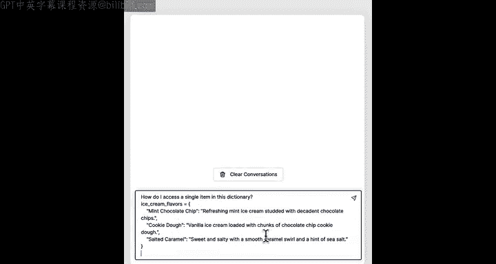
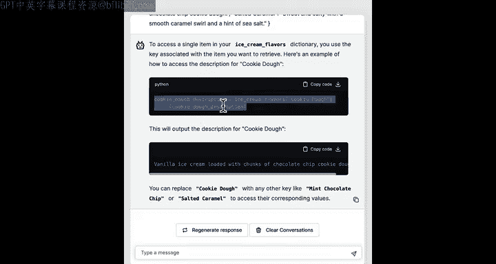
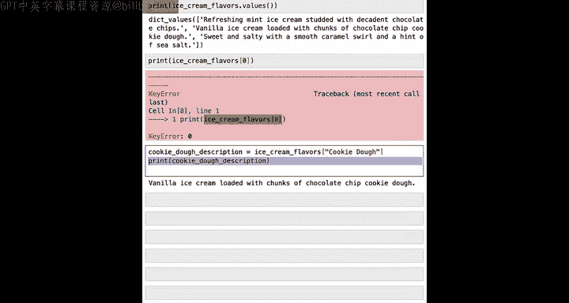
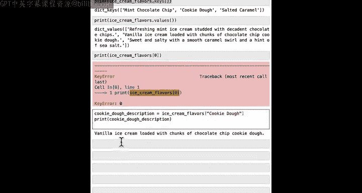
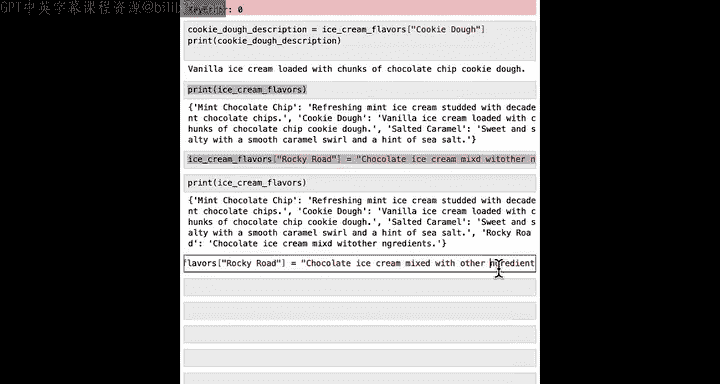
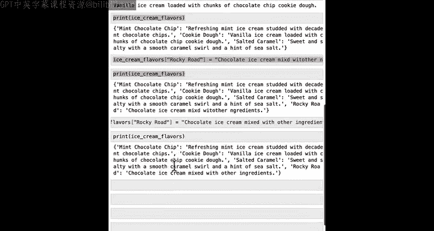
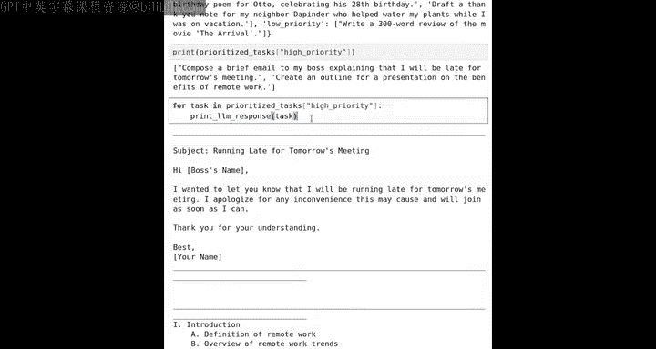

#  015：使用字典与AI进行任务优先级排序 📚


在本节课中，我们将学习Python中的一种重要数据结构——字典。我们将了解字典如何通过键值对来组织数据，并探索如何使用字典来高效地管理和访问特定信息，例如为待办事项设置优先级。


## 概述


列表是存储大量数据的好方法，当你希望使用`for`循环对列表中的每个元素进行操作时，这很有效。但是，如果你想在列表中查找一个特定元素，却不知道它的编号或索引，那么访问这个元素就会变得困难。


Python中还有另一种组织数据集合的方式，称为**字典**。字典使得从数据集合中提取特定项变得容易得多。在本课中，我们将学习字典，并会看到一个有趣的例子：使用字典来为待办事项设置优先级（例如高、中、低优先级）。让我们深入了解字典的工作原理。

## 字典简介：从列表到字典

让我们像往常一样先加载一些Python函数。我们将以冰淇淋口味及其描述为例。

以下是一个包含冰淇淋口味和描述的较长列表：
```python
["vanilla", "classic and creamy with a rich smooth flavor", "mango", "tropical and sweet with a fruity punch", "chocolate", "rich and decadent with a deep cocoa flavor"]
```
使用这样的列表的问题是，如果你想查找特定冰淇淋口味（例如芒果冰淇淋）的描述，却不记得它对应的编号或索引，那么提取芒果冰淇淋的描述会相当困难。

Python中的字典灵感来源于现实世界中人们用来查找单词含义的词典。在纸质词典中，你可能有像“Avocado”这样的词及其定义，然后是另一个词如“Apple”及其描述。

在Python中，存在类似的从单词到定义的映射，只不过我们称之为**键**和**值**。例如，你可能有一个键“mint chocolate chip ice cream”，它映射到对该口味的描述；另一个键“cookie dough”则映射到对曲奇面团口味的描述。

## 创建字典

以下是用于定义字典的Python代码片段：
```python
ice_cream_flavors = {
    "mint chocolate chip": "refreshing mint with rich chocolate chips",
    "cookie dough": "vanilla ice cream with chunks of cookie dough",
    "salted caramel": "sweet caramel with a hint of sea salt"
}
```
让我们详细分析这段代码的各个组成部分。

用蓝色高亮显示的是字典的**键**，用橙色高亮显示的是**值**。在字典中，不同的键（冰淇淋口味）映射到不同的值（在本例中是描述）。注意，键和值之间用冒号分隔。`ice_cream_flavors`是我们定义的字典的名称，`=`是常用的赋值运算符。

要定义字典，需要使用花括号`{}`来开始和结束字典内容的定义，并且用逗号分隔不同的键值对。

让我们来定义这个字典：
```python
ice_cream_flavors = {
    "mint chocolate chip": "refreshing mint with rich chocolate chips",
    "cookie dough": "vanilla ice cream with chunks of cookie dough",
    "salted caramel": "sweet caramel with a hint of sea salt"
}
```
现在，`ice_cream_flavors`被定义为一个包含三个键（如左侧所示）和对应值（如右侧文本所示）的字典。不同的行像之前一样用逗号分隔。

## 字典与列表的区别

再次指出字典和列表之间的一些关键区别。首先，如你所见，定义时使用花括号`{}`而非方括号`[]`。其次，每行有两个字符串项，而不是一个字符串。这两个字符串分别是第一个字符串的**键**和第二个字符串的**值**，它们用冒号分隔。



因为字典有键和值，我们有时说Python中的字典存储了一组**键值对**，其中每一行都是一个键值对。



如果你想查看键，可以打印`ice_cream_flavors.keys()`，这将打印出预期的三个名称。如果你想打印值，可以运行`ice_cream_flavors.values()`。

## 访问字典中的项

字典可能看起来有点像列表，但它们的行为不同。如果你尝试通过`print(ice_cream_flavors[0])`访问字典中的第一项，这将不起作用，因为字典中没有“第零个元素”这样的概念，这会产生错误信息。



那么如何访问字典中的单个项呢？让我们尝试询问ChatGPT。

它给出的建议是：
```python
cookie_dough_description = ice_cream_flavors["cookie dough"]
print(cookie_dough_description)
```
让我们试试这段代码。访问字典中特定项的代码是：字典名称`ice_cream_flavors`，后跟方括号`[]`，方括号内是其中一个键。字典会查找是否存在名为“cookie dough”的键，如果存在，则返回或传递回与该键关联的值（描述），并将其存储在变量`cookie_dough_description`中，因此打印时会输出曲奇面团口味冰淇淋的描述。



## 添加和更新字典项

让我们看看如何向字典添加项。假设我们想为“Rocky Road”口味添加描述。我们可以这样做：
```python
ice_cream_flavors["Rocky Road"] = "chocolate ice cream mixed with marshmallows and nuts"
print(ice_cream_flavors)
```
现在字典扩展了，包含了“Rocky Road”作为新键，映射到描述“chocolate ice cream mixed with marshmallows and nuts”。如果描述有拼写错误，同样的模式也可以用来更新字典中某项的值：
```python
ice_cream_flavors["Rocky Road"] = "chocolate ice cream mixed with other ingredients"
print(ice_cream_flavors)
```
现在，我们得到了更新后的描述。





## 字典存储多种数据类型

事实证明，字典可以保存各种类型的数据。在我们使用的示例中，冰淇淋口味映射到对冰淇淋口味的描述，但字典也可以映射到数字，而不仅仅是字符串。

例如，如果我想创建一个关于Isabel的字典，记录她年龄28岁，最喜欢的颜色是红色，我可以这样构建字典：
```python
isabel_facts = {
    "age": 28,
    "favorite_color": "red"
}
print(isabel_facts)
```
这里，键“age”映射到数字28，键“favorite_color”映射到另一个字符串。字典可以将键映射到不同类型的数据，在本例中是字符串或数字。

如果Isabel有三只猫，并且想存储所有猫的名字，我可以创建一个列表：
```python
cat_names = ["Charlie", "Smoky", "Tabitha"]
```
那么如何存储这些猫的名字呢？我可以创建一个额外的键：
```python
isabel_facts["cat_names"] = cat_names
print(isabel_facts)
```
在这个例子中，我获取`isabel_facts`字典，创建了一个新键“cat_names”。这个键“cat_names”现在映射到一个值，而这个值本身是一个包含三只猫名字的列表。

这是另一个例子，我可以设置Isabel最喜欢的零食：
```python
isabel_facts["favorite_snacks"] = ["pineapple cake", "candy"]
print(isabel_facts)
```

## 实践：使用字典管理优先级任务

在结束本视频之前，我想通过一个有趣的例子，展示如何使用字典来帮助你跟踪和完成高优先级任务。

你之前见过使用列表来跟踪一组任务的例子，那是一种不错的方式。但让我们提升个人组织水平，将这些任务存储在三个按优先级组织的列表中。

以下是按优先级分类的任务列表：
```python
high_priority_tasks = ["Compose a brief email", "Create an outline for a presentation"]
medium_priority_tasks = ["Schedule a meeting", "Review project documents"]
low_priority_tasks = ["Organize desk"]
```
现在，让我们创建一个字典，将这三个列表放入字典中：
```python
prioritized_tasks = {
    "high priority": high_priority_tasks,
    "medium priority": medium_priority_tasks,
    "low priority": low_priority_tasks
}
print(prioritized_tasks)
```
我们创建了一个键为字符串“high priority”，其映射到的值是之前定义的`high_priority_tasks`变量。同样，为“medium priority”和“low priority”创建了键。

现在，你看到这是一个字典，其中“high priority”是一个映射到两个项目列表的字符串键，“medium priority”和“low priority”同理。

假设你想使用大语言模型来处理高优先级任务。我可以通过查找`prioritized_tasks["high priority"]`来获取高优先级任务列表，并打印出来。

这打印出了两个任务：“Compose a brief email”和“Create an outline for a presentation”。

`prioritized_tasks["high priority"]`是一个包含两个项目的列表。还记得我们在上一课中学到的循环吗？让我们看看这可能会做什么：
```python
for task in prioritized_tasks["high priority"]:
    print(f"AI is handling: {task}")
```
运行这段代码，AI将处理“Compose a brief email”和“Create an outline for a presentation on remote work”。

如果你愿意，可以随意编辑此代码，让它也为你处理中优先级或低优先级任务。

## 总结



本节课中，我们一起学习了关于字典和列表的许多知识。你了解了字典如何通过键值对高效地组织和访问数据，以及如何利用字典来管理具有不同优先级的任务。在下一课中，我们将进一步深入字典，特别是利用字典的值来为大语言模型创建定制化的提示。我们将通过一个有趣的例子，使用大语言模型为我们编写定制的食品食谱。让我们在下一个视频中继续探索。