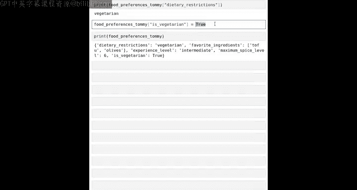

#  016：使用列表、字典和AI定制食谱 🍳

在本节课中，我们将学习如何结合使用列表和字典来组织数据，并利用这些数据定制提示词，从而让大型语言模型为你的朋友生成个性化的食谱建议。

---


正如你所见，字典和列表都是组织数据的有用方式。本节我们将通过一个有趣的例子，学习如何将朋友的食物偏好存储在列表或字典中，或者结合使用两者，然后将这些数据作为定制提示词的一部分，输入给AI，让它为你的朋友推荐食谱。


这为我们提供了一种更复杂的方式来存储数据，并利用这些数据定制输入给大语言模型的提示词，从而生成一些非常有趣且希望是美味的输出。让我们开始吧。


## 定义朋友的食物偏好字典

首先，我将定义一个字典来存储Tommy的食物偏好。


记住，我们使用花括号 `{}` 来定义字典。

以下是字典的键值对：
*   `dietary_restrictions` 键映射到字符串 `"vegetarian"`。
*   `favorite_ingredients` 键映射到一个包含两种最喜爱食材的列表：`["tofu", "olives"]`。
*   `experience_level` 键映射到字符串 `"intermediate"`，表示他的厨师经验水平。
*   `max_spice_level` 键映射到数字 `6`，表示他接受的辣度等级（满分为10）。

```python
food_preferences_tommy = {
    "dietary_restrictions": "vegetarian",
    "favorite_ingredients": ["tofu", "olives"],
    "experience_level": "intermediate",
    "max_spice_level": 6
}
```

运行这个代码单元后，你会注意到这个字典有四个键和四个对应的值。第一个值是字符串，第二个值是字符串列表，第三个值是字符串，第四个值是数字。

正如上节课所学，你可以打印字典的键和值：

```python
print(food_preferences_tommy.keys())
print(food_preferences_tommy.values())
```

## 使用字典数据定制AI提示词

现在，如果我们想为Tommy推荐一个食谱，可以使用如下提示词。这是一个f-string，它会将字典中的值动态插入到提示词中。

```python
prompt = f"""
Please suggest a recipe for the following ingredients: {food_preferences_tommy['favorite_ingredients']}.
The recipe should be {food_preferences_tommy['dietary_restrictions']}.
The difficulty of the recipe should be {food_preferences_tommy['experience_level']}.
The maximum spice level on a scale of 10 is {food_preferences_tommy['max_spice_level']}.
Please provide a two-sentence description.
"""
```

在这段代码中，`food_preferences_tommy['favorite_ingredients']` 会查找并插入 `"tofu"` 和 `"olives"`。其他键值对也会被相应地插入。

运行后，你可以查看生成的完整提示词：

```python
print(prompt)
```

你会看到，f-string中所有花括号内的值都已被从 `food_preferences_tommy` 字典中提取的相应数据填充。

接下来，我们将这个提示词发送给AI模型（这里用 `get_completion` 函数模拟）并打印响应：

```python
response = get_completion(prompt)
print(response)
```

我们可能会得到类似这样的输出：
> **地中海风味豆腐橄榄炒菜**：将豆腐切块，与彩椒、橄榄一起快速翻炒。这道菜是素食，难度中等，辣度控制在6/10以内，风味浓郁且制作简单。

注意，这个食谱包含了豆腐和橄榄，涵盖了他喜爱的两种食材。

你可以暂停视频，尝试输入你自己喜爱的食材、饮食限制等信息，看看是否能生成你满意的结果。

## 进一步定制：考虑可用食材

目前我们所有的数据都只与Tommy的食物偏好相关，因此创建一个字典变量来存储这些偏好是合理的。

但如果他告诉我们，他的厨房里香料快用完了，只剩下这四种：孜然、姜黄、牛至和红甜椒粉。我们可以进一步定制提示词。

首先，设置一个可用香料的列表：

```python
available_spices = ["cumin", "turmeric", "oregano", "paprika"]
```

然后，生成一个新的提示词，将可用香料信息也包含进去：

```python
prompt2 = f"""
{ prompt }
Also, please only use the following spices that are available: {available_spices}.
"""
```

运行并打印新的提示词，你会发现 `available_spices` 列表的内容被插入到了指定位置。

再次获取AI的响应：

```python
recipe_suggestion = get_completion(prompt2)
print(recipe_suggestion)
```

这次生成的食谱（例如，地中海豆腐橄榄炒菜）可能会特别说明使用了孜然、牛至和红甜椒粉，而不会使用他厨房里没有的其他香料。

这样就更贴切了。

## 动手尝试与扩展

在这个例子中，我主要使用了简短的食谱，并要求提供两句话的描述，以便阅读。

我鼓励你尝试以下修改：

*   更改提示词，让它提供**分步烹饪说明**。
*   在字典中**添加一个新的键值对**，比如 `"favorite_cuisine": "Italian"`，看看AI是否能根据你喜爱的菜系推荐食谱。
*   将 `food_preferences_tommy` 改为你自己的名字和偏好，看看能得到什么有趣的食谱。

编写此类代码的好处是，如果Tommy用完了另一种香料（比如牛至），你只需从 `available_spices` 列表中删除 `"oregano"`，重新运行代码，就能生成基于新香料组合的食谱。

## 总结与下节预告

本节课我们一起学习了列表和字典的更多用法，以及如何利用它们来定制提示词，从而让AI生成个性化的内容。

作为下节课的预告，你之前看到我们将 `food_preferences_tommy['dietary_restrictions']` 设置为 `"vegetarian"`。其实还有另一种存储此类数据的方式，那就是使用**布尔值（True/False）**。

例如，可以设置一个键 `is_vegetarian`，其值为 `True`。

```python
food_preferences_tommy["is_vegetarian"] = True
```

这样，`food_preferences_tommy` 就变成了一个包含五个键的字典。对于非素食者，我们可以将值设为 `False`，计算机同样能够处理。

将某些值明确存储为 `True` 或 `False` 有一些优势，例如当你需要确切追踪某人是否为素食者，以便为他们提供合适的食物选项时。



要了解所有这些内容，以及如何**比较数据**（这将为我们让AI帮助决策奠定基础），让我们进入下一个视频。