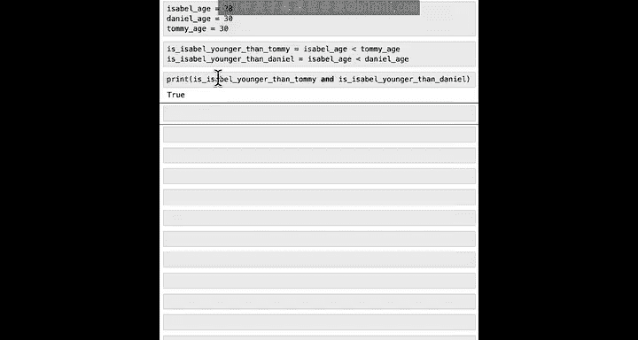

#  017：在Python中比较数据


在本节课中，我们将学习一种新的数据类型——布尔值（Boolean），并了解如何使用它在Python中比较数据、提出诸如“哪个数字更大”之类的问题，以及如何利用这些比较来回答关于数据的问题。

## 布尔值简介


上一节我们介绍了如何使用字典存储Tommy的饮食偏好。本节中我们来看看布尔变量。

在上一课结束时，我提到了一个真值变量，当时我们说 `Tommy is vegetarian is true`。


在本视频中，我们将研究这些真/假值变量，在计算机科学中我们称之为布尔变量，并看看如何在Python中使用这些变量来相互比较数据。

## 什么是布尔值？

以下是关于布尔值的一些核心事实：
*   布尔值是一种数据类型，只能取两个值：`True` 或 `False`。
*   你可以将布尔值视为对“是/否”或“真/假”问题的回答。
*   在Python中，`True` 和 `False` 是特殊的关键字，不需要引号。
*   使用 `type()` 函数检查 `True` 或 `False` 的类型，会返回 `bool`，这是“Boolean”的缩写。

```python
print(type(True))  # 输出：<class 'bool'>
print(type(False)) # 输出：<class 'bool'>
```

## 比较运算符

当你在Python中比较两个值时，比较的结果就是一个布尔值。以下是Python中用于比较的一些运算符。

以下是常用的比较运算符：
*   `>`：大于
*   `<`：小于
*   `>=`：大于或等于
*   `<=`：小于或等于
*   `==`：等于（注意：是两个等号）
*   `!=`：不等于

例如，如果你想检查Isabel的年龄是否大于或等于Tommy的年龄，你可以这样写：

```python
age_isabel >= age_tommy
```

这个表达式将根据 `age_isabel` 是否大于或等于 `age_tommy` 返回一个布尔值（`True` 或 `False`）。

## 比较操作示例

让我们通过一些代码示例来看看比较操作的实际应用。

假设Isabel、Daniel和Tommy在玩游戏，他们决定最年轻的人先开始。以下是一些可以在Python中进行的比较：

```python
age_isabel = 28
age_daniel = 30
age_tommy = 30

# 检查Isabel的年龄是否大于Daniel的年龄
print(age_isabel > age_daniel)  # 输出：False

# 检查Isabel的年龄是否小于Daniel的年龄
print(age_isabel < age_daniel)  # 输出：True

# 将比较结果赋值给一个变量
is_isabel_older_than_daniel = age_isabel > age_daniel
print(is_isabel_older_than_daniel)  # 输出：False

# 使用“小于或等于”运算符
print(age_isabel <= age_daniel)  # 输出：True
print(age_tommy <= age_daniel)   # 输出：True (因为两者都等于30)
```

## 相等性测试

除了测试大小关系，我们还可以测试两个事物是否相等。在Python中，使用双等号 `==` 来测试相等性。

**重要提示**：单个等号 `=` 用于给变量赋值，而双等号 `==` 是比较运算符。混淆两者是一个常见的错误。

```python
# 测试年龄是否相等
print(age_tommy == age_daniel)   # 输出：True (因为都是30)
print(age_isabel == age_daniel)  # 输出：False

# 错误示例：这会将daniel_age的值赋给tommy_age，而不是比较
# age_tommy = age_daniel

# 字符串也可以使用 == 进行比较
print("vegetarian" == "vegan")    # 输出：False
print("vegan" == "vegan")         # 输出：True
```

字符串相等性测试是计算机检查密码是否正确的基础步骤之一。

## 逻辑运算符

有时我们需要组合多个布尔条件。Python提供了逻辑运算符来实现这一点。

假设我和Tommy、Isabel在一起，我想知道他们是否都是我的朋友。这时可以使用逻辑运算符。

以下是主要的逻辑运算符：
*   `and` (与)：仅当**两个**输入都为 `True` 时，结果才为 `True`。
*   `or` (或)：只要**至少一个**输入为 `True`，结果就为 `True`。
*   `not` (非)：对布尔值取反。

```python
is_tommy_my_friend = True
is_isabel_my_friend = True

# 使用 and 运算符
print(is_tommy_my_friend and is_isabel_my_friend)  # 输出：True

# 如果Isabel不是我的朋友
is_isabel_my_friend = False
print(is_tommy_my_friend and is_isabel_my_friend)  # 输出：False

# 使用 or 运算符
print(is_tommy_my_friend or is_isabel_my_friend)   # 输出：True (因为Tommy仍是朋友)
```

## 综合应用示例

让我们将所学内容结合起来，解决游戏开始时的问题：确定Isabel是否是最年轻的，从而获得先手权。

```python
# 定义年龄
age_isabel = 28
age_daniel = 30
age_tommy = 30

# 进行必要的比较
is_isabel_younger_than_tommy = age_isabel < age_tommy
is_isabel_younger_than_daniel = age_isabel < age_daniel

# 使用 and 判断Isabel是否比两个人都年轻
is_isabel_the_youngest = is_isabel_younger_than_tommy and is_isabel_younger_than_daniel

print(f"Is Isabel the youngest? {is_isabel_the_youngest}")  # 输出：Is Isabel the youngest? True
```

因为表达式 `(28 < 30) and (28 < 30)` 的结果是 `True and True`，最终结果为 `True`，所以Isabel可以先开始游戏。

## 总结

本节课中我们一起学习了布尔值（`True`/`False`）这一新的数据类型。我们掌握了如何使用比较运算符（`>`, `<`, `>=`, `<=`, `==`, `!=`）来生成布尔值，以及如何使用逻辑运算符（`and`, `or`, `not`）来组合多个布尔条件。这些工具是编程中实现逻辑判断和决策的基础。在下一个视频中，我们将学习如何利用布尔值来帮助AI做出决策，根据某个条件的真假来执行不同的操作。



