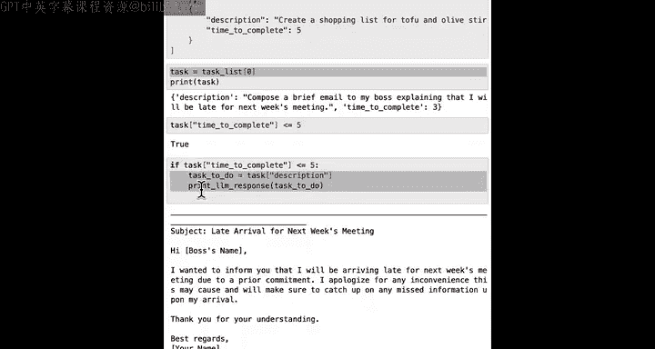
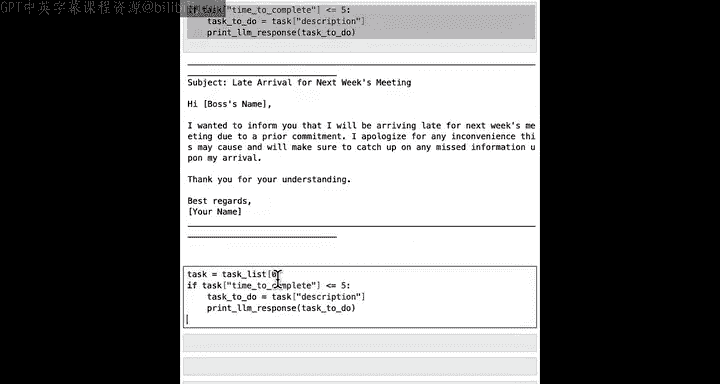
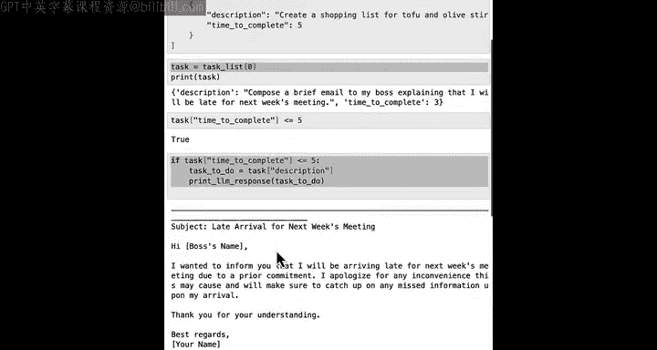
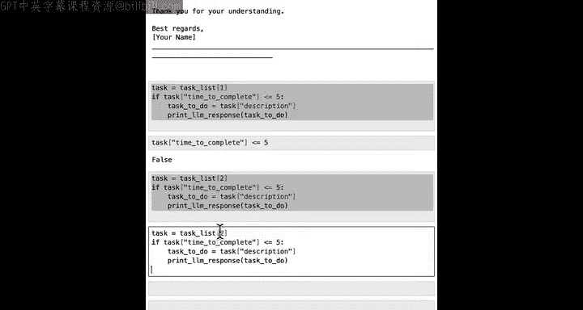
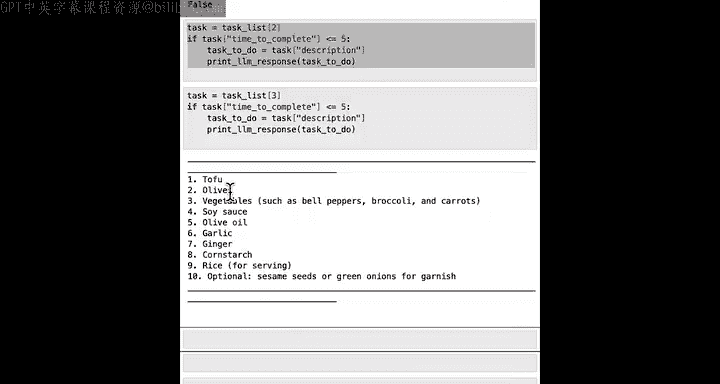
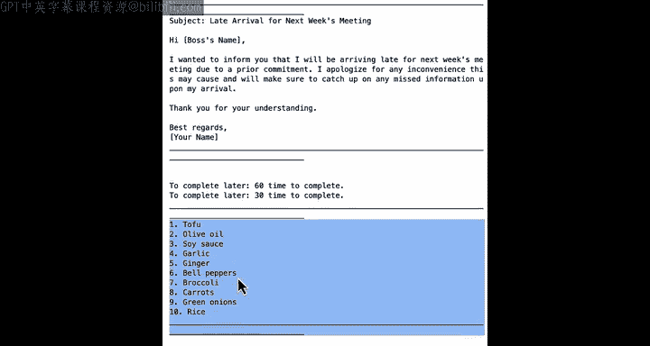
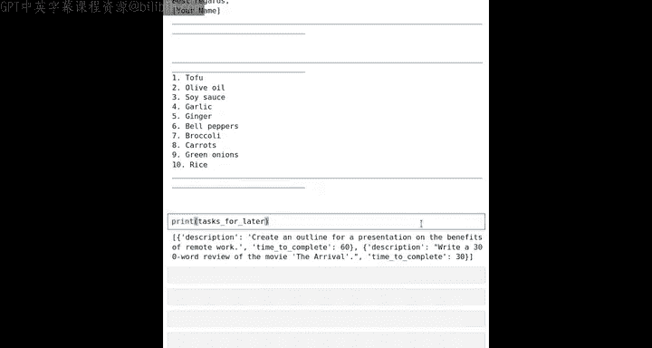

#  018：帮助AI做决策 🧠


在本节课中，我们将学习如何将布尔变量与一种新的编程模式——**条件语句**——结合起来，以帮助计算机做出决策。这将使我们能够编写一些非常酷的程序，其执行结果取决于输入的数据。例如，根据数据的不同，程序可能会执行操作A或操作B。在本视频中，我们将使用这个技术来帮助你在待办事项列表中确定任务的优先级。让我们开始吧。

---

## 一个更复杂的待办事项列表示例


让我们通过一个更复杂的待办事项列表（或任务列表）来举例说明。我将定义一个名为 `tasks` 的列表。


以下是任务列表的内容：
*   **任务 0**：为老板撰写一封简短的电子邮件。使用AI大语言模型撰写大约需要3分钟，发送需要几分钟。
*   **任务 1**：为关于远程工作的演示文稿撰写大纲。撰写、清理、编辑并发送给相关人员，预计需要60分钟。
*   **任务 2**：撰写电影《降临》的影评，预计需要30分钟。
*   **任务 3**：为与朋友Tommy、Isabel和Daniel的豆腐橄榄炒饭聚餐创建购物清单，预计需要5分钟。

通过结构化这个任务列表，我们可以用它来做更复杂的事情。

假设现在快到午餐时间，你正准备出门吃饭，但还有一点空闲时间可以完成一个快速任务。下面，你将学习如何使用一种名为**条件语句**的新编程模式来遍历你的任务，并决定是否执行每一项。

---

## 使用条件语句做出决策

首先，让我们设置 `task` 等于任务列表中的第一个元素（索引为0），并打印出来。

```python
task = tasks[0]
print(task)
```

不出所料，这打印出了你任务列表中的第一个任务。

当你准备出门吃午饭时，你可能想做的一件事是检查一个任务是否能在5分钟内完成。让我们看看这个任务。

```python
task.time_to_complete <= 5
```

如果这是一个快速任务，也许我们可以在出门前快速完成它。上面的表达式结果为 `True`。

现在，让我向你展示如何编写一个程序，让它只在任务耗时5分钟或更少时才去执行。代码看起来像这样：

```python
if task.time_to_complete <= 5:
    task_to_do = task.description
    response = get_llm_response(task_to_do)
    print(response)
```

在这里，`task.time_to_complete <= 5` 是一个布尔表达式，其值为 `True` 或 `False`。在Python中，每当有一个冒号 `:` 时，下一行几乎总是要缩进（通常是4个空格）。这段代码的意思是：如果任务完成时间小于或等于5分钟，那么就将 `task_to_do` 设置为任务描述，然后让语言模型处理这个任务提示，并打印响应。

在这个例子中，因为 `task` 是 `tasks[0]`，其完成时间小于等于5分钟，条件为 `True`。如果我运行这段代码，它将处理 `task_to_do` 并打印出语言模型的响应。



---



## 遍历列表中的其他任务



上一节我们介绍了如何使用 `if` 语句处理单个任务。本节中，我们来看看如何用同样的逻辑处理列表中的其他任务。

让我们继续处理列表中的下一个项目，即索引为1的任务。

```python
task = tasks[1]
if task.time_to_complete <= 5:
    task_to_do = task.description
    response = get_llm_response(task_to_do)
    print(response)
```

任务1（撰写演示文稿大纲）需要60分钟。如果我运行这段代码，你认为会发生什么？实际上，什么也不会发生。这正是我们期望的，因为 `task.time_to_complete <= 5` 的结果是 `False`。因此，程序决定不执行缩进块内的代码，没有打印语言模型的响应。因为代码的逻辑是：如果耗时少于5分钟，则执行；既然条件不成立，就不执行。



接下来，处理任务2（撰写影评，耗时30分钟），运行同样的代码，同样什么也不会发生。

最后，处理任务3（创建购物清单，耗时正好5分钟）。

```python
task = tasks[3]
if task.time_to_complete <= 5:
    task_to_do = task.description
    response = get_llm_response(task_to_do)
    print(response)
```

运行这段代码，它会调用语言模型并执行这个最终任务。

---

## 理解 `if` 语句

让我们回顾一下刚刚发生了什么。Python中的 `if` 语句是一种**控制流语句**，它允许你根据布尔条件的真假来定义程序的不同行为。



对于我们使用的 `if` 语句，其逻辑是：检查任务是否能在小于或等于5分钟内完成。如果为真（`True`），则执行任务（打印语言模型对该任务的响应）；否则，在这个例子中，我们什么都不做。稍后我们将看到如何编写代码，在布尔值为假（`False`）时执行其他操作。

以下是这段代码的关键组成部分：
1.  `if` 关键字。
2.  一个布尔条件（其值必须是 `True` 或 `False`）。
3.  一个冒号 `:`。
4.  缩进的代码块，当布尔条件为 `True` 时执行。

---

## 使用 `for` 循环自动化处理

刚才我们看到的是手动遍历四个任务，并为每个任务编写一段类似的代码。这显然不够高效。我们之前学习过 `for` 循环，它提供了一种更高效的方式，可以用一个循环告诉计算机对任务列表中的每一项都执行相同的步骤。

让我展示一下实现这个功能的代码：

```python
for task in tasks:
    if task.time_to_complete <= 5:
        task_to_do = task.description
        response = get_llm_response(task_to_do)
        print(response)
```

注意，我们将想要重复运行四次的代码整体向右缩进了四个空格，使其位于 `for` 循环的内部。这个 `for` 循环将对 `task0`、`task1`、`task2`、`task3`（记住我们从0开始计数）依次运行这段代码，反复检查任务是否能在5分钟内完成。如果可以，则打印该任务的语言模型响应。

运行这段代码，结果会执行第一个任务和最后一个任务，而忽略任务2和3。这正是我们想要的。

---

## 使用 `else` 处理条件为假的情况

如果你想在布尔条件为真时做一件事，为假时做另一件事，可以这样修改代码：

```python
for task in tasks:
    if task.time_to_complete <= 5:
        task_to_do = task.description
        response = get_llm_response(task_to_do)
        print(response)
    else:
        print("We will do this task later.")
```

在Python中，`else` 后面同样需要冒号，并且其下的代码块需要缩进。逻辑是：如果条件为真，执行 `if` 块；否则（即条件为假），执行 `else` 块。

运行修改后的代码，它会执行第一个任务，提示有一个60分钟的任务稍后做，另一个30分钟的任务稍后做，然后执行第四个任务。

> 当前 `else` 块中的打印信息可能不够清晰。你可以尝试修改代码，让它打印出更详细的、稍后要完成的任务描述。例如，在 `else` 块中设置 `task_to_do_later = task.description`，然后打印它。建议你暂停视频，尝试修改代码来实现这个功能。

---

## 更好地组织未来任务



到目前为止，对于我们要留到以后处理的任务，我们只是打印一条“稍后做”的消息。实际上，有一种巧妙的方法可以利用我们早先学过的知识，将这些未来任务以更有条理的方式保存起来。

以下是我们可以做的：你可能还记得以空列表开始的编码模式。我将从一个空的“稍后任务”列表开始。

```python
tasks_for_later = []
```

然后，编写以下代码来遍历任务列表：

```python
for task in tasks:
    if task.time_to_complete <= 5:
        task_to_do = task.description
        response = get_llm_response(task_to_do)
        print(response)
    else:
        tasks_for_later.append(task)
```

这段代码的逻辑是：如果任务能在5分钟内完成，现在就做；否则（即午餐前不做），就把它添加到 `tasks_for_later` 列表中。

运行这段代码，我们会立即完成第一个和最后一个任务。现在，如果我们打印 `tasks_for_later`，我们会得到需要60分钟创建大纲的任务和需要30分钟撰写影评的任务，这些都被保存下来改天处理。

---

## 总结

本节课中，我们一起学习了如何利用布尔变量和 **`if`** 条件语句来帮助程序做出决策。我们通过一个待办事项列表的实例，演示了如何根据任务耗时（是否小于等于5分钟）来决定立即执行还是推迟处理。我们还结合了 **`for`** 循环来自动化遍历整个列表，并使用 **`else`** 子句来处理条件不满足时的情况。最后，我们学习了如何将推迟的任务收集到一个单独的列表中，以便更好地组织未来的工作。这些核心概念是构建更智能、更灵活程序的基础。



> 你几乎已经完成了Python任务处理部分的所有内容。在结束之前，还有一个简短的视频，我将介绍一些关于文件操作的内容。让我们进入下一个视频。