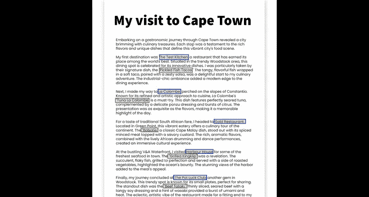
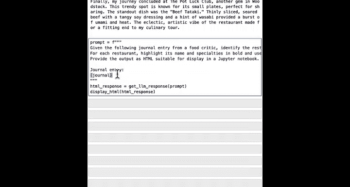
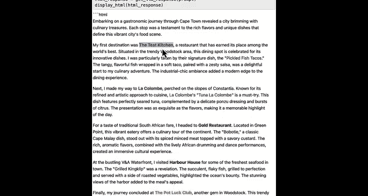
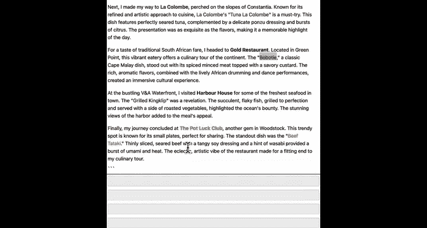
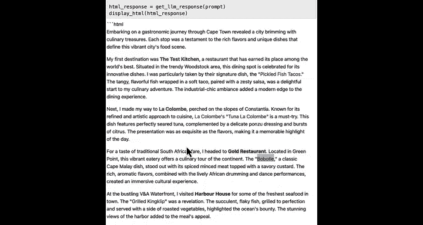

#  019：处理文件

在本节中，我们将预览下一门课程的核心内容：如何让Python和AI处理你自己的数据。你将看到一个具体的示例，了解如何读取本地文件并使用AI分析其中的信息。

---

现在你已经掌握了许多处理数据的工具，包括变量、列表、`for`循环、字典和条件语句。

我知道课程内容推进得很快，如果你没有记住所有内容，这很正常。你可以随时复习材料，或者更好地，向你的AI聊天伙伴询问任何你想回顾的概念。专业程序员也无法记住所有内容，他们也经常向聊天机器人寻求帮助。

下一阶段的目标，是在你已学知识的基础上，学习如何让Python和AI处理你自己的数据。

你可能不认为自己有数据，但我可以肯定地说，你绝对有。

让我展示一个例子。你的个人数据很可能存储在文件中，例如你的文档、待办事项列表、电子邮件或电子表格等。为了接下来的示例，我们假设你是一位美食评论家，并保存了一份记录不同城市旅行的日记，其中包含对餐厅和特色菜的描述。

假设你想分析你的日记条目，并高亮显示其中的餐厅和菜肴名称。

在这段视频中，你将简要了解如何将你自己的日记文本加载到Python中，并使用AI来高亮显示这些餐厅和菜肴。

为了本视频的目的，你不必担心视频中看到的代码的具体工作原理。你将在下一门课程中学习所有细节。

这里我将加载一些辅助函数。然后是一些Python代码，用于读取存储在我硬盘上的一个包含文本日记的文件。

让我加载并打印它。这是我的日记：“开启开普敦的美食评论之旅……”等等。

然后，我将编写一个提示词，内容是：“给定以下美食评论家的日记条目，识别其中的餐厅及其特色菜。用粗体高亮其名称和特色菜，并为每一项使用不同的颜色。以HTML格式提供输出。”

我们将使用f-string将日记插入到这个提示词中，获取AI的响应，得到一个HTML格式的响应。网页是用HTML格式化的，我们将让AI返回一个HTML响应。最后，我们可以显示这个HTML。

如果我运行这段代码（这需要几秒钟），最终会得到一个结果。在这个结果中，它高亮了餐厅名称，如“The Test Kitchen”、“La Colombe”等，以及用相应颜色标记的不同菜肴。

无论你是否是美食评论家，我希望这个例子能向你说明，如果你有存储在硬盘上的文本文件，你可以用几行代码，让AI帮助你标记和分析你自己的文本。

在下一门课程中，我将利用这个方法来规划一个美妙的假期，这个假期将包括参观许多餐厅和品尝大量美味食物。

---

恭喜你完成了本课程！你已经学习了专业开发人员日常工作中使用的非常重要的概念和编程模式。

你学习了列表和字典，它们可以用来存储数据项的集合。

你学习了`for`循环，它允许你通过告诉Python对列表中的所有项目执行相同操作来自动化重复性任务。

你学习了布尔变量，其值只能是`True`或`False`，以及如何在`if`语句中使用它们来帮助计算机程序根据看到的数据做出决策。

你涵盖了很多内容，我希望你现在已经掌握了编程工具，或许可以开始使用AI构建一些东西了。当然，还有更多知识需要学习。

我期待在下一门课程中见到你，在那里你将学习如何让Python和AI处理你自己的数据。