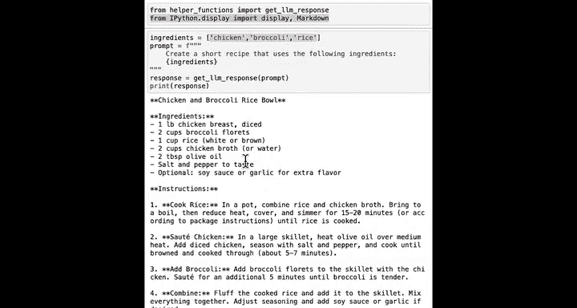
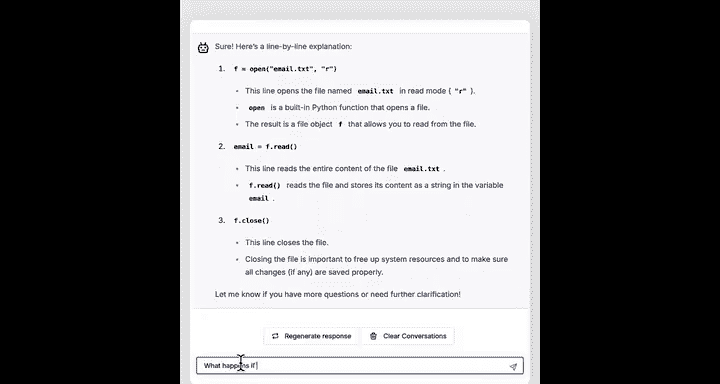
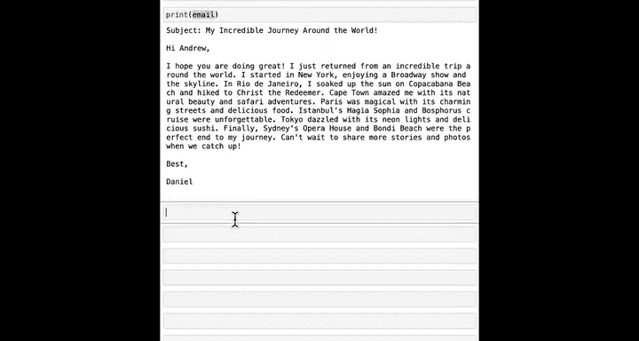
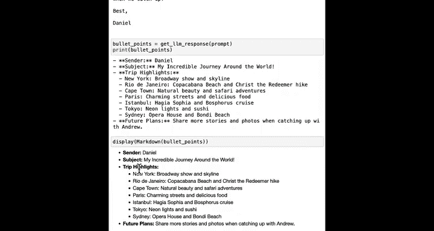
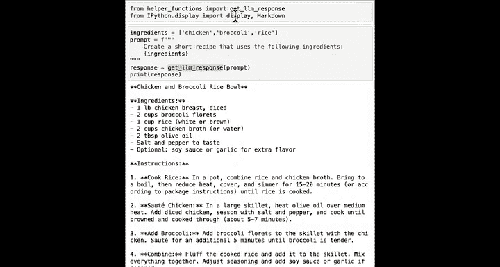
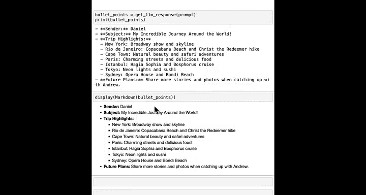
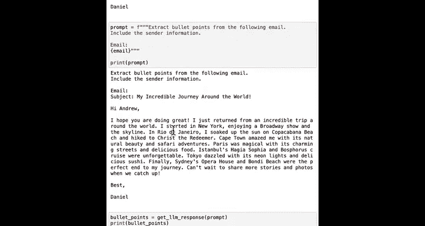

#  021：在Python中使用文件 📂


在本节课中，我们将学习如何使用Python读取存储在计算机上的文本文件。你将了解如何打开文件、读取其内容，并将这些文本数据加载到Python变量中，以便后续使用AI模型进行处理。


---

数据通常以文件形式存储在计算机上，例如文档、待办事项列表或笔记。这些笔记可能记录在类似Microsoft记事本或Mac文本编辑器的应用程序中。


实际上，我使用一个名为Obsidian的应用程序来存储我的待办事项。Obsidian基本上将我的待办事项存储在文本文件中，技术上是一种称为Markdown的文件，但大致上就是文本文件。

你可以使用Python读取这些文件中的数据或文本，从而编写代码，利用AI处理你自己文件中的文本。让我们看看如何操作。


在之前的课程中，你处理的数据是在Jupyter笔记本中直接创建并赋值给变量的。

你学习了如何创建多行字符串、列表和字典。你看到了我们如何创建一个食材列表。

以下代码片段中，有一行 `from IPython.display import display, Markdown`。目前无需担心这行代码。然后，我们使用一个f-string创建了一个提示词，要求大型语言模型使用这些食材创建一个食谱，并将响应存储在名为 `response` 的变量中，最后打印出来。让我们运行这两个代码单元格。

事实证明，与其像这样在笔记本中键入所有数据（例如鸡肉、西兰花和米饭），你可以从存储在计算机上的文本文件或其他类型的文件中加载数据。

让我们从加载存储在文本文件中的一封电子邮件开始。



---

## 打开并读取文件

以下是打开并读取文件的核心代码：

```python
with open("email.txt", "r") as f:
    email = f.read()
```

这段代码执行以下操作：
1.  **`open("email.txt", "r")`**：打开名为 `email.txt` 的文件。`.txt` 后缀表明这是一个纯文本文件。参数 `"r"` 表示以“读取”模式打开文件。这个打开的文件对象被赋值给变量 `f`。
2.  **`email = f.read()`**：读取文件 `f` 中的所有文本内容，并将其存储在一个名为 `email` 的字符串变量中。
3.  **`with` 语句**：使用 `with` 语句可以确保文件在使用完毕后被正确关闭。关闭文件可以释放计算机的一些内存资源。

运行这段代码后，`email.txt` 文件中的所有文本都被读取并保存在变量 `email` 中。现在，如果我们打印 `email`，就会输出该变量的值，即一封来自Daniel的电子邮件，内容是关于他精彩的环球之旅。

如果我使用文本编辑器打开 `email.txt` 文件，这正是保存的文件内容。而这就是Python读取到Jupyter笔记本中的内容。

---

## 使用AI处理文件内容

现在我们已经将文本加载到Python中并保存在变量 `email` 里，就可以使用大型语言模型来处理它了。



例如，我很高兴读到Daniel的愉快经历，但如果我想让AI模型为我总结这封邮件，我可以编写如下提示词：


```python
prompt = f"""
Extract bullet points from the following email and include the sender information:

{email}
"""
```

这是一个f-string，它将 `email` 变量的文本内容嵌入到提示词中。然后，我可以通过调用模型来获取对这个提示词的响应，并打印出总结的要点。



之后，AI模型为我总结了Daniel的邮件。

你可能会注意到输出中有双星号 `**`，这是一种称为Markdown的格式化语法。如果你希望以更美观的格式化方式显示这些文本，可以使用 `display` 和 `Markdown` 函数。

```python
display(Markdown(bullet_points))
```

这会使Python以这种格式良好的方式打印所有文本。这就是为什么在笔记本的开头，我预先导入了 `display` 和 `Markdown`，因为我知道稍后会用到它们。你将在第四门也是最后一门课程中了解更多关于 `import` 命令的知识。目前只需记住，在使用 `display` 和 `markdown` 函数之前，必须先运行那行导入代码。

你并非必须以这种更美观的格式打印输出。但如果你要向朋友展示，或者想让自己更快地阅读，这会让阅读体验更好一些。



---

## 总结



本节课中，我们一起学习了：
1.  如何使用 `with open(...) as f:` 和 `f.read()` 在Python中安全地打开和读取文本文件。
2.  如何将文件内容存储在变量中，以便在程序中使用。
3.  如何将读取的文件内容作为输入，构建提示词，交由AI模型进行处理（如总结）。
4.  如何使用 `display(Markdown(...))` 来美化Markdown格式文本的输出显示。

在本视频中，你看到了如何加载一个特定的文件 `email.txt`。在下一课中，我们将了解如何对你自己的文本文件进行同样的操作。





让我们继续下一课。