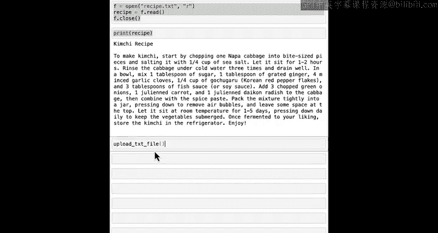
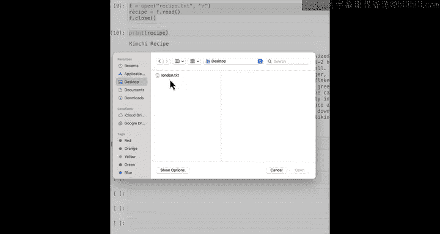
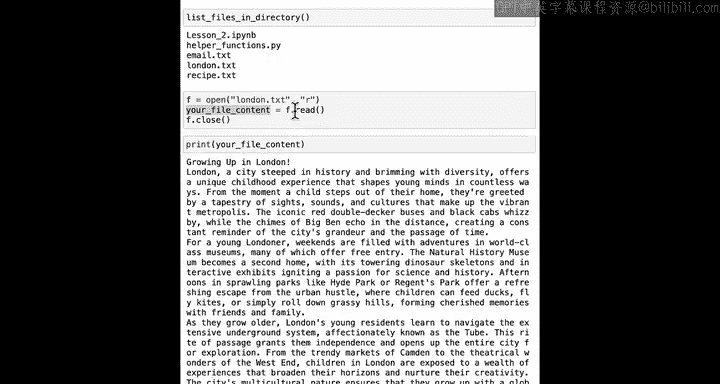
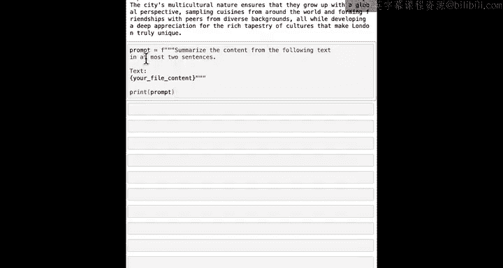
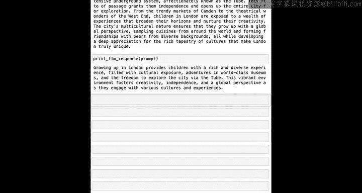
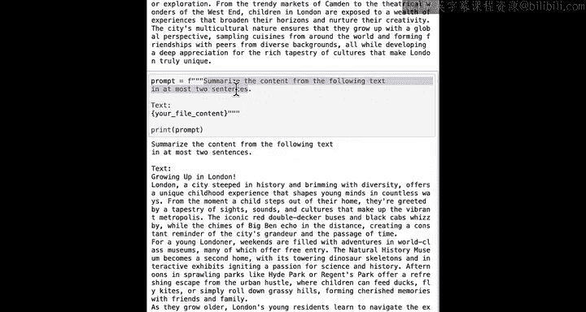

#  022：加载与使用个人数据 📂

在本节课中，我们将学习如何在Python中打开和读取文件，并使用AI大语言模型来总结文档中的关键要点，例如处理电子邮件。

上一节我们介绍了如何与AI模型交互生成文本。本节中我们来看看如何让AI处理我们自己的文本文件。

## 理解文件与工作目录 💻

在计算机上，你可能将许多不同类型的数据保存在不同的文件中。这可能包括你保存的文档，如报告、待办事项、电子邮件、包含预算的电子表格以及其他类型的公司数据。

在本笔记本中，你将学习如何处理自己的文本文件。

计算机中的文件被组织在不同的文件夹中。开发者倾向于使用“目录”这个词来代替“文件夹”。如果你听到我说“这个文件在那个目录中”，这基本上意味着该文件在一个特定的文件夹中。

在你当前运行的Jupyter Notebook网站上，有一套文件夹存储着不同课程的文件，例如第一课、第二课等。我们现在处于第二课，在`lesson2`文件夹中。实际上，这里有一个文件列表，代码将在这里运行，它位于一个名为`lesson2.ipynb`的文件中。文件名中“点”后面的部分称为扩展名。Jupyter Notebook是扩展名为`.ipynb`的文件。如果你好奇，`ipynb`代表“IPython Notebook”。之前我们从`helper_functions`导入代码时，它实际上保存在另一个扩展名为`.py`（代表Python）的文件中。

Python首先在其中查找文件的文件夹或目录，也称为“工作目录”。因此，如果你告诉它读取`email.txt`或`recipe.txt`，Python将在当前工作目录（即`lesson2`文件夹）中查找你想要读取的文件。

为了更深入地理解工作目录，让我们询问AI助手：“Python首先在哪个文件夹中查找文件？默认是哪个文件夹？”

Python首先在当前工作目录中查找。和往常一样，如果你想了解更多细节，可以随时与你的AI聊天机器人交流。

## 在代码中操作文件 📝

让我们转到本笔记本中的代码。我将从`helper_functions`加载一些新函数：`upload_text_file`、`list_files_in_directory`以及我们常用的`print_response`。

请按照与我相同的顺序执行代码单元格。

现在，让我们列出目录中的文件。

以下是当前工作目录中的文件列表。

如果我们打开并读取`email.txt`文件，然后打印`email`变量，我们会看到上一节课中见过的电子邮件内容。

类似地，如果我们打开`recipe.txt`文件并打印`recipe`变量，我们会得到这份美味的泡菜食谱。

## 上传你自己的文本文件 ⬆️

现在，让我们上传一个文本文件到当前工作目录。运行代码会创建一个上传按钮。点击它，会弹出一个文件浏览器。我已在桌面上保存了一个关于伦敦（我出生的地方）的文件。

打开`london.txt`文件。现在，`london.txt`已被上传。如果我再次列出目录中的文件，一个新的文件`london.txt`就会出现。

现在，我可以打开这个文件并将其内容读取到变量`your_file_content`中。

打印`your_file_content`，它会输出`london.txt`的全部内容，这是一段关于伦敦的精彩描述。

当你运行这段代码时，我鼓励你创建自己的文本文件，点击上传按钮并上传它。你可以从最近的电子邮件、在线新闻文章或其他地方复制一两段文字。

如果你在Windows系统上，可以使用Microsoft Word；在Mac上，可以使用TextEdit程序；也可以使用Google Docs。然后，转到“文件”->“下载为纯文本(.txt)”，生成一个可以上传到Jupyter Notebook的文本文件。

**请注意：请不要上传任何机密文件。**

你需要将代码中的`london.txt`更改为你实际上传的文本文件的名称。如果你这样做了，你就能在Jupyter Notebook中看到你自己的数据运行。

## 使用AI处理你的文本数据 🤖

对于你提供的任何文本，你都可以创建一个提示词。例如，创建一个提示词：“用两句话总结以下文本的内容。”

然后，让我们打印对该提示词的响应。

现在，AI将那段关于伦敦的长文本总结成了两句话。

除了提供摘要，你还可以尝试其他操作，例如要求“提取关键要点”或“就你刚刚上传的内容，集思广益如何制作演示文稿”。

我希望这些示例能给你一些启发，让你了解在使用AI大语言模型处理自己的文本数据时可以完成哪些任务。我希望你觉得这既有趣，也可能对你手头的项目有用。

在下一课中，我们将继续探索以更复杂的方式处理文本数据。具体来说，你将学习如何从多段文本中读取内容，并使用AI来判断这些内容是否与规划梦想假期相关。

在你尝试用你自己的文本数据运行一些代码之后，让我们进入下一课，在那里我们将学习如何以更复杂的方式处理文本。

## 总结 📚

本节课我们一起学习了：
1.  **文件与目录**：理解了计算机中文件的组织方式以及Python的“当前工作目录”概念。
2.  **文件操作**：使用`list_files_in_directory`查看目录内容，使用`open`和`read`函数读取文本文件内容。
3.  **上传个人文件**：通过`upload_text_file`功能将本地的`.txt`文件上传到Jupyter Notebook环境中。
4.  **AI文本处理**：将读取的个人文本内容传递给AI大语言模型，执行如总结、提取要点等任务。

你已经掌握了如何让AI处理你自己的文档，这是将AI应用于个人或工作项目的重要一步。