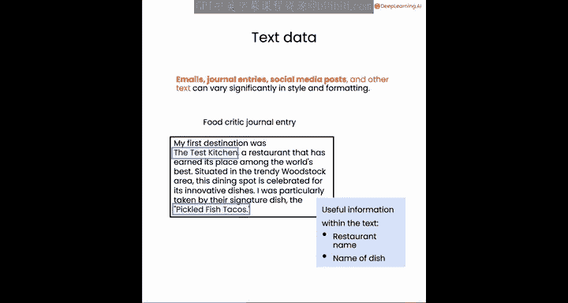
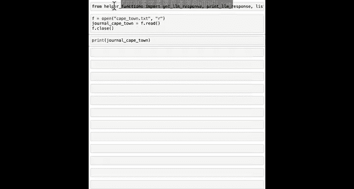
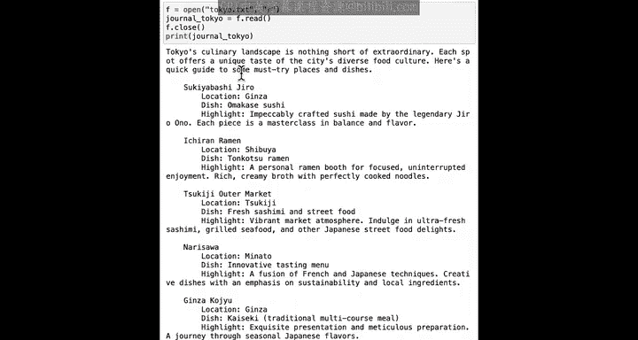
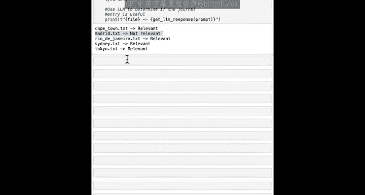
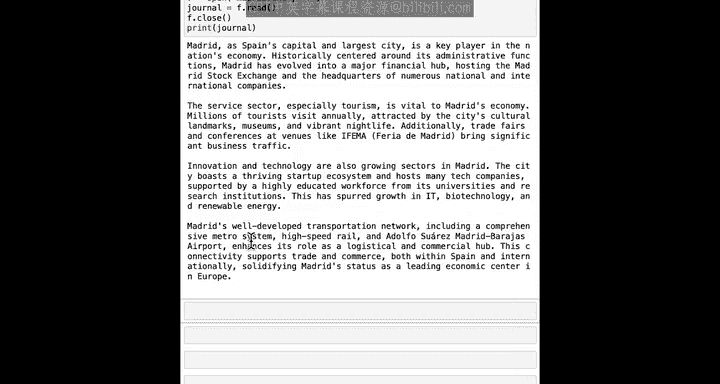
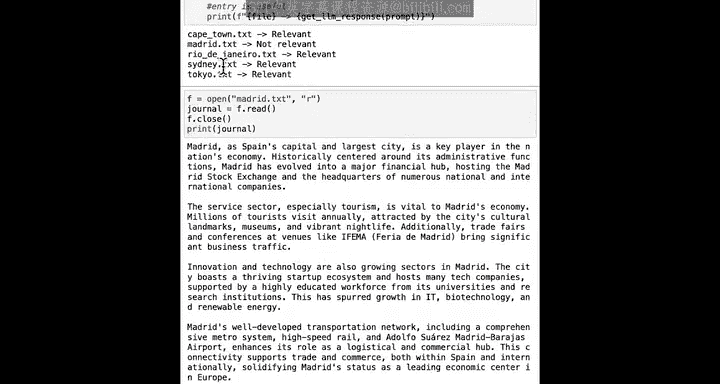
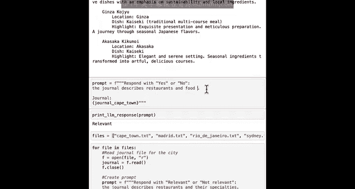
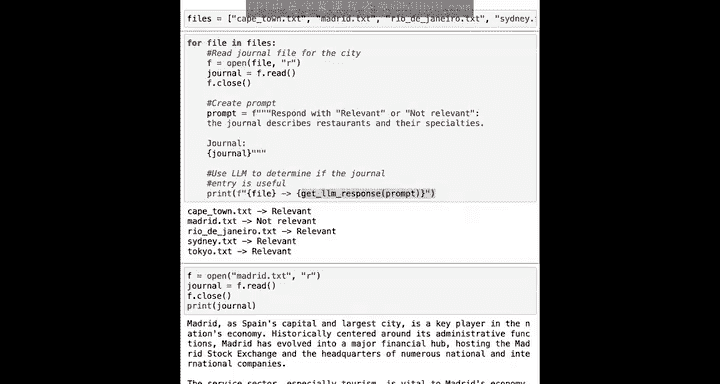

#  023：阅读美食评论家的日志 📖

在本节课中，我们将学习如何使用Python和大语言模型来处理大量文本数据，特别是如何自动筛选出与特定主题（如餐厅和美食）相关的文档。我们将构建一个简单的文本分类系统。

## 概述

许多人每天需要处理大量文本数据，例如电子邮件、文章和个人笔记。根据任务的不同，你可能希望借助AI来帮助你阅读和处理这些海量文本。

例如，假设你正在规划一次梦想假期，需要决定在不同城市去哪些餐厅以及品尝什么美食。你可能已经保存了许多关于不同目的地的长篇博客文章，其中一些描述了不同城市的餐厅和菜肴。

在本视频的示例中，我们将学习如何将这些信息整合到你即将到来的旅行的美食相关行程中。但在这一大堆文件和文章中，可能也包含许多与餐厅、美食或就餐地点无关的文档。

如果你时间紧迫，不想逐一打开并阅读每个文件来判断它是否与美食相关，那么最好使用AI来查看所有这些文本并帮助你处理它们。

让我们看看如何在Python中实现这一目标。

## 处理文本数据

我们将使用美食评论家的日志条目，这些条目包含了推荐的餐厅和菜肴，并学习如何使用大语言模型来处理这些数据。

像电子邮件、日志条目和社交媒体帖子这样的文本数据，在风格和格式上可能有很大差异。有些人使用项目符号列表写作，而另一些人则写长段落。

在本课的代码中，你将使用Python和大语言模型从这些文本文件中提取相关信息，例如提取餐厅名称和你可能想尝试的特色菜名。

但在提取餐厅名称和菜名之前，你可能需要先确认这个文本文档是否相关。例如，如果你有一篇关于城市历史的文章，它可能没有任何值得提取的当前餐厅名称。

让我们看看如何使用Python代码来完成所有这些工作。

## 代码实践

请记住按顺序运行代码单元。首先，我们像上一课一样定义一些常用函数，然后加载文件 `Cape_Town.txt` 并打印开普敦的日志。

`Cape_Town.txt` 是由一位美食评论家撰写的日志，重点介绍了“The Test Kitchen”和“The Codfather”等餐厅。

接下来，让我们看看 `Tokyo.txt`。这个文件记录了前往东京的旅行，并列出了一些令人向往的餐厅。它的格式与开普敦文档的段落文本截然不同。

在处理这些文本文件以提取餐厅和菜名之前，我们希望使用大语言模型来检查文档，判断其是否与餐厅及其特色菜相关。

以下是一个提示词示例。我将打印对该提示词的响应。确实，东京的文章是相关的。事实上，开普敦的文章也是相关的。

我知道在这个目录下有五个文件：`Cape_Town.txt`、`Madrid.txt`、`Rio_de_Janeiro.txt`、`Sydney.txt` 和 `Tokyo.txt`。

为了编写处理所有五个文件的Python代码，你还记得代码结构吗？我们可以使用 `for` 循环来遍历多个文件。

我将设置 `files` 等于这个包含五个文件名的列表。这里的方括号是我们在Python中创建列表的方式。然后我们说 `for file in files:`，像往常一样打开并读取文件，然后关闭文件。

接着，我们将创建一个提示词，根据日志是否描述餐厅及其特色菜来响应“相关”或“不相关”。然后，我们将上面刚刚读取的日志变量 `journal` 放入提示词中。

然后，让我们使用大语言模型从提示词中获取响应。我们将打印文件名，然后是一个右箭头，接着获取响应并打印出每个文件是否与餐厅及其特色菜相关。

让我们运行一下看看结果。希望这能成功。

好的。所以开普敦是相关的，但 `Madrid.txt` 不相关，其他的是相关的。因此，如果你有100或200个文档的集合，你可以使用这样的循环让Python自动为你读取所有文档，并仅为你指出哪些是与美食相关的。

让我们检查一下 `Madrid.txt`。让我们读取并打印 `Madrid.txt`。你会发现这是一篇关于马德里的非常好的文章，但并没有特别关注美食，这就是为什么大语言模型说 `Madrid.txt` 不相关。

顺便说一下，我也鼓励你尝试不同的提示词。例如，你可以说“用‘是’或‘否’来回应，如果日志描述了餐厅和食物菜肴的话”。有多种方法可以做到这一点。

更高级的做法是让它只打印出相关文件的文件名。这将是一个相当高级的练习。如果你想尝试一下，也可以询问AI聊天机器人伴侣。

作为一个有趣的知识点，如果你对我们刚刚所做事情的名字感到好奇：我使用AI来确定不同文本是否相关。这个任务有一个特定的名称。我们刚刚在这里构建的是一个**文本分类系统**。

## 总结

本节课中，我们一起学习了如何使用Python和大语言模型自动处理大量文本数据，并筛选出与特定主题（如餐厅和美食）相关的文档。我们构建了一个简单的文本分类系统，通过循环读取多个文件，并使用提示词让AI判断其相关性。

我鼓励你尝试修改这段代码，让它做不同的事情。请务必尝试不同的提示词，看看会得到什么不同的结果。我希望你能看到，像这样简单的几行代码可以为你快速读取五个甚至更多文档，并帮助你识别出最相关的那些。

编码的好处在于，你可以让计算机执行各种各样的事情。希望你玩得开心。在下一课中，我们将学习如何从一篇相关文章中提取关键信息，例如餐厅名称和菜肴名称。

我们下节课再见。