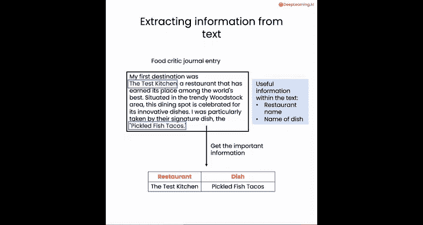
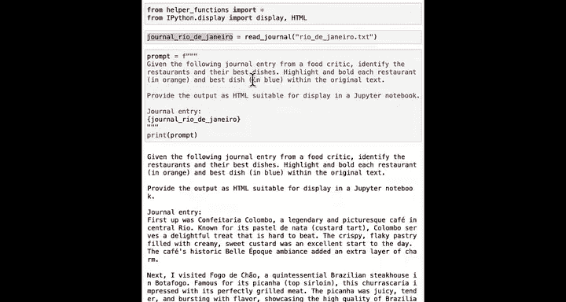
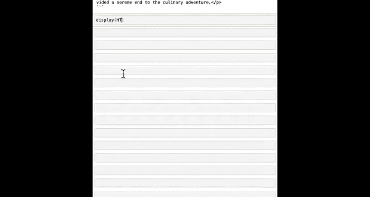
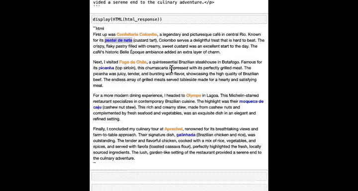
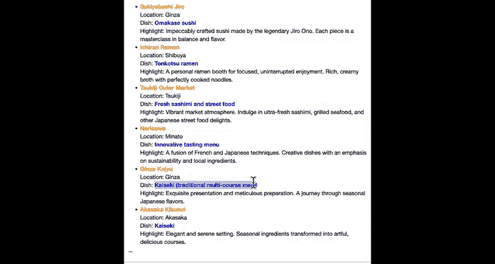
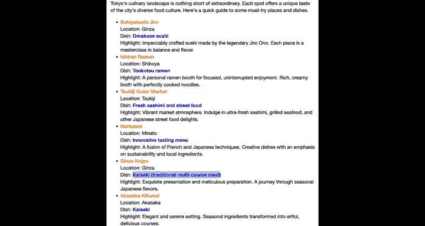
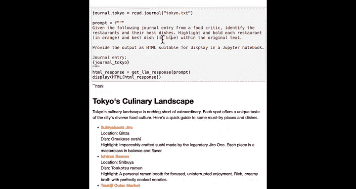
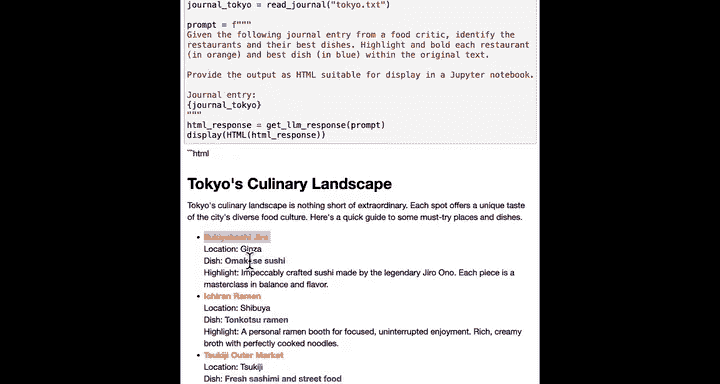
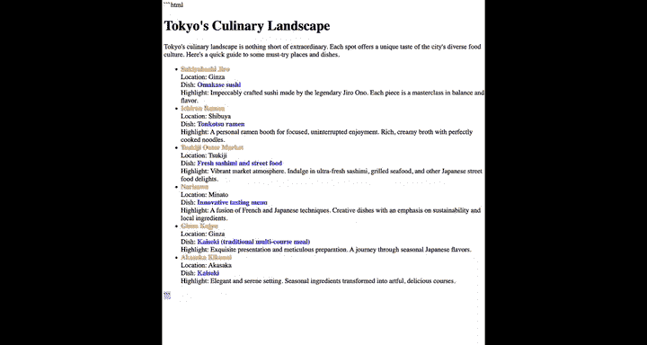

#  024：从日记条目中提取餐厅信息


在本节课中，我们将学习如何使用大型语言模型从文本中提取特定信息，例如餐厅名称和招牌菜。我们将看到如何高亮显示这些信息，并将其保存为易于阅读的HTML文件或结构化的CSV文件。

## 回顾文本分类


上一节我们介绍了文本分类，即判断一段文本是否与食物相关。本节中，我们将以更深入的方式，让大型语言模型查看文档并提取特定的信息片段，例如餐厅和菜品名称，以便在其他地方使用。


## 高亮显示提取的信息

我们将学习如何高亮显示提取出的信息，并将其保存到新文件中以便阅读。



让我们看看具体如何操作。正如你所见，我们为不同目的地记录的日记条目中可能包含餐厅信息以及值得尝试的招牌菜。提取这些信息后，你可能希望将其保存在一个类似表格的结构中，这样当你在那个城市时，就能轻松决定去哪里用餐。

以下是读取日记文件并构建提示词的代码：

```python
journal_rio_de_janeiro = read_journal("rio_de_janeiro.txt")
prompt = f"""
Given the following journal entry for food tracking, tell me the restaurants and the best dishes.
Highlight and bold each restaurant and best dish within the original text.
{journal_rio_de_janeiro}
We want the large language model to provide the output as HTML suitable for display in the Jupyter notebook.
"""
```

网页使用HTML格式，这让我们可以使用丰富的格式，例如用橙色或蓝色书写文本。提示词中包含位于下方的日记条目。现在，让我们调用大型语言模型并获取该提示词的响应，我将响应存储在`html_response`变量中并打印出来。



```python
html_response = get_completion(prompt)
print(html_response)
```

你会看到大型语言模型输出了HTML。`<p>`标签表示开始一个段落，这些被称为指定格式的HTML标签。如果你想显示实际的HTML，可以使用以下命令：



```python
display(HTML(html_response))
```



现在，它会打印出格式精美的HTML，其中餐厅用橙色高亮，菜品名称用蓝色高亮。

接下来，让我们对东京的日记条目进行同样的操作。代码如下：





```python
journal_tokyo = read_journal("tokyo.txt")
prompt = f"""
Given the following journal entry for food tracking, tell me the restaurants and the best dishes.
Highlight and bold each restaurant and best dish within the original text.
{journal_tokyo}
We want the large language model to provide the output as HTML suitable for display in the Jupyter notebook.
"""
html_response = get_completion(prompt)
display(HTML(html_response))
```

模型做得很好，用橙色标出了餐厅，用蓝色标出了菜品，尽管这段文本的格式与里约热内卢的日记条目非常不同，大型语言模型仍然能够处理。

我鼓励你尝试修改提示词。也许这里有一个挑战：你能修改这个提示词，用绿色高亮任何甜点吗？或者尝试修改代码，在每个食材旁边添加一个表情符号？





## 提取信息到CSV格式

现在，让我们看看除了用不同颜色高亮某些信息片段外，我们是否可以修改提示词来从文本中提取信息。以下是我要使用的提示词：

```
Extract the comprehensive list of the restaurants and their respective dishes mentioned in the following journal entry. Ensure the restaurant name is accurately identified and listed.
Provide your answer in CSV format ready to save.
```

CSV代表逗号分隔值，是计算机存储类似表格信息的非常常见的格式。理解这个的好方法就是运行它并看一个例子。CSV文件的第一行告诉你每行将出现什么数据，每行将包含一个餐厅名称和一个菜品名称。

你可以将其视为计算机如何表示一个有两列的表，其中第一列是餐厅，第二列是菜品。

有了这样的提示词，你还可以遍历你拥有的所有日记条目。让我们逐步看一下这段代码：

```python
files = ["cape_town.txt", "istanbul.txt", "new_york.txt", "paris.txt", "rio_de_janeiro.txt", "sydney.txt", "tokyo.txt"]

for file in files:
    journal = read_journal(file)
    prompt = f"""
    Extract the comprehensive list of the restaurants and their respective dishes mentioned in the following journal entry.
    {journal}
    Provide your answer in CSV format ready to save.
    """
    csv_response = get_completion(prompt)
    print(f"File: {file}")
    print(csv_response)
    print()  # 打印一个空行
```

代码在几秒钟内遍历了所有这些数据。想象一下，如果你必须一次打开这些文件，阅读并提取菜品，那将花费多长时间。因此，我希望你能想象，随着需要分析的文件数量增加，大型语言模型会变得越来越有用。我认为你节省的所有时间，现在或许可以花在一些美味的餐厅里。

我鼓励你尝试这个提示词的不同版本。例如，也许你可以尝试修改提示词来提取餐厅及其所在的街区（如果已知），或者提取菜品名称及其主要成分。

## 将数据保存到文件

我们即将结束本课。在总结之前，我想演示一下如何打开文件以及如何将数据保存到文件。

回想一下，之前我们生成了这个HTML响应。为了将这个变量`html_response`的内容保存到文件中，你可以使用以下代码：

```python
f = open("highlighted_rio.txt.html", "w") # 使用“w”表示写入，而不是“r”表示读取
f.write(html_response)
f.close()
```

与打开文件进行读取的主要区别在于，使用“w”而不是“r”来写入而不是读取，然后使用`f.write`而不是`f.read`。如果你想更好地理解这段代码在做什么，可以询问AI聊天机器人。它会解释`open`、`write`和`close`的作用。

如果你愿意，也可以运行`files.download('highlighted_rio.txt.html')`来将此文件下载到本地桌面。点击此链接，如果在网页浏览器中打开该文件，你应该会看到类似这样的内容，即你生成的HTML文件。

## 课程总结

本节课中我们一起学习了很多内容：识别特定术语并高亮显示它们，或者提取它们并保存到CSV文件中，以及如何将数据写入文件并下载。



在下一课中，你将看到如何加载CSV格式的数据（类似于本课中创建的包含餐厅及其菜品的数据），并使用它来帮助规划你的假期。请尝试完成本Jupyter笔记本末尾的练习，之后，我期待在下一个视频中见到你。