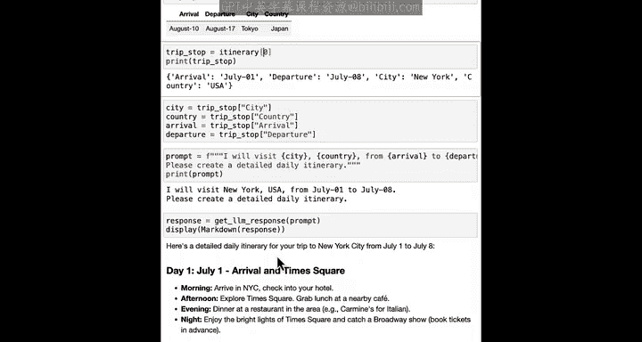
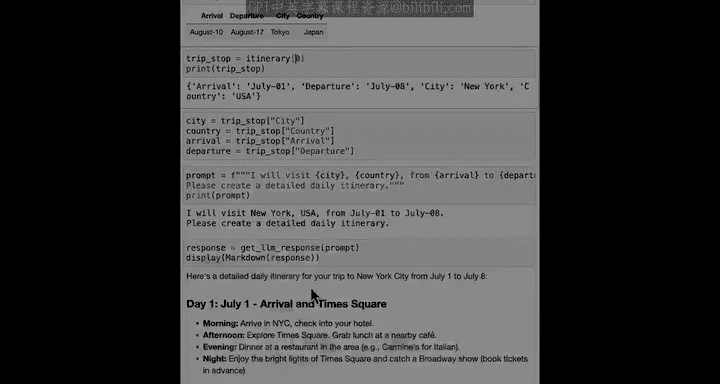

#  025：使用CSV文件规划假期 📅

在本节课中，我们将学习如何处理结构化的数据，特别是CSV文件。我们将了解如何读取CSV文件、从中提取信息，并使用Python代码（无需AI语言模型）来过滤数据，从而辅助我们规划假期行程。

---

## 文本文件与结构化数据

文本文件非常通用，可以用多种不同方式格式化。因此，我们有时称其为**非结构化数据**，因为文本文件几乎没有或完全没有预定义的结构。

相比之下，电子表格具有明确定义的格式或结构，数据整齐地排列在行和列中。这种看起来像带有行和列的表格的数据被称为**结构化数据**。

在Python中，处理像电子表格这样的结构化数据与处理非结构化文本文件略有不同。通常，你甚至可以不使用AI语言模型，而直接使用Python代码来处理它。

例如，如果你一直在电子表格中为梦想假期的每个目的地保存信息，其中一列指定了国家，那么你就可以使用Python来帮助你按位置筛选，并查看特定国家（如日本）的所有停留点。

---


## 处理行程表示例


在本节中，我们将使用一个处理行程表的例子，该表格如下所示：


每一行对应一个目的地，包含到达和离开时间。如果你要将此表格表示为CSV文件，它可能看起来像这样，其中每一行都有逗号分隔的四个值，对应表格的四列。

所以，如果你的计算机上有这样的CSV文件，你可以将这些数据加载到Python中。

---

## 读取CSV文件

让我们导入一些函数，这里的新命令是 `import csv`。

我的行程保存在一个名为 `itinerary.csv` 的文件中，因此这将打开该文件。

以下是用于将数据加载到 `itinerary` 变量中的代码。我们将详细讲解每一行的作用，但如果我现在直接运行它，最终会得到以下结果。

```python
import csv
from display_table import display_table

itinerary = []
with open('itinerary.csv', mode='r') as file:
    csv_reader = csv.DictReader(file)
    for row in csv_reader:
        itinerary.append(row)

print(itinerary)
```

这段代码会逐行读取CSV文件，并将其保存到列表 `itinerary` 中。让我关闭文件（如果我忘记的话）。如果我打印 `itinerary`，你会看到这个结果。你可以确认 `itinerary` 的类型。

让我们看看 `itinerary[0]`。这本身是一个字典，其键为 `arrival`、`departure`、`city`、`country`。因此，如果我使用 `itinerary[0]` 然后访问 `country` 键，最终会得到 `USA`。

现在你可能想知道这段代码做了什么。我鼓励你尝试使用聊天监视器并阅读解释，看看是否能理解。但我们将一起详细讲解。

---

## 代码详解

这是我们刚才用来读取 `itinerary.csv` 的代码。

第一行以读取模式打开文件。中间部分的代码读取文件内容并将其分配给 `itinerary` 变量，然后关闭文件。

让我们深入探讨这段代码中间部分的作用。

第一行 `csv_reader = csv.DictReader(file)` 使用了我们导入的 `csv` 模块，它将使用字典来存储每一行的数据。

接下来，`itinerary` 初始化为一个空列表。最后，这段代码遍历CSV文件的每一行，并将该行的内容添加到 `itinerary` 列表的末尾。

现在，打印 `itinerary` 会得到这个结果，有点难以阅读。因此，我还提供了一个我们导入的 `display_table` 函数，它能以美观的方式打印出表格。

这不是很好吗？

---

## 过滤结构化数据

对于像这样的表格形式的结构化数据，通常更可行的是过滤信息，甚至无需使用AI语言模型。

例如，如果你想获取所有位于日本的目的地，以下是你可以做的。

```python
filtered_data = []
for trip_stop in itinerary:
    if trip_stop['country'] == 'Japan':
        filtered_data.append(trip_stop)

display_table(filtered_data)
```

这段代码的意思是：遍历行程中的所有行，如果国家是日本，则将该停留点添加到 `filtered_data` 中。如果我这样做，然后调用 `display_table(filtered_data)`，最终会得到对应日本的那一个停留点。

---

## 使用行程建议活动

现在让我们使用行程来建议旅行活动。

首先，检索第一个目的地，即美国的纽约市。

我们可以设置 `trip_stop = itinerary[0]`，因为记住，0对应列表中的第一个条目。这是一个在纽约、美国的停留点。

现在，让我们将该停留点的所有关键数据存储到四个新变量中：`city`、`country`、`arrival`、`departure`。提醒一下，这是访问字典中特定键的代码。

然后，我将创建一个语言模型提示，内容是：“我将访问 `city` `country`，从 `arrival` 到 `departure`。请创建详细的每日行程。”让我们获取模型的响应并显示它。

这会创建一个相当有趣的行程。7月4日是美国独立日，因此它建议去看7月4日的烟花表演。

我鼓励你在看完这个视频后尝试自己的变体。为什么不做出一些改变，看看是否也能得到一个有趣的行程呢？

---

## 总结与展望

我希望你在思考潜在假期时能获得乐趣。当你完成对这个笔记本的探索后，我期待在下一节课见到你，在那里你将学习如何定义自己的函数。

你已经看到，有些代码行我们最终会反复编写，例如，打开文件、从该文件读取文本、然后关闭文件。在下一节课中，你将看到定义自己的函数如何让你重新运行一组命令，而无需反复编写它们，这种方式比完整的循环更灵活。

期待在下一节课见到你。






