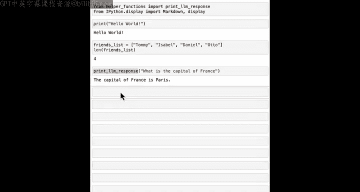
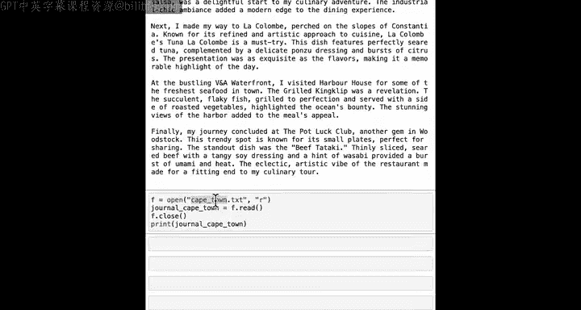
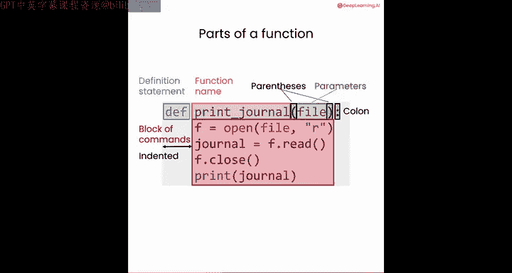
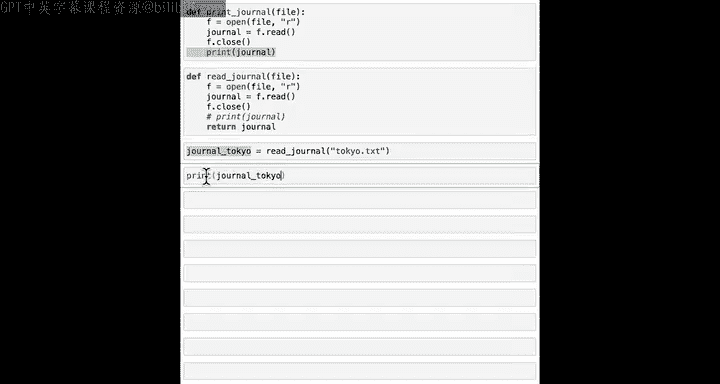
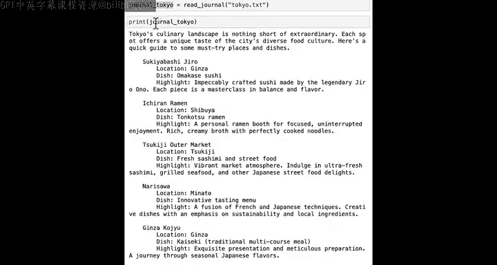
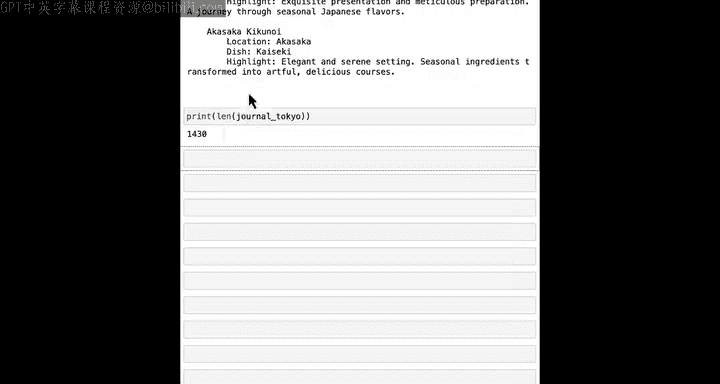
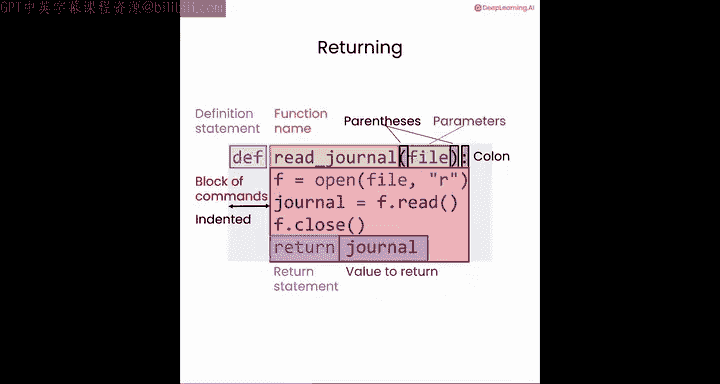
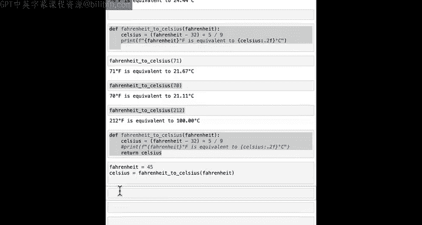
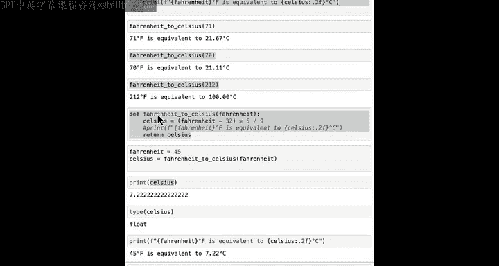

#  026：将代码块转换为可重用函数 🧩

在本节课中，我们将要学习Python中一个非常强大的概念——函数。我们将了解如何将重复的代码块封装成可重用的函数，从而提高代码的效率和可读性。


在前几门课程中，你可能已经注意到，我们偶尔会重复执行某些步骤。例如，反复执行打开文件、读取内容、然后关闭文件的操作；或者定义几个变量，使用f-string创建提示词，然后让大语言模型根据该提示词生成响应。


我们已经看到，`for`循环可以帮助你连续多次执行相同的操作。但`for`循环要求你连续地、一个接一个地多次执行该操作，而不是说先加载读取一个文件，然后可能做一些其他事情，再读取另一个文件。这与`for`循环那种一个文件接一个文件加载的刚性结构不同。

然而，Python提供了另一种非常有用的创建可重用代码块的方法，称为**函数**。

函数是编程中一个非常重要的概念，所有现代编程语言都提供了定义和使用函数的方法。


在本课程和前几门课程中，你已经在许多地方遇到并使用过函数。在本节课中，你将学习如何创建自己的函数，并了解它们如何帮助你避免重复代码和反复输入相同的内容。


函数很重要，让我们看看如何创建它们。


## 什么是函数？ 🔧


函数是一组可重用的命令，帮助你执行特定任务。你已经见过`print`函数，或者`len`函数（给定一个列表，返回其长度），或者`print`大语言模型的响应。

现在，让我们看看为什么你可能想要定义自己的函数。


之前，我们写过这样的代码块来打开文件、读取内容并打印从文件中加载的文本。


```python
f = open("Sydney.txt")
journal = f.read()
f.close()
print(journal)
```

如果我想对另一个城市（如巴黎）执行此操作，我必须这样做，并将文件名替换为“Paris.txt”。

我不想一遍又一遍地这样做。因此，我将定义一个名为`print_journal`的函数。





## 定义第一个函数 📝

以下是定义函数的代码：

```python
def print_journal(file):
    f = open(file)
    journal = f.read()
    f.close()
    print(journal)
```

现在，你可以对“Sydney.txt”调用`print_journal`函数，让它加载并打印出文件内容。然后，如果你想要“Paris.txt”的内容，你可以再次调用它。

让我们仔细看看这里的每一行代码做了什么。

`def`是一个特殊的命令，它告诉Python你想要定义一个新函数。`print_journal`是函数的名称。然后是一对括号，括号内是变量名`file`。`file`被称为这个函数的**参数**。这意味着当你使用或调用这个函数时，这个函数期望你给它一个文件名。

接着是一个冒号，后面跟着一个缩进的代码块。函数将运行这四行代码，即设置`f`等于打开文件、读取内容、关闭文件并打印日志。因此，每次调用`print_journal`函数时，都会运行这四行代码。这与你反复使用的四行代码完全相同。



## 返回值的函数 🔄

上面我们定义了一个函数来加载和打印日志。但如果你想要一个加载日志但不立即打印的函数呢？

让我定义一个不同的函数。我将把它放在下面，以便你可以比较这两个函数。

```python
def read_journal(file):
    f = open(file)
    journal = f.read()
    f.close()
    return journal
```

首先，函数名从`print_journal`改为了`read_journal`。其次，我们移除了`print`语句，并添加了一行`return journal`。

`return`命令的作用是让`read_journal`函数获取`journal`的值并将其返回。如果我调用`read_journal("Tokyo.txt")`，这个函数将返回一个值。因此，我可以定义一个新变量`journal_tokyo = read_journal("Tokyo.txt")`。运行后，`journal_tokyo`将被设置为函数返回的值。

现在，如果你打印`journal_tokyo`，你会得到我们之前看到的文章。由于你将内容保存在变量`journal_tokyo`中，你还可以做其他事情，比如打印这篇文章的长度。

详细解释一下我们刚才看到的内容：除了将`print`语句改为`return`语句外，其他部分与之前相同。`return`语句获取`journal`的值并将其返回。在这种情况下，返回的值是变量`journal`所持有的值。

## 另一个实用示例：温度转换 🌡️

让我们再看一个例子。之前，你看到Python可以执行计算，比如将华氏度转换为摄氏度，使用的代码如下：



```python
fahrenheit = 72
celsius = (fahrenheit - 32) * 5 / 9
print(celsius)  # 输出 22.22
```







如果你想转换另一个温度，你可以再次编写这段代码。例如，68华氏度是20摄氏度，76华氏度是24.44摄氏度。因此，如果你想转换多个温度，最终可能会反复编写这段代码。

以下是定义一个函数来进行转换的方法：

```python
def fahrenheit_to_celsius(fahrenheit):
    celsius = (fahrenheit - 32) * 5 / 9
    print(celsius)
```

我定义了一个名为`fahrenheit_to_celsius`的函数，并输入参数`fahrenheit`，它表示华氏温度。必须有一个冒号，然后是一个缩进的代码块。转换到摄氏度的公式是`(fahrenheit - 32) * 5 / 9`，然后我们可以在这里使用`print`语句。

现在，如果我运行这段代码，它就定义了`fahrenheit_to_celsius`函数。现在，如果我调用这个函数并传入71，它会进行转换。如果我要求它转换70度，或者转换212华氏度到摄氏度，结果是100度。

你会发现，如果没有函数，如果你想转换不同的温度，你会反复编写非常相似的代码。但有了函数，你可以定义函数一次，然后反复使用它。因此，右边的代码比之前的例子要短得多。

## 使用`return`语句的函数 📤

在上一个例子中，函数没有返回任何值，它只是将结果打印到屏幕上。为了保存温度转换的结果，你可以使用`return`语句。

因此，我们可以不使用`print`语句，而是让它返回`celsius`值。

```python
def fahrenheit_to_celsius(fahrenheit):
    celsius = (fahrenheit - 32) * 5 / 9
    return celsius
```



现在，当我运行这段代码时，我定义了一个新的`fahrenheit_to_celsius`函数。现在，如果我说`fahrenheit = 45`，`celsius = fahrenheit_to_celsius(fahrenheit)`，然后打印摄氏温度，你会得到7.222。你还可以对`celsius`做其他事情，比如查看它的类型，在这种情况下它是一个浮点数。

## 动手练习 ✍️

我们已经编写了将华氏度转换为摄氏度的函数。你能修改这段代码来转换摄氏度到华氏度，或者转换英尺到米吗？



我希望你享受使用函数的乐趣，毕竟“function”（函数）这个词里就包含着“fun”（乐趣）。在下一课中，我们将把你目前所看到的一切整合起来，使用文本和CSV文件来规划一次完美的环球度假。下节课见！