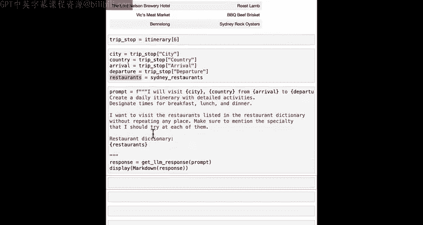
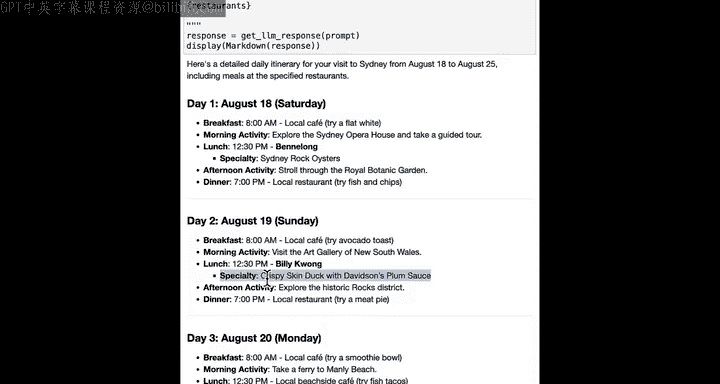
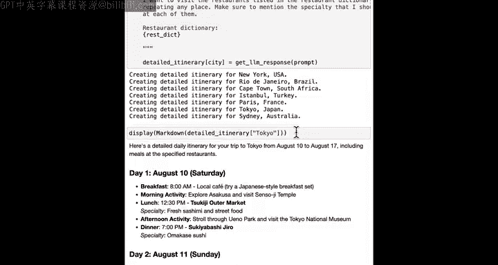
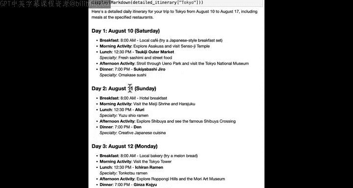
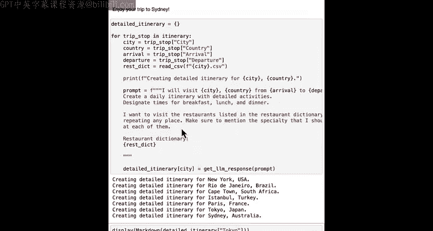

#  027：为多个城市创建行程


在本节课中，我们将综合运用之前学到的所有知识，来规划一次环球旅行。我们将学习如何遍历一组文件，为每个文件提取关键信息，并利用这些信息调用大语言模型，最终借助Python和AI的力量，规划出完整的旅行行程。


## 概述


上一节我们学习了如何处理文件和结构化数据。本节中，我们将看看如何将这些技能结合起来，构建更复杂的工作流。具体来说，我们将遍历多个城市的旅行数据文件，为每个城市生成包含餐厅推荐和详细活动的个性化行程。


## 处理单个城市的行程


首先，让我们回顾一下如何为单个城市（例如悉尼）创建详细行程。我们需要读取该城市的旅行日志和餐厅数据。

### 读取CSV文件

我们定义一个函数来读取CSV格式的文件。这个函数会打开文件、加载数据并返回。

```python
def read_csv_file(filename):
    with open(filename, 'r') as file:
        data = csv.reader(file)
        return list(data)
```

运行此函数后，我们可以将CSV数据加载到变量中并显示。

### 生成详细行程

接下来，我们使用大语言模型为悉尼生成详细行程。我们需要提供城市、国家、抵达和离开日期，以及从CSV文件加载的餐厅字典。

以下是用于提示大语言模型的模板：

```
为{city}, {country}从{arrival}到{departure}的访问创建一个详细的每日行程，包含详细的活动，并指定早餐、午餐和晚餐的时间。我们希望参观列在以下餐厅字典中的餐厅：{restaurants}。
```

我们将使用f-string来插入变量，获取大语言模型的响应，并显示结果。运行此代码会生成一个包含餐厅推荐和活动安排的详细行程。



## 为所有城市创建行程



现在，我们已经掌握了为单个城市创建行程的方法。本节中，我们将看看如何为行程中的所有城市自动完成这一过程。

### 初始化与循环

我们首先创建一个空字典来存储所有城市的详细行程。

```python
detailed_itineraries = {}
```

然后，我们遍历行程中的每个旅行站点。对于每个城市，我们设置城市、国家、抵达和离开日期等变量，并从对应的CSV文件（例如 `Sydney.csv`）加载餐厅数据。



### 构建提示并获取响应

在循环中，我们为每个城市构建与大语言模型交互的提示。提示结构与之前类似，但会动态插入每个城市的具体信息。

```
为{city}从{arrival}到{departure}的访问创建详细行程，包含早餐、午餐和晚餐。餐厅字典如下：{restaurant_dictionary}。
```





接着，我们获取大语言模型对该提示的响应，并将结果保存到 `detailed_itineraries` 字典中，以城市名为键。


### 查看结果

循环完成后，所有城市的详细行程都保存在字典中。例如，要查看东京的行程，可以执行：


```python
display_markdown(detailed_itineraries['Tokyo'])
```

## 实践与探索

本节我们快速浏览了大量代码。请务必亲自运行代码并仔细阅读，以确保理解。我鼓励你修改代码进行探索，例如，可以告诉大语言模型你是一个早起者，希望行程从每天早上6点开始；或者你习惯晚起，不希望每天上午11点前起床。请查看不同城市的行程安排。记住，如果对任何代码有疑问，你随时可以咨询你的AI聊天助手。


## 课程总结


恭喜你完成本课程！在本节课中，我们一起学习了：


*   如何综合运用文本和CSV文件处理技能。
*   如何利用大语言模型为多个城市自动生成详细旅行行程。
*   通过遍历文件和数据，构建自动化工作流的方法。


几年前，要实现本课程中展示的内容会非常困难，甚至对于经验丰富的程序员来说也可能无法实现。但得益于AI语言模型的普及，即使是编程新手，现在也能构建出几年前世界上最优秀的程序员都难以完成的应用程序。这正是一个学习编程和使用AI的激动人心的时代。现在，初学者能够实现的事情范围正在迅速扩大，有很多事情是地球上还没有人做过的。因此，为你自己、你的家人、朋友、在工作和家庭中编写代码来提供帮助的机会是巨大的。


希望你在看到编写代码所能实现的一些功能后，能继续探索如何将其应用于你自己的数据和兴趣领域。在本系列简短课程的第四门也是最后一门课程中，你将学习如何访问这些预先编写好的Python程序（称为包或库）。这将让你能够使用大量非常强大的函数，仅用几行代码就能完成真正强大的事情。最后一门课程中的示例将会是最有趣的，我期待在那里见到你。