#  029：从本地文件导入函数 📂


在本节课中，我们将要学习如何从本地文件中导入函数。这是复用代码、组织项目以及使用他人编写好的工具函数的关键技能。


在上一节课程中，我们学习了如何使用 `def` 命令来定义函数，例如定义华氏度转摄氏度的转换函数。


## 导入函数的方法

除了自己定义函数，另一种将函数引入代码的方式是使用 `import` 命令。在之前的代码中，你可能见过类似 `from helper_functions import print_llm_response` 或 `display_table` 的语句。

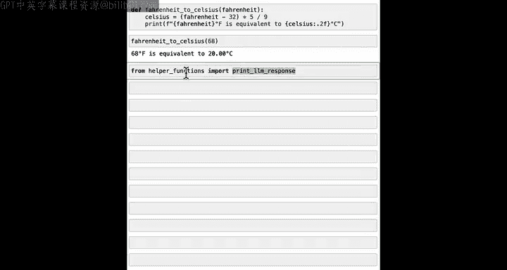

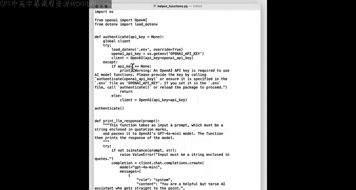

实际上，`import` 是 Python 用于从计算机上的某个位置加载一个或多个函数的命令。

## 深入理解 `import` 命令 🛠️

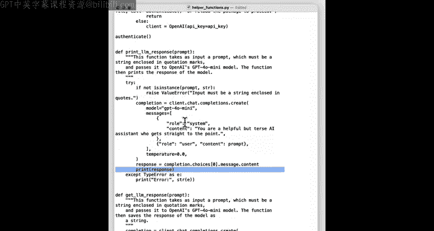

让我们深入了解一下 `import` 命令背后的实际运作机制。

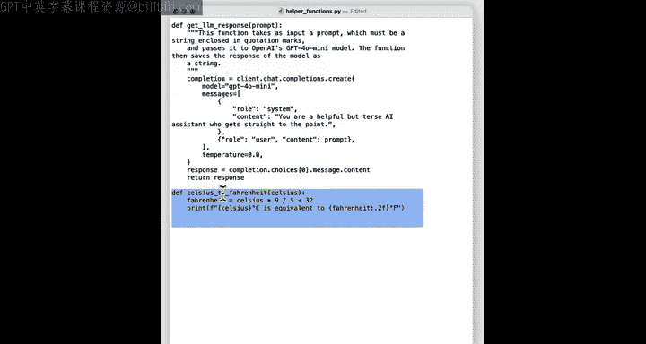

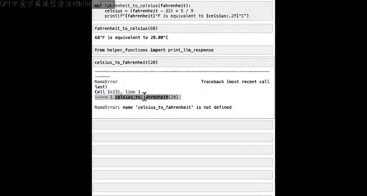

在 Python 中，函数允许你将执行某个动作（并可能返回值）的一段代码打包在一起。例如，我们之前定义的华氏度转摄氏度函数。在课程中，你看到的 `from helper_functions import print_llm_response` 这类代码，其本质是 Python 在寻找一个名为 `helper_functions.py`（`.py` 代表 Python 文件）的文件，并从中加载 `print_llm_response` 函数。


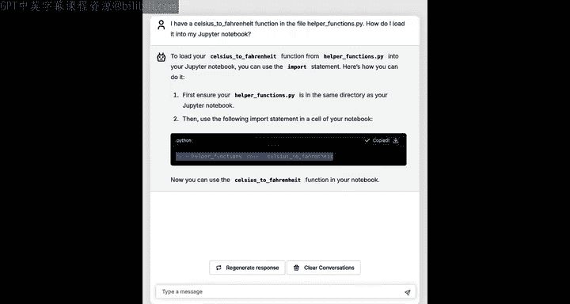

`helper_functions.py` 文件的内容是我们预先编写好的一系列函数定义，例如 `def print_llm_response` 函数，它接收一个提示词，进行一些处理，最终打印出响应。该文件还包含一个我们新定义的 `celsius_to_fahrenheit` 函数，用于执行转换并打印结果。

那么，如何将这个文件中的函数引入到你的代码中呢？

## 实践导入过程

如果直接调用 `celsius_to_fahrenheit(20)`，会导致错误，因为该函数在当前环境中尚未定义。

以下是几种使用 `import` 命令的方法：

### 方法一：导入特定函数
你可以从文件中导入你需要的特定函数。
```python
from helper_functions import celsius_to_fahrenheit
```
运行这行代码后，你就可以直接使用 `celsius_to_fahrenheit(20)` 了。

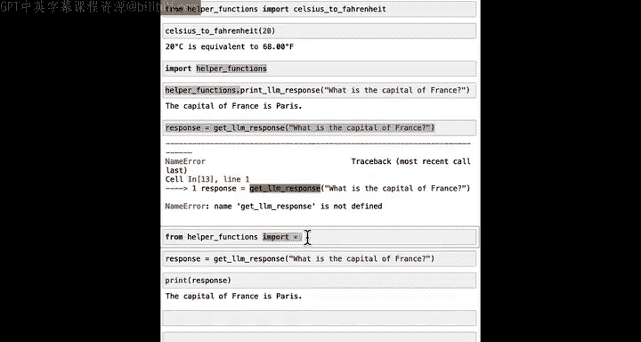

### 方法二：导入整个模块
你也可以导入整个文件（称为“模块”）。
```python
import helper_functions
```
这种方式会导入 `helper_functions.py` 中定义的所有函数。但在调用时，需要在函数名前加上模块名作为前缀。
```python
helper_functions.print_llm_response("What is the capital of France?")
```

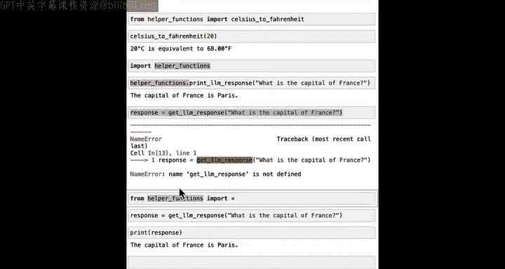

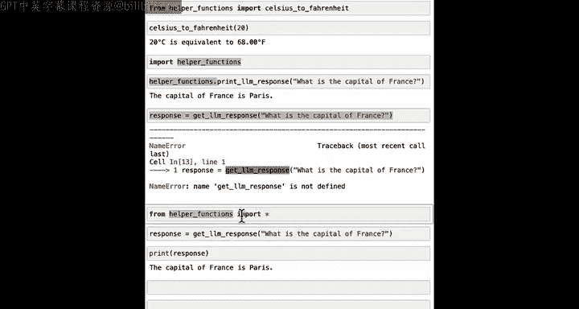

### 方法三：导入所有函数（不推荐）
使用 `from ... import *` 可以导入模块中的所有函数。
```python
from helper_functions import *
```
这样，你可以直接调用 `get_llm_response("What is capital France?")` 而无需前缀。但我不常使用这种方法，因为它会导入大量可能不需要的函数，不够清晰。

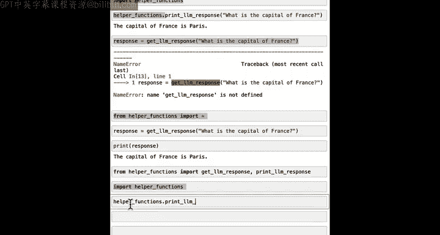

我个人的习惯是只导入需要的特定函数，或者导入整个模块并在调用时使用 `module.function()` 的格式。

## 本节总结

本节课中，我们一起学习了如何从本地文件（如 `helper_functions.py`）导入函数。主要方法有：
*   `from file import function`：从指定文件导入特定函数。
*   `import file`：导入整个文件模块，调用时使用 `file.function()`。
*   `from file import *`：导入文件中的所有函数（谨慎使用）。

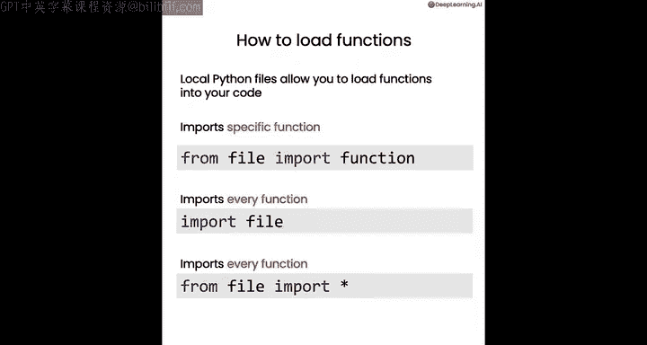

Python 还内置了许多称为“包”的函数库，它们不一定对应你当前目录下的文件，也无需预先安装。在下一节视频中，我们将学习如何从这些内置包中导入函数，你会发现这些函数能极大地提升你的编码效率。我们下节课见。