#  030：内置包 📦

在本节课中，我们将要学习如何使用Python内置的包。Python自带了许多功能强大的工具和函数，例如处理CSV文件、进行数学运算、统计分析以及绘制简单图形等。这些内置包由Python语言的支持团队维护，你无需一次性掌握所有，可以根据代码需求选择性地导入。本节课我们将重点学习如何导入和使用数学、统计以及随机数相关的包，为下一课学习第三方包打下基础。


---


## 导入与使用数学包 🧮

上一节我们介绍了Python内置包的概念，本节中我们来看看如何使用数学包进行基础运算。

Python内置的`math`包提供了丰富的数学函数和常数。你可以将其想象为一本关于数学的参考书，在需要时从中选取特定的工具。

以下是导入和使用`math`包中函数的示例：


```python
from math import cos, sin, pi

print(pi)  # 输出圆周率π的近似值
```

在上面的代码中，我们从`math`包中导入了余弦函数`cos`、正弦函数`sin`以及常数`pi`。常数`pi`是一个高精度的浮点数，代表圆的周长与直径之比。

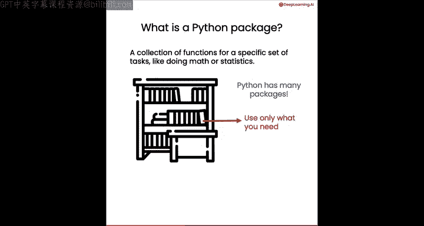

接下来，我们可以计算不同角度的余弦值：

```python
angles = [0, pi/2, pi, 3*pi/2, 2*pi]
for angle in angles:
    print(cos(angle))
```

你可以尝试将`cos`替换为`sin`，来计算这些角度的正弦值。

此外，`math`包还包含其他实用函数，例如向下取整函数`floor`：

```python
from math import floor
print(floor(5.7))  # 输出 5
```

---

## 使用统计包分析数据 📊

除了数学运算，Python还内置了用于统计分析的`statistics`包。

现在，我们来看看如何使用这个包来计算数据集的平均值和标准差。

以下是导入和使用`statistics`包的示例：

```python
from statistics import mean, stdev

heights = [165, 170, 175, 180, 185]  # 朋友的身高列表，单位厘米
print(mean(heights))    # 计算平均身高
print(stdev(heights))   # 计算身高的标准差
```

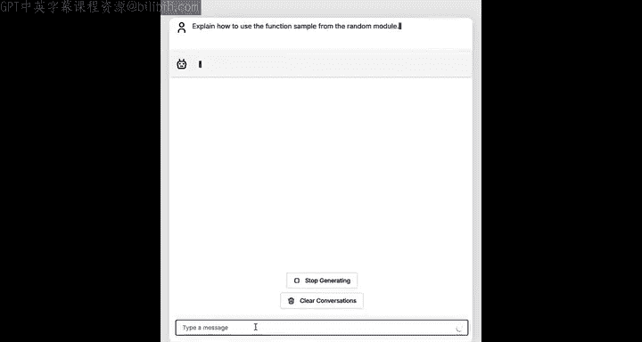

`statistics`包还提供了计算中位数、分位数等其他统计量的函数，可用于对数据进行简单的统计分析。

---

## 利用随机包增加不确定性 🎲

有时，我们希望程序能产生一些随机结果。Python的`random`包正是为此设计。

本节我们将学习如何使用`random`包中的`sample`函数，从列表中随机抽取元素。

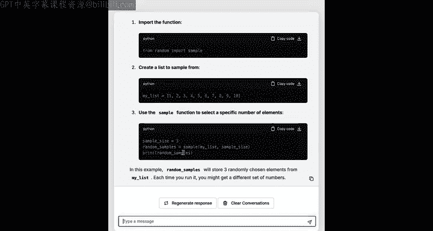

以下是一个有趣的应用示例：随机选择食材来生成新食谱。

首先，我们定义一些食材列表：

```python
spices = ["Paprika", "Oregano", "Cumin", "Cinnamon"]
vegetables = ["Broccoli", "Carrot", "Spinach", "Bell Pepper"]
proteins = ["Chicken", "Beef", "Tofu", "Salmon"]
```

然后，我们从每个列表中随机抽取指定数量的食材：

```python
from random import sample

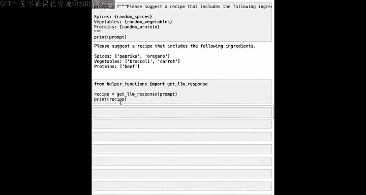

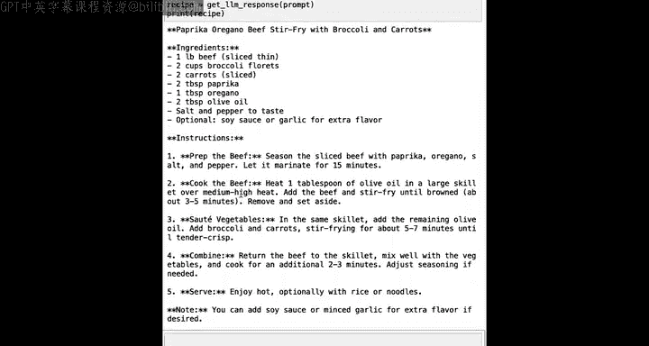

random_spices = sample(spices, 2)
random_vegetables = sample(vegetables, 2)
random_protein = sample(proteins, 1)

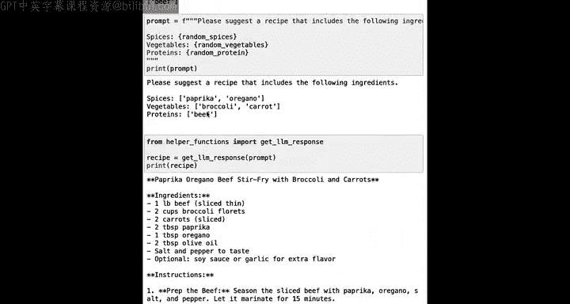

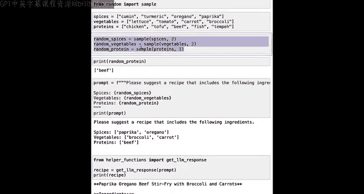

print(random_spices)
print(random_vegetables)
print(random_protein)
```

每次运行这段代码，你都会得到一组不同的随机食材组合。接下来，你可以将这些随机食材组合成一个提示词，发送给大语言模型来生成一个全新的食谱创意。

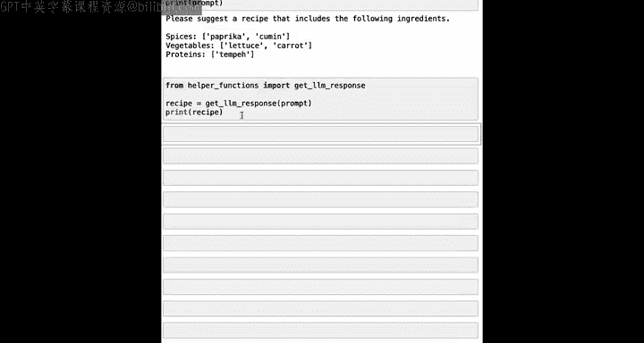

```python
prompt = f"Suggest a recipe using {random_spices}, {random_vegetables}, and {random_protein}."
print(prompt)
# 此处可以调用大语言模型API来获取食谱建议
```

通过导入`random`包中的`sample`函数，你可以编写出每次运行都能产生不同随机结果的代码，这为程序增添了趣味性和灵活性。

---

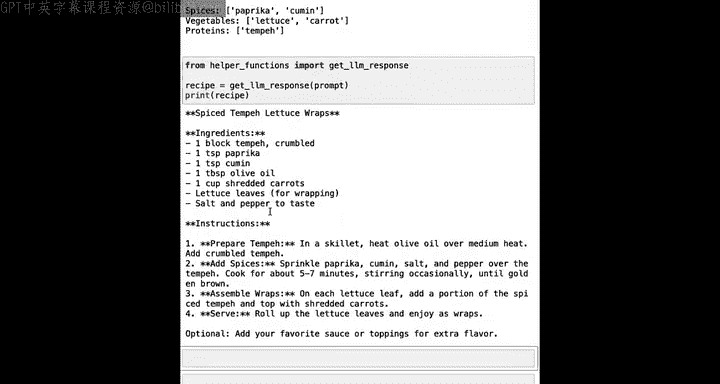

## 总结 ✨

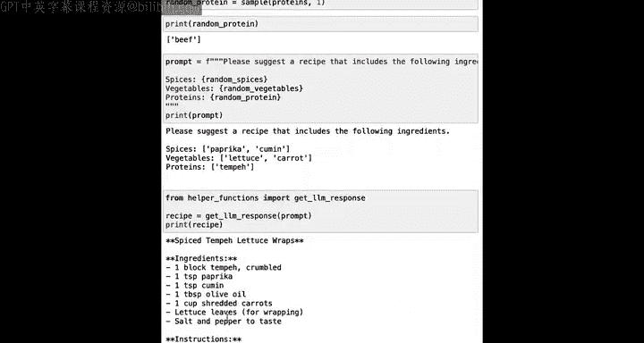

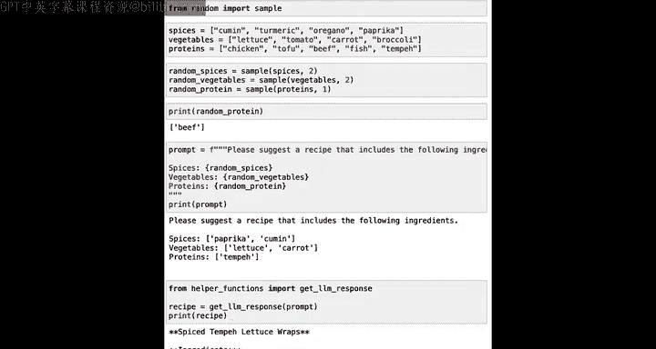

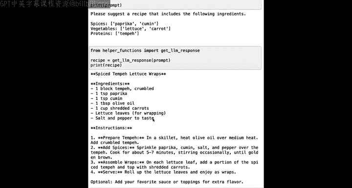

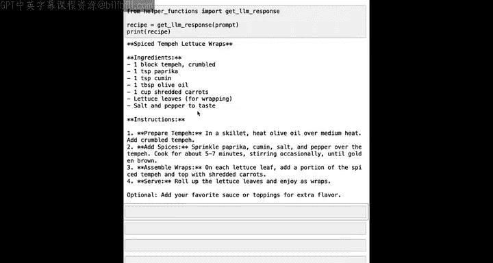

本节课中我们一起学习了Python内置包的使用方法。我们首先介绍了如何从`math`包导入函数来进行数学计算，然后使用`statistics`包对数据进行统计分析，最后利用`random`包为程序注入随机性。这些内置包是Python强大功能的基础组成部分。在下一课中，我们将超越内置包，探索如何从互联网下载和安装第三方包，这将极大地扩展Python的能力范围。