#  031：使用第三方包 🧩

在本节课中，我们将学习如何使用他人编写并分享的Python代码包，即第三方包。我们将重点介绍两个在数据处理和图表绘制中极为流行的包：`pandas`和`matplotlib`。通过它们，你可以高效地处理表格数据并创建可视化图表。


---


许多人编写了Python代码并在网上免费分享，供任何人使用。也许有一天你也会这样做。编写代码、在线分享并看到他人使用你的成果，会是一件非常酷且令人满足的事情。


得益于他人已在网上分享的代码，你可以通过下载和安装他们的包来利用他们的工作成果。

我将这些包称为**第三方包**，因为它们是由你或Python官方维护者之外的其他人编写的。

如今，至少有数十万个这样的第三方包存在。本节课中，你将看到一些由第三方开发的最流行的包，用于处理数据和绘制图表，这两者都是我在工作中经常使用的。你将看到的包叫做`pandas`和`matplotlib`。让我们开始吧。


---


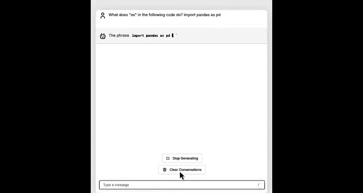

## 使用pandas处理数据 📊

最流行的Python第三方包之一是`pandas`，它常用于处理结构化数据，例如电子表格和CSV文件中的数据。需要说明的是，这里的“pandas”与可爱的动物无关，它来源于经济学术语“面板数据”的缩写。如果你想知道更多，可以询问AI助手或在线搜索。

导入`pandas`包最常见的方式是使用以下命令：
```python
import pandas as pd
```
这里的`pd`是一个新的东西。接下来，我们问问AI助手这行代码的作用。

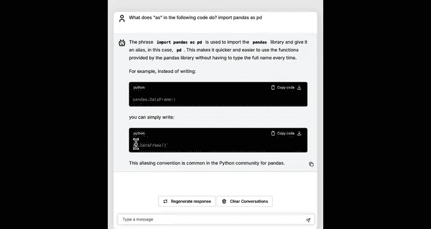

原来，如果你直接运行`import pandas`，那么在使用其功能时需要写成`pandas.函数名()`。但如果你不想每次都输入`pandas`，而想用`pd`作为简短的别名，那么`import pandas as pd`就告诉Python：加载`pandas`包，但在后续代码中将其称为`pd`。这让我们可以写`pd.函数名()`而不是`pandas.函数名()`，节省了一些打字时间。我提到这一点是因为，如果你让AI助手编写使用`pandas`包的代码，它很可能会使用`import pandas as pd`这种形式。

在本节中，我们将使用一个关于二手车售价的数据集。该数据改编自一个公开URL，由Nehalal Burer等人提供。我将使用`pandas`的`read_csv`函数读取数据，然后将其打印出来。

`pandas`也允许你筛选重要信息。例如，你可以获取所有售价高于10,000美元的汽车数据。`pandas`有很多不同的命令，很难全部记住。

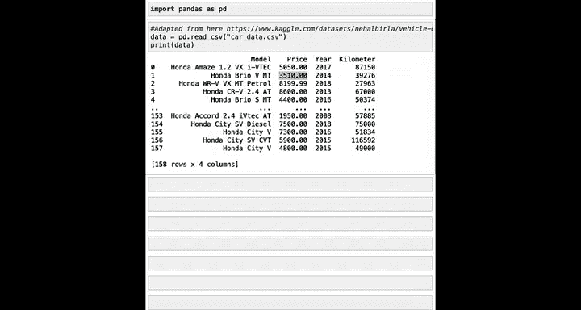

但事实证明，我们的AI助手非常了解`pandas`。我们使用代码加载一些数据，告诉AI助手数据的样子，并希望筛选出售价大于等于10,000美元的数据。

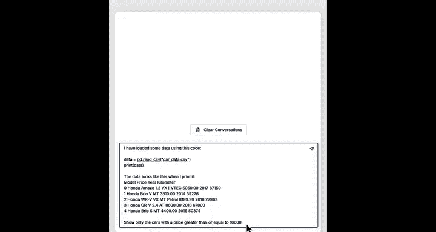

我们运行它，AI助手说你可以使用以下语法来筛选数据：
```python
filtered_data = data[data[‘Selling_Price’] >= 10000]
```
如果你想知道这具体做了什么，可以随时请AI助手解释。我将直接复制这段代码片段。

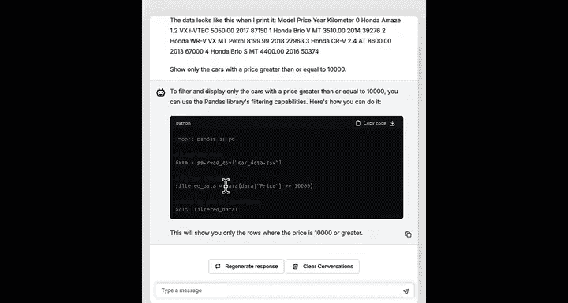

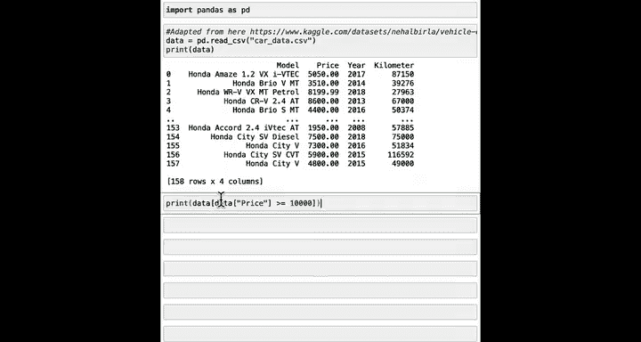

回到Jupyter笔记本，我们打印从AI助手那里得到的筛选结果。现在，它打印出了售价超过10,000美元的汽车数据。

或者，如果你想找到所有年份为2015年的汽车，你也可以这样做，这会打印出2015年款的汽车。

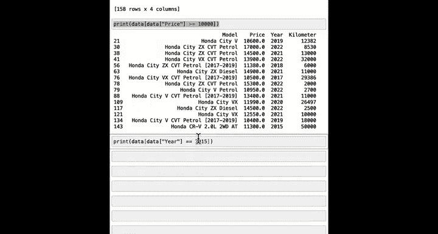

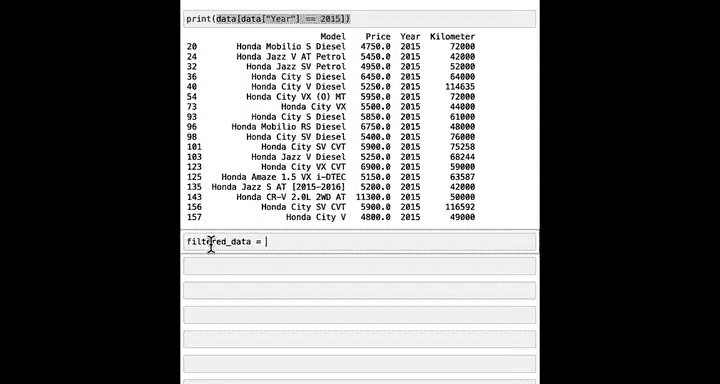

以下是另一个你可以做的操作。你可以说：
```python
filtered_data = data[data[‘Year’] == 2015]
```
我们也可以打印`filtered_data`，然后查看所有2015年款汽车的价格，并打印出中位数价格。这相当于查看所有这些价格，并打印出2015年所有汽车的中位数价格。看起来5,465美元是该年份汽车的中位数价格。

我知道我在这里展示了很多不同的例子。你不需要记住任何特定的代码行，因为如果你想要筛选数据、计算平均值或中位数，我鼓励你向AI助手寻求帮助。顺便说一下，`pandas`是一个非常强大的工具，专业的数据科学家在日常工作中也使用完全相同的`pandas`包。

---

## 使用matplotlib绘制图表 📈

除了操作数据，另一个非常流行的用于绘制图表的包叫做`matplotlib`。要从`matplotlib`导入绘图函数，最常见的代码行是：
```python
import matplotlib.pyplot as plt
```
这个包名有点不寻常，因为中间有一个点。但就我们的目的而言，你不需要担心那意味着什么。

导入`plt`函数后，我可以使用`plt.scatter`绘制一个散点图，展示价格与行驶里程的关系。如果我运行它，会显示一个图表，其中X轴是行驶里程（公里），Y轴是价格（美元）。

事实证明，如果你想给坐标轴添加标签，可以添加一些额外的命令。如果我重新运行，你会得到一个看起来像这样的图表。

有时你会看到开发者多写一行`plt.show()`，这明确告诉Python显示图表。让我也这样做。这样我们就得到了一个关于价格与里程的漂亮图表。

现在，操作数据时你可能想做的一件事是修改已有的图表。例如，如果你想给图表添加网格线，将散点图的颜色改为红色，并增大标题字体大小，该怎么做呢？

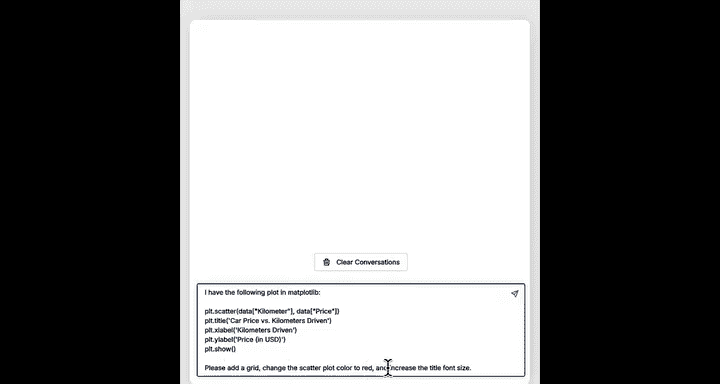

我们可以向AI助手提问：“对于下面的绘图命令，请添加网格线，将散点图颜色改为红色，并增大标题字体大小。”让我们看看它是否能为我们解决这个问题。

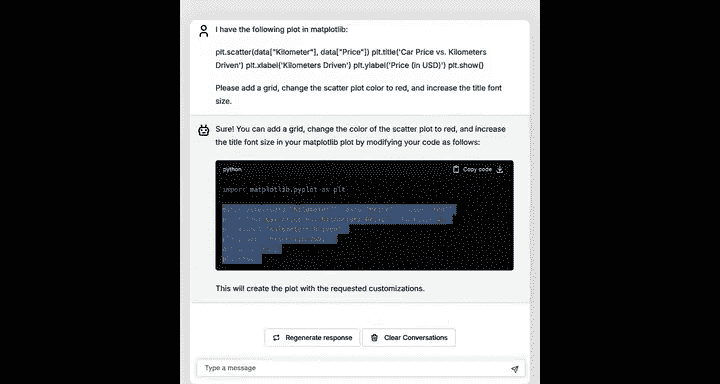

我将直接获取代码并运行，看看是否有效。然后我运行它，图表中点的颜色变成了红色，并且添加了网格线，标题字体也变大了。

AI助手并不总是给你完全正确的代码，但它们通常工作得相当好。因此，许多开发者会让AI助手生成代码，快速检查一下确保它看起来合理，然后运行看看是否有效。有时它可能不工作。但如果你去告诉AI助手：“谢谢，但它不太对，字体或列名不是我预想的。”有时你可以让AI助手再试一次，第二次得到正确答案的机会更大。但在这里，它第一次就工作得很好。

---

## 总结 ✨

在本节课中，你尝试使用了两个第三方包：`pandas`包和`matplotlib`包。你看到了在使用它们之前需要先导入函数。这种导入命令与你用于内置包（如`math`包）或保存在文件中的函数（如`helper_functions`文件）非常相似。

对于Python内置包，它们已经是Python的一部分，你不需要安装它们。在这个Jupyter笔记本环境中，我们已经确保`pandas`和`matplotlib`已经安装好了。

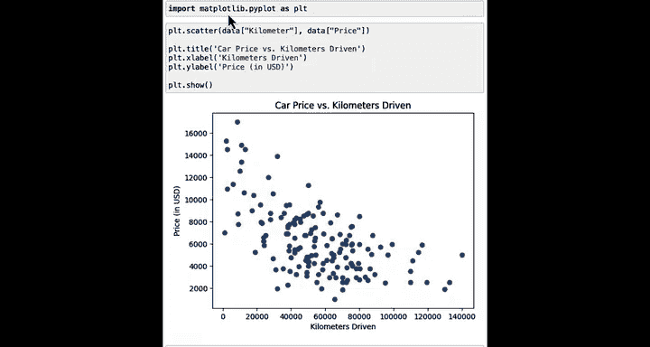

但是，还有很多第三方包尚未安装在你的电脑或特定的Jupyter笔记本环境中。那么，你如何让你的电脑连接到互联网，去下载并安装一些全新的第三方Python包呢？让我们进入下一课来学习如何做到这一点。