#  032：安装Python包


在本节课中，我们将要学习如何在Jupyter Notebook中安装Python包。你将了解安装包的基本流程，并通过安装`bs4`和`ai-setup`这两个具体的包来实践。掌握这项技能后，你将能够在自己的环境中使用各种强大的Python库。

## 概述


到目前为止，本网站上的所有Jupyter Notebook都已预先安装了运行所需的所有包。


但是，如果你在单独的Jupyter Notebook中工作，例如在你自己的电脑上而非本网站，你可能需要自己安装一些包。


在本课程后期，如果你有兴趣，会看到如何在自己的电脑上设置Python运行环境。

在本节课中，你将看到下载和安装包的过程是怎样的。你将完成一个用于解析HTML网页的包的安装过程。


## 安装包的基本方法


安装Python包有多种方式。这里，我将介绍如何直接在Jupyter Notebook中完成安装。

我们想在本节课中使用一个名为`bs4`的包来解析HTML网页。要安装`bs4`包，我使用命令`!pip install`，后面跟上包名。

```python
!pip install bs4
```


运行此命令后，我的电脑将联网查找`bs4`包，然后下载并安装它。看起来它已成功安装`bs4`版本0.0.2。顺便说一下，`bs4`代表Beautiful Soup版本4。Beautiful Soup这个名字引用了《爱丽丝梦游仙境》中的一首诗，如果你好奇这个名字的由来，可以在网上搜索或询问AI聊天机器人。


这是一个用于解析HTML网页的Python包。`bs4`是一个相对较小的包，所以它在几秒钟内就安装完成了。有些包可能需要几分钟才能安装。

安装此包后，你就可以导入该包或其包含的任何函数。

## 使用已安装的包

我将从刚刚安装的`bs4`包中导入`BeautifulSoup`函数。这里，`bs4`是包名，`BeautifulSoup`是函数名。对于今天要使用的例子，我们还需要导入一些其他东西。

以下是需要导入的模块和函数：

```python
from bs4 import BeautifulSoup
import requests
import helper
from IPython.display import display, HTML
```

*   `requests` 将用于下载网页。
*   `helper` 是辅助函数。
*   `from IPython.display import display, HTML` 用于在Jupyter Notebook中打印HTML网页。

## 实践：从网页抓取文本

要从网络抓取数据，首先需要获取网页的内容。这里有一个URL，它实际上是我在一份名为“The Batch”的每周通讯中写的一封信的链接。

为了获取这个URL，我将使用`requests`库。

```python
url = "https://example.com/the-batch-letter"  # 示例URL
response = requests.get(url)
```

我们使用了点号表示法`requests.get(url)`。如果我们之前写的是`from requests import get`，那么就可以直接写`get(url)`，但这是程序员使用`requests`包更常见的方式。

现在，让我们看看网页实际是什么样子。下面的代码将在Jupyter Notebook中显示该网页地址的URL，技术上是在一个叫做`iframe`的东西里。

```python
display(HTML(f'<iframe src="{url}" width="800" height="600"></iframe>'))
```

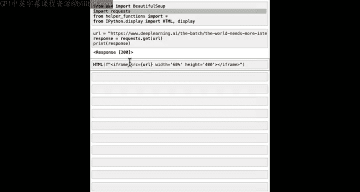

这显示了我写的那封信，内容是关于为什么我认为世界会因更多智能而变得更好。如果你愿意，可以随时在你自己的网络浏览器中加载这个URL，你会看到相同的网页。

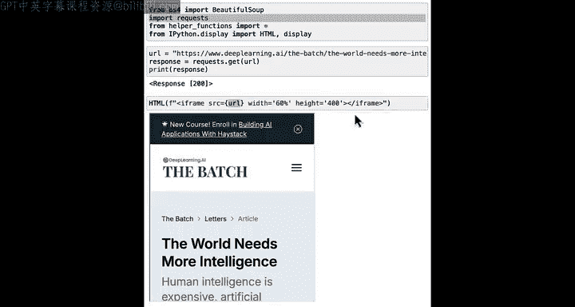

这个网页包含许多元素。有一个菜单栏，有许多不同的字体，有一个徽标图片，下面还有另一张图片。它有一堆指向其他网页的链接。所以这里有很多不同的东西。

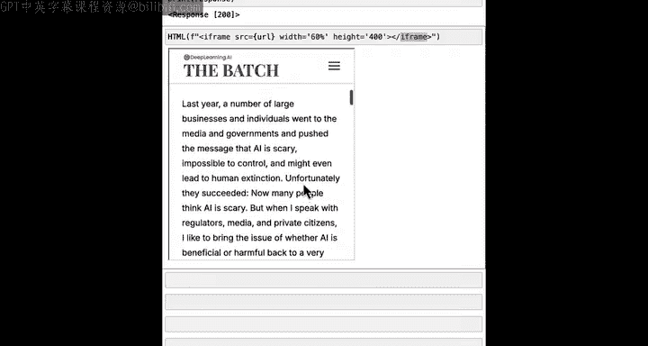

但是，如果你想使用你的大语言模型来为你总结这封信，你可能只想提取其中的主要文本。

使用Beautiful Soup，你可以获取我们之前得到的响应，并仅提取网页的文本。

```python
soup = BeautifulSoup(response.content, 'html.parser')
paragraphs = soup.find_all('p')
combined_text = ' '.join([para.get_text() for para in paragraphs])
print(combined_text)
```

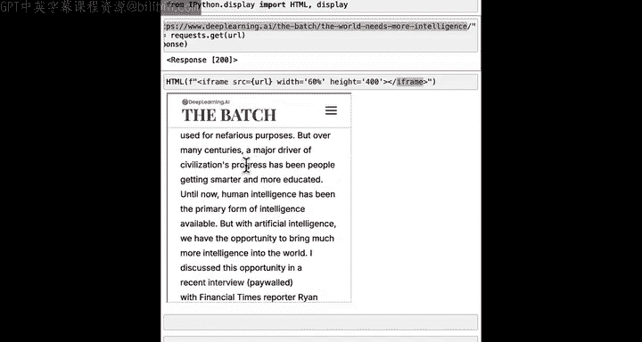

如果你需要自己编写这样的代码，不必过于担心细节，实际上你可以请AI聊天机器人为你编写代码。

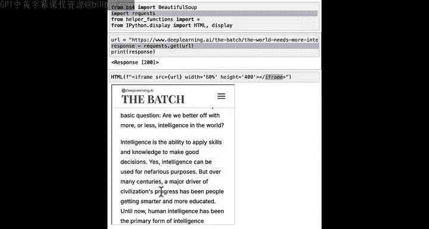

我使用Beautiful Soup从响应中获取文本并解析（即解释）HTML，然后找到HTML页面中所有段落里的文本，最后将所有内容合并成一个巨大的文本并打印出结果。

这样做之后，你最终会得到信中的文本。如果在你运行此代码时网页内容已更改，你自己运行时可能会得到略有不同的结果。

但希望你能看到，如何获取像这样的文本并将其传递给大语言模型，让它为你生成要点摘要，因为我们在这里打印的组合文本只是一个字符串，然后你可以将其插入到大语言模型的提示词中。

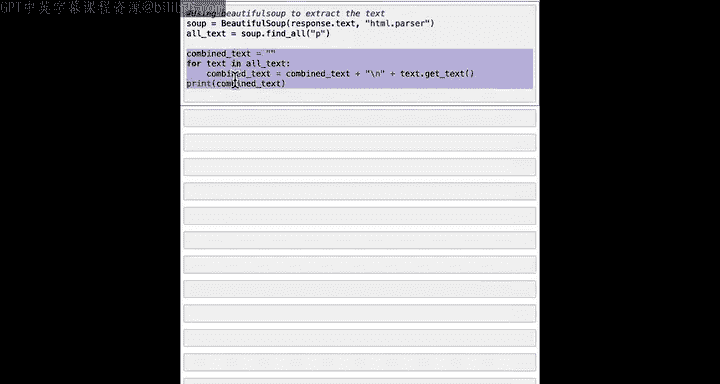

事实上，如果你想这样做，这里有一个提示词：“从文本中提取关键要点”，后面跟着`combined_text`，然后是`print_response`。

```python
prompt = f"""
请从以下文本中提取关键要点：
{combined_text}
"""
print_response(prompt)
```

这样，它就从信中提取出了最重要的要点。

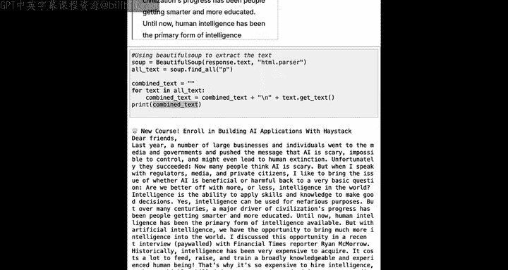

## 核心要点

我向你展示这些的主要目的并不是专门介绍Beautiful Soup，尽管如果你想了解这段代码具体在做什么，可以询问AI聊天机器人。

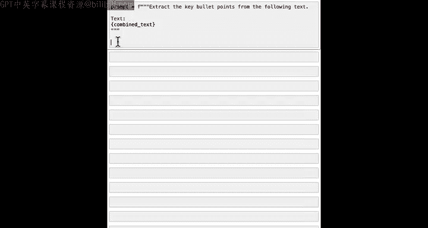

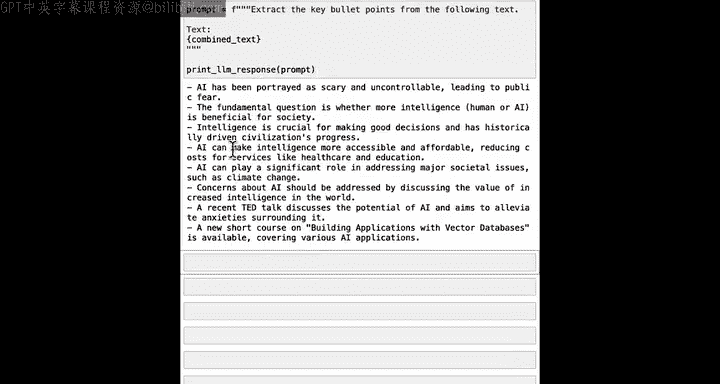

我希望你从中学到的关键要点是：使用 `!pip install` 加包名。安装包之后，你就可以导入包中的函数，并立即在你自己的代码中开始使用它。

## 安装另一个包：ai-setup

让我再展示一个安装另一个包的例子。运行 `!pip install ai-setup`。

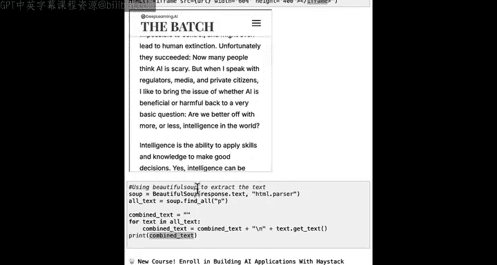

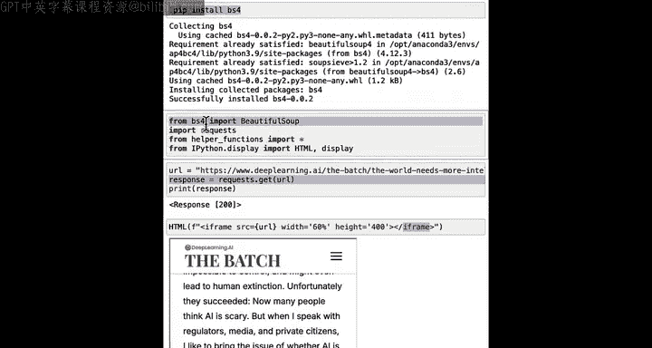

```python
!pip install ai-setup
```

`ai-setup` 是由DeepLearning.AI团队提供的一个包，它包含了你在本课程和先前课程中见过的关键辅助函数，并配置你的电脑以识别这些你一直在使用的关键辅助函数。这样你就可以在你自己的代码中使用它们。

例如，安装后你可以运行：


```python
from ai_setup import get_response
```

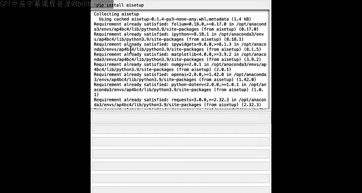

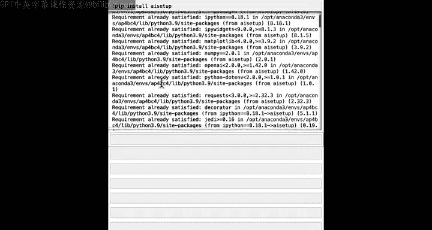

现在你可以提问，比如：“为什么编程语言叫Python？”，然后你会得到答案。我认为这是一个有趣的答案，其灵感来源于一个非常有趣的电视节目《蒙提·派森的飞行马戏团》。

因此，从 `!pip install ai-setup` 中得到的启示是：这让你可以立即导入函数，并在你自己的代码中开始使用它们。

`ai-setup` 的这个特定例子在本网站上有效。要在你自己的电脑上实际使用 `ai-setup`，还需要一个步骤，我们将在后面的课程中讨论。

事实证明，`get_response` 正在使用一种叫做API（应用程序编程接口）的东西，通过互联网访问某个大语言模型提供商的网站（在本例中是OpenAI），来获取这个问题的答案。

事实证明，API是一种非常强大的方式，让你可以用代码在获得许可的情况下访问别人的计算机，并从别人的计算机获取答案。

## 总结

本节课中，我们一起学习了如何在Jupyter Notebook中安装Python包。我们通过安装`bs4`包来解析HTML网页，并安装了`ai-setup`包来获取课程中的辅助函数。你学会了使用 `!pip install [package_name]` 命令，并在安装后导入和使用包中的功能。这项技能是扩展Python编程能力的基础。

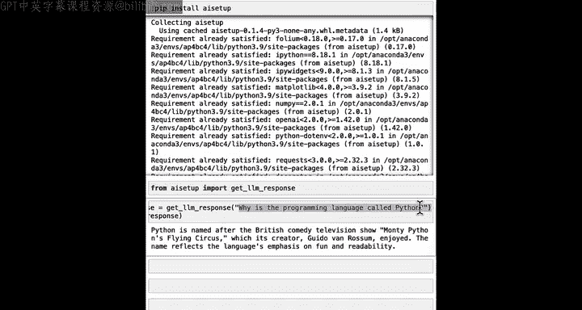

在下一个视频中，我们将深入探讨什么是API以及如何在你自己的代码中使用它们。让我们进入下一个视频，学习API以及它们如何帮助你快速使你的程序变得更强大。