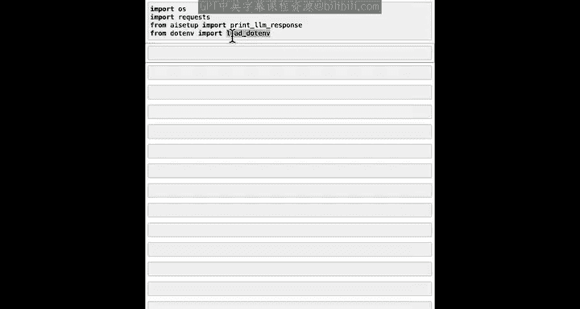
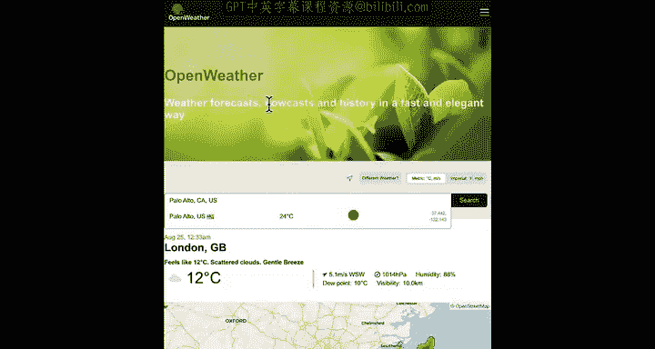
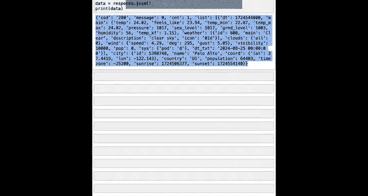
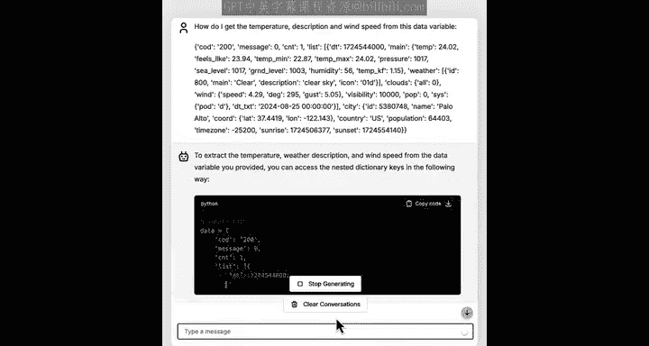
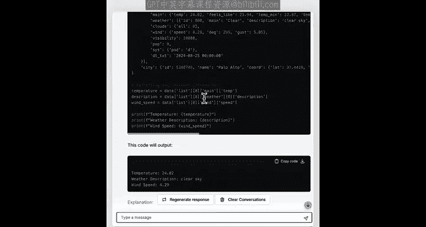
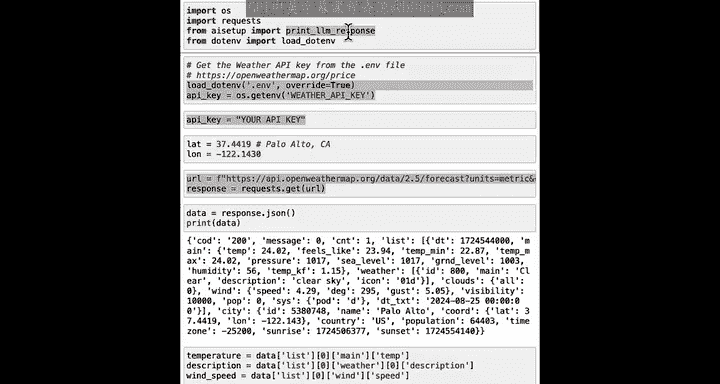

#  033：使用API从网络获取数据 🌐

在本节课中，我们将学习如何使用API从互联网获取实时数据。我们将以获取天气数据为例，了解API的工作原理，并编写代码来获取和解析这些数据。

---

有时，您希望编写代码解决的问题可能涉及实时数据。例如，使用天气数据来规划当天的着装，或许是在您度假时。

为了访问诸如当前天气、股票价格、新闻或调用网络搜索引擎查找相关网页等数据，您需要使用一种称为API（应用程序编程接口）的东西。API为您的计算机提供了一种与另一台计算机通信的方式，让那台计算机为您执行某些操作，例如获取某个城市的当前天气并将其返回给您的计算机。互联网上有很多API，有些是免费的，许多可能需要付费，因为运行计算机和操作该API服务通常需要成本。

但与下载软件包在本地运行不同，API允许您在获得许可的情况下，让别人的计算机为您完成工作。

让我们通过一个有趣的例子来看看API是如何工作的：使用API获取实时天气数据来规划当天的着装。


---

## API如何工作 🤔

API是您的计算机让另一台计算机为您获取数据或执行工作的方式。可以将其类比为您坐在餐厅里想要一些食物。您与一位友好的服务员交谈，然后服务员会去厨房获取并递送您点的餐。服务员就是您和厨房之间的中间人，而API的作用就是作为您和提供数据或服务的其他计算机之间的中间人。

---

## 获取天气数据示例 🌤️



让我们通过一个示例来实践。我将导入必要的库，并使用一个名为`openweathermap.org`的网站提供的API。我现在位于美国加利福尼亚州的帕洛阿尔托，此刻这里的天气是24摄氏度，相当不错。但与其使用网页界面查询天气，我将展示如何使用API让我的计算机自动从另一台计算机获取天气。

大多数API会要求提供所谓的“密钥”或“API密钥”。您可以将API密钥视为一个专属于您的密码。这样，处理您请求的计算机就知道请求来自谁。

以下是加载我的专属API密钥的简单代码。目前不必过于担心这段代码在做什么，稍后我会再详细说明。

```python
import os
import requests
from ai_setup import print_lm_response
import dotenv
```



我将指定我所在位置的纬度和经度，然后构建一个URL字符串。这是一个指向API的URL，在字符串中插入纬度、经度和API密钥。然后，我将通过向该URL发送请求来获取响应。以下是打印我们从响应中获取的数据的语法。

```python
# 加载API密钥（示例，实际使用时需替换为您的密钥）
api_key = os.getenv('OPENWEATHER_API_KEY')

# 指定位置（以帕洛阿尔托为例）
lat = 37.4419
lon = -122.1430

# 构建API请求URL
url = f"https://api.openweathermap.org/data/2.5/weather?lat={lat}&lon={lon}&appid={api_key}&units=metric"

# 发送请求获取数据
response = requests.get(url)
data = response.json()
```

返回的数据是一个包含许多值的字典。温度是24.02度，体感温度是23.98度。描述显示天空晴朗。这里还有风速等信息。这是一个相当复杂的字典。

为了提取我可能想要的关键信息，如温度、描述和风速，我可以让我的AI聊天机器人帮我编写代码。我会问它：“如何从这个数据变量中获取温度、描述和风速？”

然后，我将复制聊天机器人提供的代码并运行它。



```python
# 假设这是从AI聊天机器人获得的代码，用于解析数据
temperature = data['main']['temp']
description = data['weather'][0]['description']
wind_speed = data['wind']['speed']



print(f"温度: {temperature}°C")
print(f"天气状况: {description}")
print(f"风速: {wind_speed} m/s")
```



运行后，它会将温度提取到`temperature`变量中，以及描述和风速。如果您想要一份美观的天气报告，我们可以提取这些数据并像这样打印出来。

运行此代码时，您可以自由查找您自己城市的纬度和经度，并填入其中，以查看您所在城市的当前天气。

---

## 根据天气建议着装 👕

一件有趣的事情是，我们可以根据以下天气情况建议合适的户外着装。如果您有特定的着装偏好，可以添加到提示中，但为了保持通用性，例如轻便的T恤和短裤、太阳镜或防晒霜（防晒霜实际上是个好主意）。

```python
# 根据天气数据提供简单的着装建议
if temperature > 20:
    outfit_suggestion = "建议穿着轻便的T恤和短裤。"
elif temperature > 10:
    outfit_suggestion = "建议穿着长袖衬衫和长裤。"
else:
    outfit_suggestion = "建议穿着外套或夹克。"

print(f"着装建议: {outfit_suggestion}")
```

这就是您如何通过互联网调用API，从其他计算机（如`openweathermap.org`的Web服务器API）获取信息。

---

## 关于API的更多信息 📚

对于不同类型的数据服务，会有不同的API。您可能需要在线查找文档或咨询其他AI聊天机器人，以了解如何调用不同的API。AI聊天机器人更可能知道如何调用互联网上更流行的API；对于不太流行的API，您可能需要自己查看文档。

对于许多API，您需要提供一个API密钥值。这是一个秘密的字符串（由数字和字母组成），让网站知道是您在发出此API请求调用。

我们已经设置了这个Jupyter笔记本环境来使用此API。但如果您想在自己的计算机上实际操作，您需要访问相关网站注册账户并获取一个秘密的API密钥，然后将`api_key`变量设置为等于该密钥。一种方法是编写一行代码，如`api_key = "您的秘密字符串"`。如果您使用实际的API密钥运行这行代码，然后调用API，那将起作用。

但事实证明，尽管这可行，大多数程序员不会这样编写代码，因为如果您将API密钥直接放在代码中，那么如果您的代码泄露给他人，其他人将能够访问您的秘密API密钥。

因此，大多数程序员会使用`dotenv`包的`load_dotenv`函数，它通过几个额外的步骤来安全地加载和使用API密钥。如果您想了解这两行代码的作用，可以询问AI聊天机器人，以更详细地解释如何更安全地存储API密钥（如果您感兴趣的话）。

---

## 总结 📝

在本节课中，我们学习了如何获取实时数据（即天气数据）。实际上，还有许多API可以让您访问先进的AI模型。事实上，`print_lm_response`函数就是使用互联网上的API来访问OpenAI的ChatGPT大型语言模型。在下一课中，我们将深入探讨`print_lm_response`函数实际如何工作，以及您如何编写代码通过互联网访问先进的AI模型。



让我们在下一个视频中继续学习。