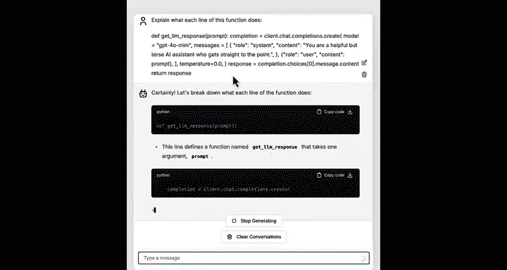
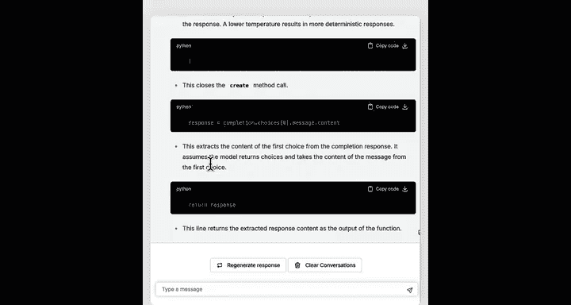
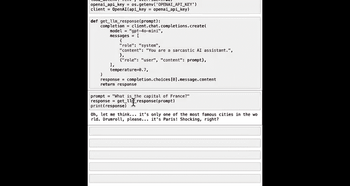
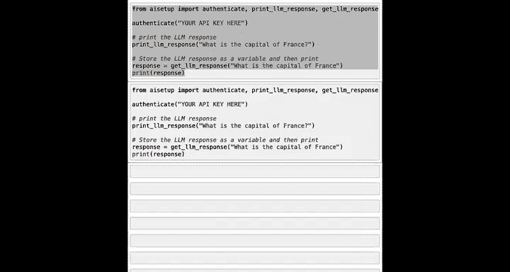
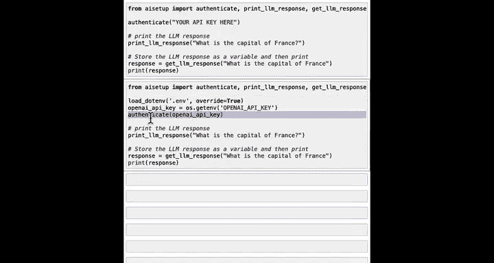
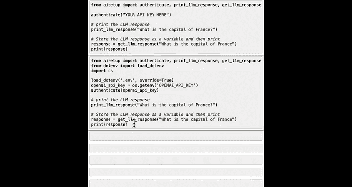

#  034：使用API调用AI模型 🧠


## 概述
在本节课中，我们将学习如何使用应用程序编程接口来调用在线AI模型。你将了解`get_response`函数背后的工作原理，并学习如何通过API与OpenAI的ChatGPT等大型语言模型进行交互。


---


上一节课我们学习了如何使用API获取实时天气数据。但API的功能远不止获取数据，它们还能帮助你访问在线AI工具，例如OpenAI的ChatGPT、Google的Gemini或Anthropic的Claude等。


例如，你一直在使用的`get_response`函数，其底层就是调用了OpenAI的ChatGPT API。


OpenAI的大型语言模型运行在互联网上的计算服务中。你可以通过API向ChatGPT提问并获取答案。

在本节中，我们将深入探究你在过去几门课程中一直使用的`get_response`函数的具体实现。让我们来看一看。

## 使用OpenAI API的步骤
以下是使用OpenAI API的方法。我已经安装了`openai`包。如果你的电脑上还没有安装，可能需要运行`pip install openai`，但我已经完成了这一步，所以这里不再重复。

来自`openai`包的`openai`函数，正是你在`helper_functions`或`ai_setup`包中使用的`get_response`函数的动力来源。

让我们看看`get_response`函数实际上做了什么。我知道这段代码看起来有点复杂，你不需要理解每一行，但我希望快速浏览一遍，让你对现代前沿API的使用方式有一个直观感受。

以下是`get_response`函数的核心代码示例：

```python
completion = client.chat.completions.create(
    model="gpt-4o-mini",
    messages=[
        {"role": "system", "content": "You are a helpful AI assistant."},
        {"role": "user", "content": prompt}
    ],
    temperature=0
)
response_text = completion.choices[0].message.content
return response_text
```

`client.chat.completions.create`是OpenAI提供的一个函数。

这行代码选择了我们想要使用的大型语言模型，这里我们使用的是`gpt-4o-mini`模型。

当你使用大型语言模型时，我们常做的一件事是告诉它如何回应，这被称为**系统消息**。我们告诉大型语言模型，我们希望它扮演一个AI助手的角色。稍后我们将看到一个例子，看看如果你改变这个系统消息会发生什么。

然后我们还指定了**提示词**，它可以是一个问题，例如“法国的首都是什么”。

事实证明，大型语言模型有一个名为**温度**的参数，它控制着响应的随机程度。在我的代码中，我经常将其设置为零，如果我不希望响应过于随机的话。这是你可以使用大型语言模型的最低温度。


接着，顶部的这行代码从大型语言模型（我们有时称之为“补全”）获取结果，然后你提取响应的文本，最后返回响应的文本。



如果你不理解这段代码的每一行，请不要担心。我只是想让你了解一下，如果你自己要实际使用它，代码会是什么样子。你可以直接复制这段代码块，粘贴到你自己的代码中并运行。

事实上，如果你访问OpenAI的网站，那里有API的在线文档，你很可能会找到一个看起来很像这样的代码示例。因此，你可以直接从OpenAI文档、Anthropic Cloud文档、Google Gemini文档或你正在使用的任何工具的文档中获取代码示例，然后让它在你自己的代码中运行，而无需担心这里的每一行代码具体在做什么。



## 理解代码与寻求帮助
如果你想理解这段代码每一行的作用，像往常一样，你也可以询问一个语言模型。

它会逐行为你讲解。请注意，你的语言模型是通过阅读互联网上的文本学习的，因此它们会更擅长理解更知名、在互联网上存在时间更长的API。对于不太流行的API，或者由互联网上其他人刚刚创建和发布的API，它们的理解能力可能就没那么强。

## 配置API密钥与运行示例
现在，为了使用OpenAI API，你需要使用从OpenAI网站获取的**秘密API密钥**。我将使用`load_dotenv`方法来安全地获取这个API密钥。

然后，这行代码你也可以从OpenAI文档中获取，用于初始化OpenAI服务或OpenAI客户端。运行之后，我现在就定义了`get_response`函数。

现在，如果我发送提示词“法国的首都是什么”，它将生成响应。因为我在这里使用了我的API密钥，所以会向我的账户收取一小部分费用。

为了展示一些有趣的东西，如果你将系统消息改为“你是一个讽刺的AI助手”，让我重新定义一下。

如果我再次运行，让我们看看它会说什么。哦，这确实相当讽刺。是的，答案是巴黎，但带着很多态度。这就是系统消息的作用，它告诉大型语言模型你希望它如何表现。

也许再展示一个有趣的现象，如果我将温度设置为一个更高的数字，比如1.0（这是一个相当高的温度），这会使响应更加随机。每次我运行它，在这种情况下，都会得到一个不同的讽刺性回应。

这个**温度**参数可以在0到2之间变化，让你可以控制你希望响应具有的随机程度。许多人使用大约0.7的值，这是一个常见的选择，这会给你带来一点随机性，也许是一点创造性的表象，而不会过度随机。

我鼓励你尝试这个参数，试试不同的温度值并多次运行，或者尝试不同的系统消息。也许尝试创建一个总是返回押韵句子的AI系统，或者一个只说某种语言（如西班牙语或日语）的AI系统，看看你会得到什么结果。



## 在本地计算机上运行
最后，如果你想在自己的计算机上本地运行所有这些，我想分享一些关于如何将API密钥放入代码中的细节。

在通过`pip install ai_setup`安装`ai_setup`之后，你可以从`ai_setup`导入一个名为`authenticate`的函数，以及`print_response`和`get_response`。

`authenticate`函数需要传入一个你可以从OpenAI网站获取的API密钥。这是一项付费服务，因此可能会要求你提供信用卡信息。其他大型语言模型提供商通常也会要求提供信用卡信息以获取访问其服务的API密钥。

但如果你这样做，这将使用你安全的API密钥对你的程序进行身份验证，以访问OpenAI的API服务，然后你就可以用它来生成大型语言模型的响应。

将你的API密钥存储在代码内部并不是最安全的方式。一个更好、更推荐的方式如下：



```python
import os
from dotenv import load_dotenv
load_dotenv()
api_key = os.getenv("OPENAI_API_KEY")
# 然后使用 api_key 进行身份验证
```

这三行新代码会将API密钥存储在一个`.env`文件中，从该文件加载密钥，然后使用更安全地从`.env`加载的API密钥进行身份验证。你还需要`from dotenv import load_dotenv`并运行这段代码，以及另一个名为`os`的库。

我现在不想深入探讨这些细节，但你可以询问AI语言模型，它将能够为你详细讲解所有这些步骤。如果你尝试这个并遇到任何错误信息，那么我会将错误信息复制粘贴到AI聊天机器人中，让它尝试帮助你调试。

因此，如果你在自己的计算机上设置了Python，而不是在DeepLearning.AI等网站通过互联网运行，这就是你将使用的代码。



## 后续步骤与课程总结
在这段视频之后，有一个可选的阅读材料，它将向你展示如何在本地计算机上安装Python和Jupyter笔记本的一些选项。有不同的方法可以实现，在Mac和Windows机器上可能略有不同。该材料免费提供了几个选项，以便你可以在需要时安装这些东西并在自己的计算机上运行。

阅读这个材料以及安装相关软件对你来说完全是可选的。但我个人很喜欢在我的笔记本电脑上运行Jupyter笔记本和Python，我认为你可能也会喜欢，因为即使在没有网络连接的情况下（比如在飞机上或其他地方）也能在自己的计算机上运行东西，这真的很酷。

无论你是否阅读那个材料，我们都将以最后一个视频结束，在视频中我们将讨论完成本课程后你接下来可能要去往何方。

---



## 总结
本节课我们一起学习了如何使用API来调用在线AI模型。我们探讨了`get_response`函数的核心代码，了解了**系统消息**和**温度参数**如何影响AI的响应。我们还介绍了如何安全地配置API密钥，并简要提及了在本地计算机上设置开发环境的可选步骤。通过API，你可以将强大的AI能力集成到自己的应用程序中。