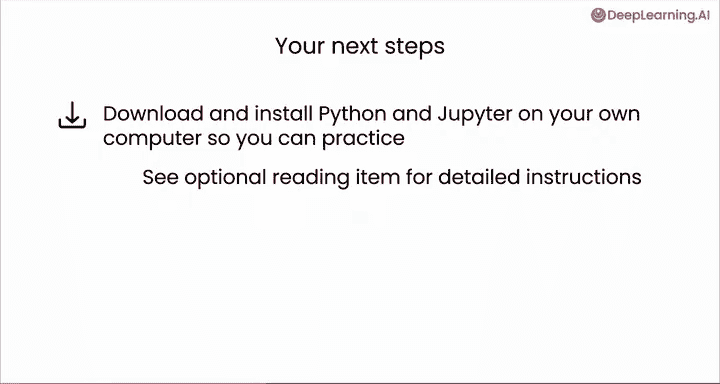
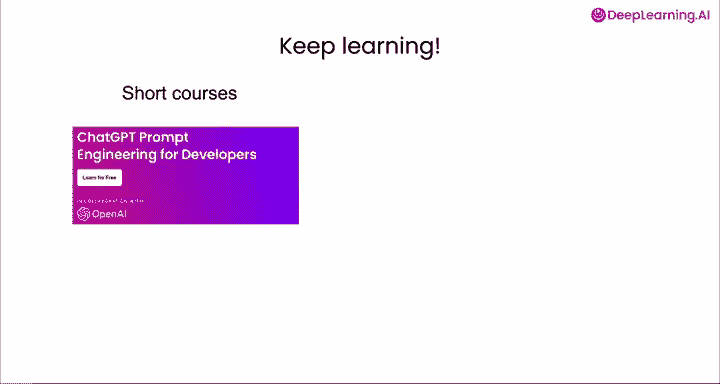
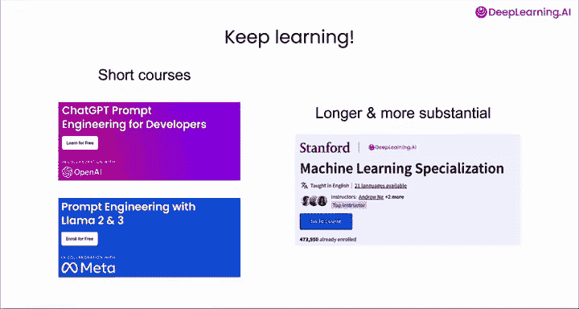
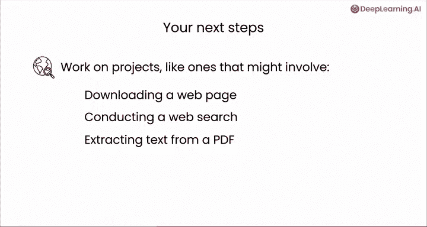

#  035：课程总结与后续步骤 🎉

在本节课中，我们将对《给初学者的AI Python编程课》进行总结，并探讨完成课程后可以采取的后续学习与实践步骤。

恭喜你完成了这门课程，也完成了“AI Python for Beginners”系列的学习。在这几门课程中，你学到了很多知识。

## 课程回顾 📚

上一节我们介绍了如何使用外部包来扩展Python的能力。现在，让我们回顾一下整个系列的学习成果。

你从Python的基础知识学起，例如**数据类型**、**函数**和**变量**，以及**代码模式**，比如`for`循环和`if`语句。

```python
# 示例：一个简单的for循环
for i in range(5):
    print(i)
```

你还学会了如何让Python读取计算机中的文件，从而能够处理你自己的文档和数据，或者利用AI来规划梦想假期。

在这最后一门课程中，你看到了如何通过使用其他程序员编写的包来扩展Python的能力。这些包让你可以下载和处理网页、制作图表、获取天气数据，甚至通过互联网调用大型语言模型。

## 后续步骤建议 🚀



现在你可能想知道接下来可以做什么。有很多事情可以做。

以下是你可以考虑的一些具体后续步骤。

首先，如果你还没有这样做，请考虑在你自己的计算机上安装Jupyter。在自己的笔记本电脑上运行代码会很有趣。




此外，我希望你继续学习课程，不断进步。在DeepLearning.AI平台上，有几门短期课程你可以考虑。



一门是**ChatGPT Prompt Engineering for Developers**，它将教你如何以更复杂的方式提示ChatGPT。


另一门是**Prompt Engineering with Llama 2**。

如果你想学习更深入、更实质性的内容，可以考虑参加我们的**机器学习专项课程**。




## 开始你的项目 💡

在你继续学习课程的同时，如果你有项目想法，请付诸实践。

请负责任地运用你的技能，即以帮助他人的方式使用它们。我见过初学者从事的项目可能涉及下载网页并处理该页面，也许是为了总结它，或者收集与你的业务相关的见解。

其他项目可能包括通过使用网络搜索引擎的API进行网络搜索，或者从PDF中提取文本并处理该文本，以及许多其他有趣的例子。


## 如何获取帮助与持续成长 🌱

如果你还不知道如何做某件事，我鼓励你去询问AI聊天机器人。不一定是本网站上的那个，而是打开ChatGPT、Anthropic的Claude、Google的Gemini或其他机器人，向它们寻求帮助。

也许还可以快速进行网络搜索，看看是否有任何相关的Python包或API可以使用。

许多人从做小项目开始，然后随着时间的推移逐渐发展到越来越大的项目。所以不要觉得你的第一个项目必须是改变世界的庞然大物。如果你能做一些小而有趣的项目，那就很棒了。

无论你的项目是否成功，你都可以吸取这些经验教训，并希望进行第二个稍大一点的项目，通过这个过程学习更多，依此类推。

直到今天，我仍然经常尝试编写代码，有时我做的事情就是行不通。这发生在我们所有人身上，这就是练习。

## 总结与寄语 ✨

通过完成这门课程，你正在不断提升自己的技能。你是一名Python程序员。你刚刚起步，但你现在已经是全球AI编码社区的一员了。我很高兴你能加入我们，并且我乐观地认为，你会找到运用这些技能来改善日常生活和工作的方法。

我们共同的旅程暂时告一段落，我有点难过，但也非常感谢你为学习Python在这些课程上投入的所有时间和精力。

😊，我希望很快能再次见到你，希望你能继续学习和实践，并用你的新技能做出美好的事情，帮助自己和他人。

**本节课中我们一起学习了整个AI Python初学者系列的总结，回顾了从基础语法到使用外部包的关键知识点，并为你规划了安装工具、学习进阶课程、开启实践项目以及寻求帮助的清晰路径。记住，编程是一场持续的旅程，重要的是开始行动并享受过程。**