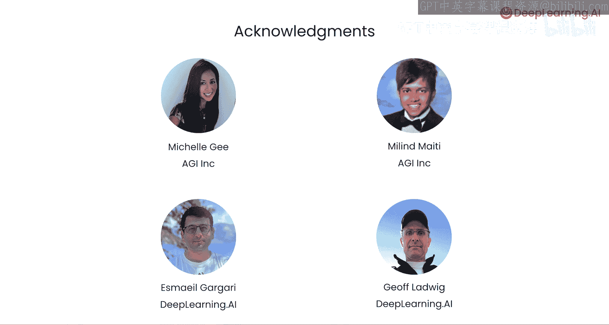

# 001：课程介绍 🚀

在本节课中，我们将学习AI浏览器智能体的基本概念、其面临的挑战以及本课程将涵盖的核心方法与项目。

AI浏览器智能体，或称AI网络智能体，能够登录网站、填写表单、点击网页链接，甚至为你在线下单。你的AI网络智能体可以同时利用视觉信息（即屏幕截图）和结构信息（例如网页的HTML或文档对象模型DOM表示）来进行推理并采取行动。

如果你打开一个网页并查看其底层代码，就会发现智能体在每一步可能面临的操作空间有多么庞大。😊

由于这些智能体可以自动运行一长串操作序列，任何错误都可能引发意想不到的后果，例如预订了错误的航班或订购了随机商品。或者，如果智能体误解了某个字段（比如产品名称），它可能会完全走上错误的路径，而这些错误会迅速累积。

## 应对挑战：Agent Q方法

上一节我们介绍了智能体可能遇到的问题，本节中我们来看看应对这些挑战的一种方法。我很高兴向大家介绍讲师D Gg和Namgog，他们是AGI Inc的联合创始人。Div Naman及其团队构建了Multion，这是一个基于他们在Agent Q论文中发表的方法的Web智能体平台。

感谢Andrew。为了应对您提到的挑战，我们引入了Agent Q。Agent Q结合了蒙特卡洛树搜索（MCTS）与自我批判机制的研究，并使用了直接偏好优化（DPO）进行迭代微调。😊

在Agent Q的搜索过程中，会探索不同的分支或操作序列，并评估其结果。这些模拟及其反馈被用来创建偏好数据集。随后，DPO算法被用于通过从这些高级偏好中学习，来微调语言策略模型。😊 这有助于优先选择那些能带来更好结果或被AI反馈排名更高的操作。

## 课程实践项目

接下来，我们将了解本课程中你将动手构建的项目。在本课程中，你将构建几个智能体。首先，你将构建一个简单的智能体，用于分析深度学习AI网站并列出特定主题的所有课程。然后，你将扩展此智能体的功能，使其能够执行诸如点击课程、总结课程内容甚至注册批量通讯等操作。

之后，你将深入探究作为我们Agent Q方法核心组成部分的MCTS，并解决一个寻找最优路径的网格问题。接着，你将探索Agent Q + MCTS的一个变体，该变体接收课程标题，在网络上搜索并导航结果，直到找到正确的课程。你将可视化并分析智能体在达成目标前所采取的不同树路径。

许多人为此课程做出了贡献。我要感谢来自HI Inc的Michel G和Mil My，以及来自Tvaar AI的Ash Gagari和Jeff Lawig，他们也参与了本课程的制作。第一课将是关于AI智能体的介绍。

这听起来太棒了。现在，让我们开始吧，与其只看网页，不如动手实践。😊

---

**本节课总结**：本节课我们一起学习了AI浏览器智能体的定义、其潜在风险与挑战，并初步了解了本课程将用于构建可靠智能体的核心方法——结合了MCTS和DPO的Agent Q框架。我们还预览了课程中将完成的实践项目，从基础分析到复杂导航，为后续深入学习奠定了基础。