# 002：Web智能体入门 🚀

在本节课中，我们将直接了解什么是Web智能体，以及它们如何被用于自动化在线任务，例如在任何商业网站上购买商品。我们还将讨论常见的挑战，例如可靠性问题、错误累积以及智能体陷入循环。让我们开始吧。

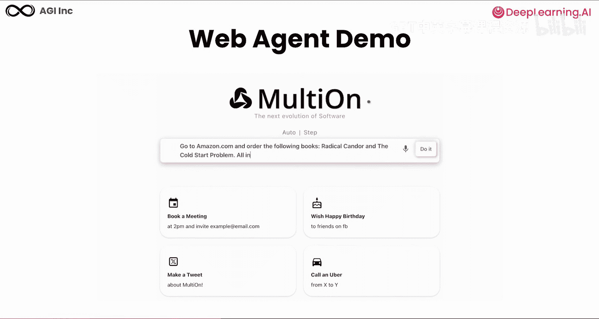

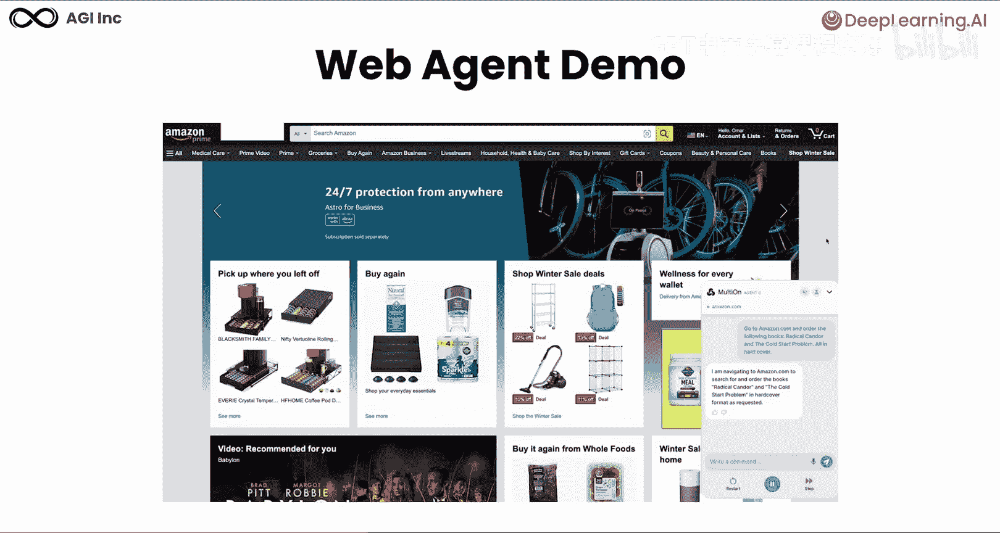

## 真实世界示例 📚

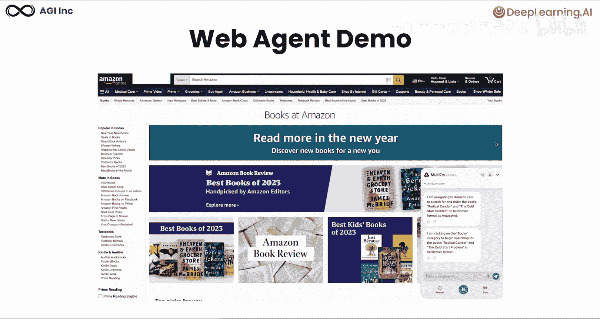

首先，让我们看一个真实世界的例子。想象你想在线购买书籍，但没有时间搜索和结账。在这个演示中，我们要求我们的智能体订购两本书：《Radical Candor》和《The QAR Problem》，并将它们添加到我们在亚马逊的购物车中。

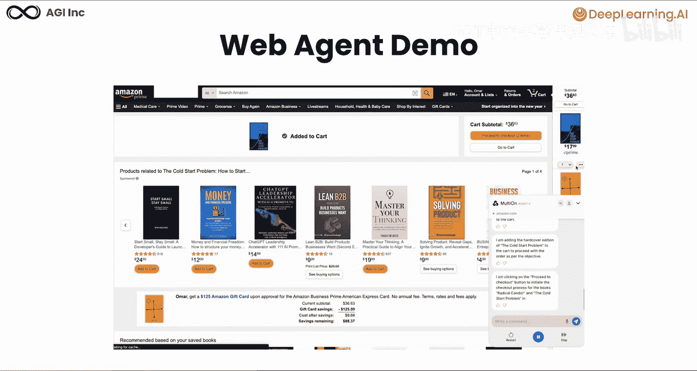

以下是智能体执行任务的过程：

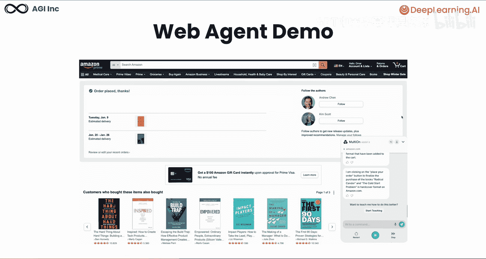

*   **导航与搜索**：智能体像人类一样导航到亚马逊网站，并智能地搜索第一本书。
*   **添加商品**：找到书籍后，它将其添加到购物车。
*   **重复流程**：接着，它开始搜索第二本书，并同样将其添加到购物车。
*   **理解界面**：我们可以看到，智能体准确地理解在哪里点击以及如何浏览网站。
*   **完成订单**：最后，智能体可以去下订单。

如你所见，智能体成功地找到了两本书并将它们添加到购物车，无需任何人工干预。这只是Web智能体能做的事情的一个例子。想象一下，这种智能体几乎可以在互联网上的任何网站上自动化任务的所有可能性。

## 什么是Web智能体？🤖

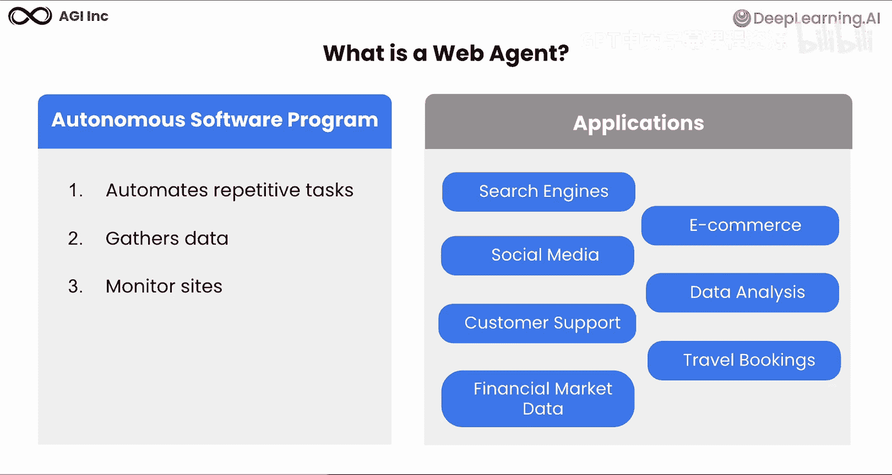

一个Web智能体是一个自主的软件程序，代表你自动执行在线任务。这些智能体被创建用于各种目的，例如自动化重复的在线任务、从多个来源收集信息，或监控网站的变化或更新。

Web智能体可以为我们的日常数字活动中的各种应用提供动力，范围包括：
*   **增强在线搜索**：超越简单的关键词查询。
*   **电子商务助手**：用于查找产品和完成购买。
*   **社交媒体管理**：包括监控和自动发布。
*   **跨平台数据分析**。
*   **客户支持自动化**。
*   **旅行预订和规划**。
*   以及金融、医疗保健和许多其他行业的专业应用。

## 构建Web智能体的关键组件 ⚙️

现在，让我们看看构建Web智能体的关键组件。这里我们探讨这些智能体如何工作的架构。一个设计良好的Web智能体由五个基本模块组成：

1.  **用户界面模块**：允许人们用自然语言与智能体通信。
2.  **控制模块**：作为系统的大脑，处理推理和行动决策。
3.  **知识库**：包含智能体完成任务所需的工具、模型数据、规则和信息。
4.  **通信模块**：管理与网站、API和其他系统的交互。
5.  **数据处理模块**：在返回结果之前分析、处理和转换数据。

在这些模块内部，几个专门的组件协同工作：
*   **解析器**：可以系统地提取网站数据并解释HTML。
*   **行动模型**：进行决策并预测要采取的行动。
*   **执行器**：在网站上执行特定操作，例如点击、填写表单等。

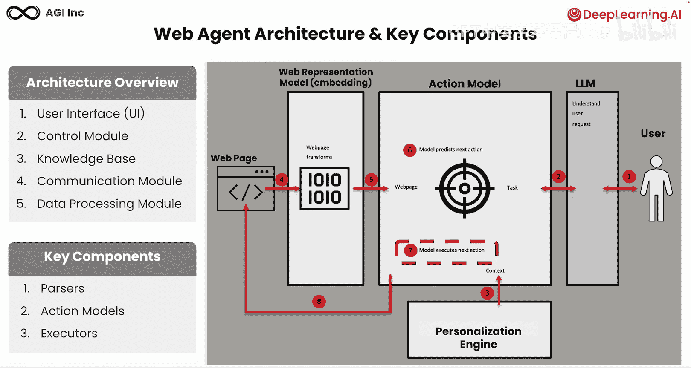

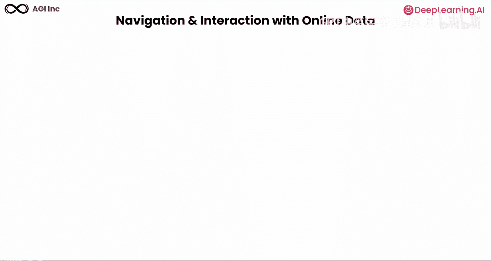

以下是整个流程的运作方式：
1.  人类向智能体提供请求。
2.  智能体理解用户的请求，并根据上下文制定其方法。
3.  行动模型获取网站的表示（如HTML），并确定在网页上采取什么行动。
4.  接着，模型预测在当前设置下的最优行动。
5.  该行动随后在网站上被执行。
6.  这个循环重复，直到任务完成。

## 智能体如何与网页交互 🖱️

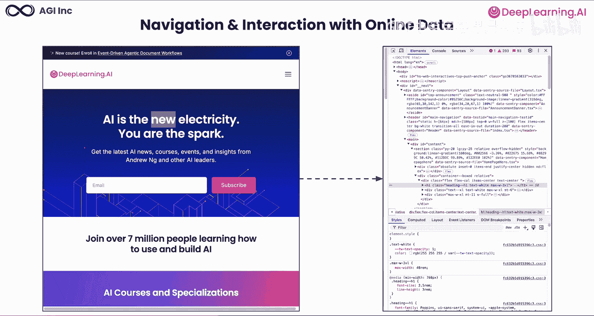

让我们看一个例子。假设你正在构建一个智能体，它可以处理视觉信息（即截图）以及结构信息（即网站的HTML DOM表示），以便在DeepLearning.AI网站上导航、查找课程并进行网站交互。

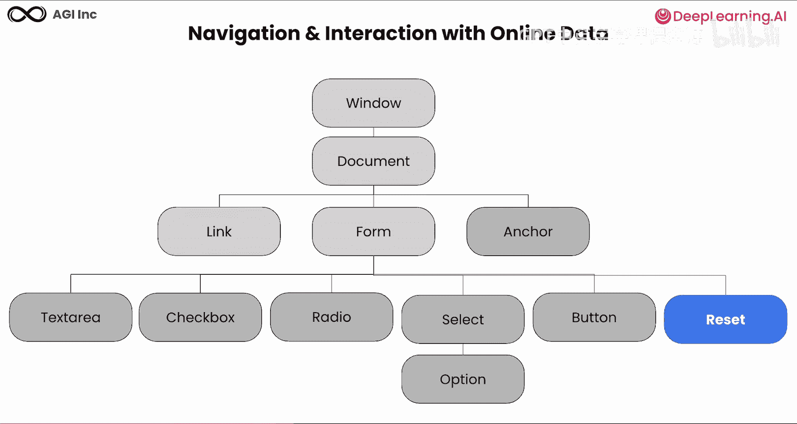

现在，我们探讨智能体如何处理DOM结构以理解页面元素。Web智能体几乎可以与网页上的任何HTML元素交互，这包括：
*   **链接**。
*   **文本区域**：用于输入信息。
*   **复选框**：用于表单选择。
*   **单选按钮**：用于选择选项。
*   **下拉菜单**：用于从列表中选择。
*   **按钮**：用于提交表单或触发操作。
*   以及重置表单字段等。

## 现有框架的局限性 ⚠️

为了理解现有框架的局限性，让我们检查智能体通常遵循的关键步骤：
1.  **规划**：确定要采取什么行动。
2.  **推理**：基于可用信息做出决策。
3.  **环境行动**：执行计划的行动。
4.  **解释**：向用户总结做了什么以及为什么。

在推理阶段会出现许多问题。如果智能体无法形成一个合理的计划，它可能会做出错误的决策。这就是为什么改进推理是我们后续课程的一个关键重点。

让我们看看现有自主智能体框架的主要局限性：
1.  **可靠性与信任挑战**：确保自主系统可以被信任，并配备人工监督机制。
2.  **决策错误**：存在错误累积以及利用与探索之间的权衡问题。
3.  **计划偏离与循环**：在智能体执行过程中存在重复循环或计划偏离的风险。

首先，与当前的自主系统建立可靠性和信任非常困难。它们是随机的，事情可能出错。在决策错误方面，智能体受到错误累积的影响，即随着时间的推移，一连串的错误可能会增长。早期的错误可能会滚雪球般变成更大的问题，因为它们会影响后续的决策。

**缺乏自我纠正**意味着智能体无法识别和修复自己的错误。这可能导致灾难性的失败，因为错误会累积和放大。

**有限的上下文**：智能体在决策时可能会错过关键信息。没有完整的上下文，决策会变得越来越有缺陷。

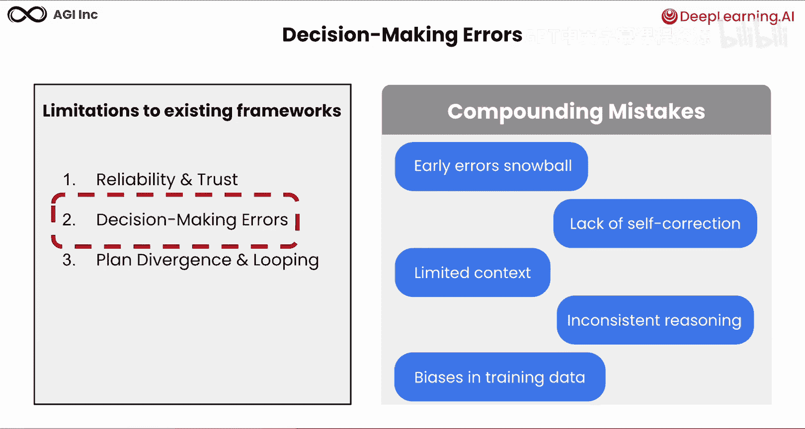

**错误的推理**：基于不正确或不完整的逻辑过程做出的决策会导致不可预测的行为和不可靠的结果。

**偏见问题**：训练数据中可能存在的偏见会在智能体的决策中被放大，随着时间的推移，这会产生越来越有偏见或不公平的结果。总之，这些问题严重削弱了自主智能体的决策能力。

## 利用与探索的权衡 ⚖️

Web智能体不断面临一个关键的决策挑战：它们应该利用已知的信息，还是应该探索新的可能性？这个权衡从根本上塑造了智能体如何浏览网站。

在**利用策略**中，智能体专注于最大化奖励。它们在考虑替代方案之前，沿着单一路径深入探索。它们探索边界树中的子元素，并使用递归在更有希望的路径上导航更深。

利用的优势在于，它允许通过利用已知的成功策略来最大化当前奖励。它允许在已知价值的路径上高效利用资源。在熟悉的环境中，它能提供更可预测的性能。但它也有很多缺点，例如可能错过替代路径。智能体可能被锁定在当前策略中，如果所选路径不是最优的，它们可能无法适应。

现在，我们检查另一种方法：**探索**。在探索中，智能体使用广度优先搜索策略。智能体尝试新的、未经测试的路径，以发现潜在更好的奖励和策略。它不是深入探索，而是探索所有可能的方向。如图所示，智能体在开始深入之前，会检查每一层的所有子元素。当发现一个有希望的路径时，智能体继续探索。如果路径没有导向期望的状态，智能体回溯，并可以尝试替代方案。这在整个网站结构中形成了更广泛的搜索模式。

它的优势在于可以解锁新的机会，帮助发现以前未知的高奖励或更好路径。它可以防止停滞，减少陷入次优策略的风险，并使其能够适应不断变化的环境或需求。它也有一些缺点，例如可能产生更直接的代价。探索可能产生即时奖励较低的结果，甚至可能导致负面结果。它可能导致浪费时间，追求未知路径可能导致资源和时间的低效使用，并且增加决策过程的复杂性。

Web智能体的关键挑战在于确定何时利用、何时探索。在策略之间选择错误是决策错误的常见来源。理想的方法通常涉及根据上下文，自适应地平衡两种策略。

## 计划偏离与循环 🔄

现在，我们检查一个关键挑战：当智能体偏离其预定路径时。在当前框架的局限性中，我们现在将重点关注计划偏离和循环行为。

计划偏离发生在智能体偏离路线时。在此图中，你可以看到理想路径是一条直线，但实际路径显著偏离。这就像要求一个助手系统总结一个主题，但却收到了无关的信息。即使是像GPT-4这样的高级AI代理，在犯错时也很难自我纠正。

一旦智能体偏离或陷入困境，由于三个关键因素，恢复变得极其困难：
1.  **有限领域知识**：智能体通常在通用信息上训练，但它们在专业任务上存在困难。
2.  **环境意外变化**：导致其重复无效操作而非适应。
3.  **情境意识不足**：使得智能体难以在陌生情况下导航，并识别它们何时偏离了轨道。

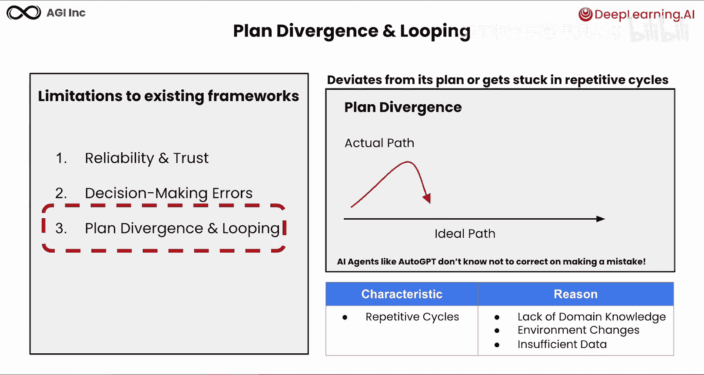

## 总结 📝

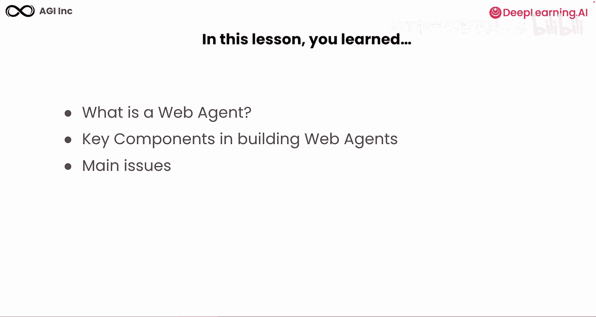

在本节课中，我们一起探讨了什么是Web智能体、构建它们的关键组件以及它们面临的主要问题。我们了解了智能体如何自动化在线任务，其核心架构模块，以及当前在可靠性、决策权衡（利用 vs. 探索）和计划偏离方面存在的挑战。在接下来的课程中，你将学习如何应对这些基本挑战。