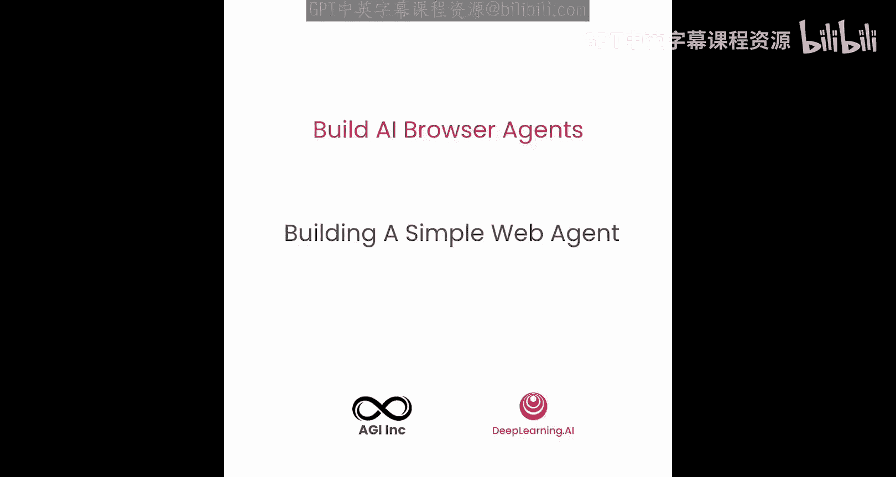
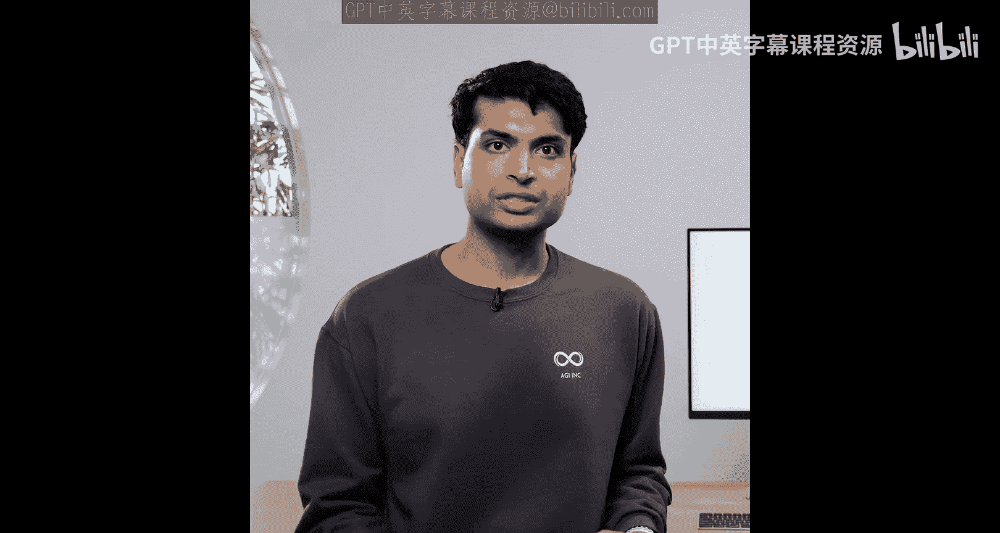
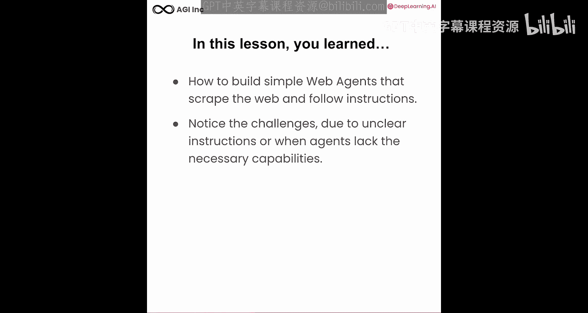
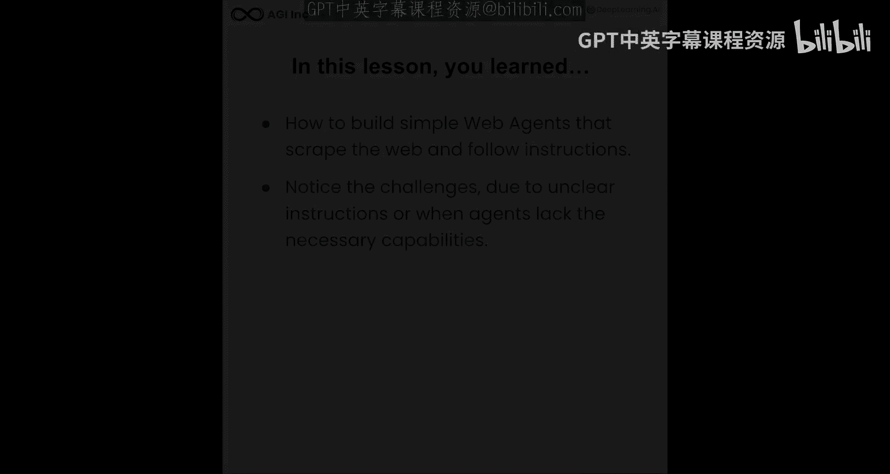

# 003：构建一个简单的网页智能体 🕸️🤖

在本节课中，我们将学习如何构建一个简单的网页智能体。这个智能体能够根据自然语言指令抓取网页内容，并以结构化的格式输出结果。





---

## 概述

我们将构建一个名为“学习推荐智能体”的网页抓取工具。它的工作流程是：首先导航到DeepLearning.AI网站，然后根据指令抓取课程列表，找到特定主题的课程，并读取该课程的详细信息和学习目标。

---

## 导入必要的库

首先，我们需要导入构建智能体所需的各种库。

以下是构建智能体所需的核心库：

*   `pandas`：用于数据处理。
*   `playwright`：用于自动化浏览器操作和网页抓取。
*   `OpenAI`：用于调用大型语言模型（LLM）处理指令和内容。
*   `PIL` (Python Imaging Library)：用于处理和显示截图。
*   `hyperthon`：用于辅助功能。
*   自定义的辅助函数。

---

## 初始化环境

在开始编写智能体逻辑之前，我们需要设置好运行环境。

我们首先初始化OpenAI客户端，并传入API密钥。同时，确保我们的代码能够以异步方式运行。在DeepLearning.AI平台上，API密钥已经预先为您配置好了。

```python
# 初始化OpenAI客户端
client = OpenAI(api_key=your_api_key)
```

---

## 创建网页抓取智能体

接下来，我们定义智能体的核心类。这个类将封装所有与网页交互和数据提取相关的功能。

我们创建一个名为 `WebScraperAgent` 的类。在初始化时，它会设置智能体的角色，并启动一个浏览器实例用于抓取网页的HTML内容。此外，它还支持截取屏幕截图并将其转换为缓冲区，以便更好地展示。最后，我们还需要一个方法来关闭浏览器。

```python
class WebScraperAgent:
    def __init__(self):
        self.browser = None
        # ... 其他初始化代码

    async def scrape(self, url, instruction):
        # 导航到URL，获取HTML，截图
        # ... 具体实现代码

    async def close(self):
        # 关闭浏览器
        # ... 具体实现代码
```

---

## 定义结构化输出格式

为了让LLM返回整齐的数据，我们需要预先定义好输出的数据结构。

我们定义一个数据结构来描述DeepLearning.AI的课程。每个课程对象包含以下字段：`title`（标题）、`description`（描述）、`presenter`（主讲人）、`image_url`（图片链接）和`course_url`（课程链接）。我们将创建一个包含多个此类课程对象的列表。

```python
# 定义课程数据结构
course_schema = {
    "title": str,
    "description": str,
    "presenter": str,
    "image_url": str,
    "course_url": str
}
```

---

## 配置LLM与系统提示词

智能体的“大脑”是大型语言模型。我们需要告诉它扮演什么角色以及具体任务。

我们初始化OpenAI客户端，并指定使用 `gpt-4-mini` 模型，该模型经过高度微调，擅长返回结构化的JSON响应。接着，我们定义系统提示词，明确智能体的角色是一个网页抓取代理，其任务是从HTML中提取相关信息并转换为JSON格式。我们指示它只返回JSON，不要包含任何其他格式的文本。

```python
system_prompt = """
你是一个网页抓取智能体。你的任务是根据用户指令，从提供的HTML内容中提取相关信息，并将其转换为指定的JSON格式。
只返回JSON对象，不要添加任何解释性文字。
"""
```

---

## 整合抓取与处理流程

现在，我们将之前定义的各个部分组合起来，形成完整的智能体工作流。

在 `WebScraperAgent` 的 `scrape` 方法中，整个流程串联起来：首先获取目标网页的HTML内容并截取屏幕截图，然后将HTML和用户指令一起交给LLM处理，最后LLM返回结构化的JSON响应。为了确保准确性，我们还可以加入数据验证或交叉检查的步骤。

---

## 实践示例一：抓取所有课程

让我们运行第一个示例，看看智能体如何抓取网站上的所有课程。

我们首先定义目标URL（DeepLearning.AI网站）和一个基础URL（用于构建完整的课程链接）。然后，我们给出一个简单的指令：“获取所有课程”。运行智能体后，它会开始提取HTML内容、截图，并处理结果以生成结构化数据。

```python
target_url = “https://www.deeplearning.ai”
base_url = “https://www.deeplearning.ai”
instruction = “获取所有课程列表。”
```

处理完成后，我们使用可视化函数来展示结果。如图所示，智能体成功抓取了网站上的所有课程，例如“LangChain记忆”、“Llama课程”等，并输出了每门课程的标题、描述、主讲人、图片和链接。同时，我们也能看到智能体抓取页面时的截图。

---

## 实践示例二：基于描述筛选课程

智能体的优势在于能理解语义。我们可以让它阅读课程描述，并只返回我们感兴趣的主题课程。

我们可以指示智能体阅读所有课程描述。这些描述可能包含课程摘要、主讲人信息等未在列表页面直接显示的细节。这样，LLM就拥有了比我们肉眼所见更丰富的信息，能够基于对课程内容的内在理解进行筛选。

现在，我们给出一个新指令：“只返回与‘检索增强生成（RAG）’主题相关的三门课程，确保输出中没有其他课程”。让我们处理并查看结果。

再次使用可视化函数，我们可以看到智能体现在返回的课程都是关于RAG的。它成功地根据描述和标签找到了相关的课程。

---

## 面临的挑战与局限性

尽管智能体功能强大，但它并非完美无缺。让我们通过一个更复杂的例子来看看当前面临的挑战。

如果我们给出一个更复杂的指令，例如“获取关于[某个主题]的顶级课程的摘要和学习要点”，让我们看看它会返回什么。

可视化结果后，我们发现智能体没有正确遵循指令。指令要求提供摘要和学习要点，但智能体可能因为无法深入理解任务，直接返回了网站上的所有课程。这表明，要完成此类任务，可能需要改进智能体，使其能够点击进入课程详情页，抓取具体的学习目标和教学大纲，然后再进行总结输出。但这可能会使智能体过度针对特定网站结构，而非通用化地理解任务。

---

## 总结





在本节课中，我们一起学习了如何构建一个简单的网页智能体。我们掌握了它抓取网页、遵循指令并输出结构化结果的基本流程。同时，我们也注意到了当前面临的挑战：有时指令可能不够清晰，或者智能体本身缺乏足够的能力来完全遵循复杂指令，从而导致输出错误。这揭示了构建可靠智能体的难点。在下一节课中，我们将探讨如何克服当前智能体所面临的一些挑战。