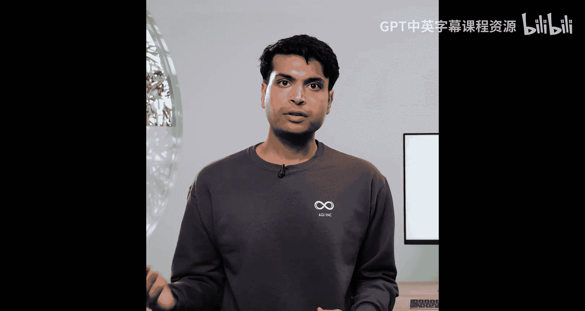
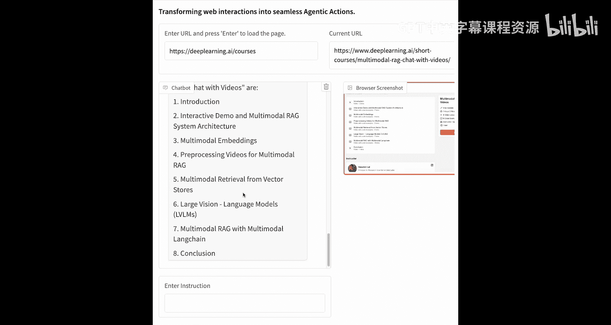
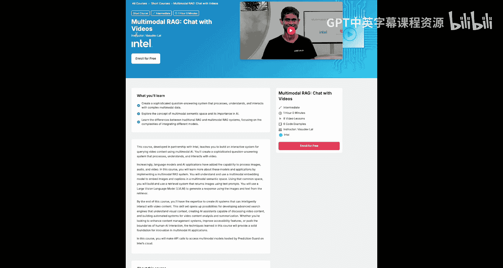
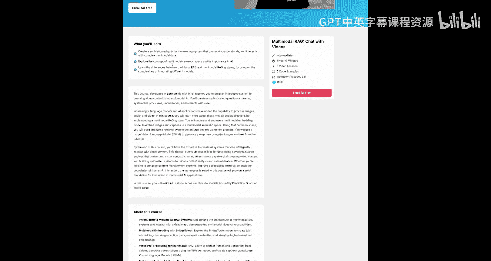
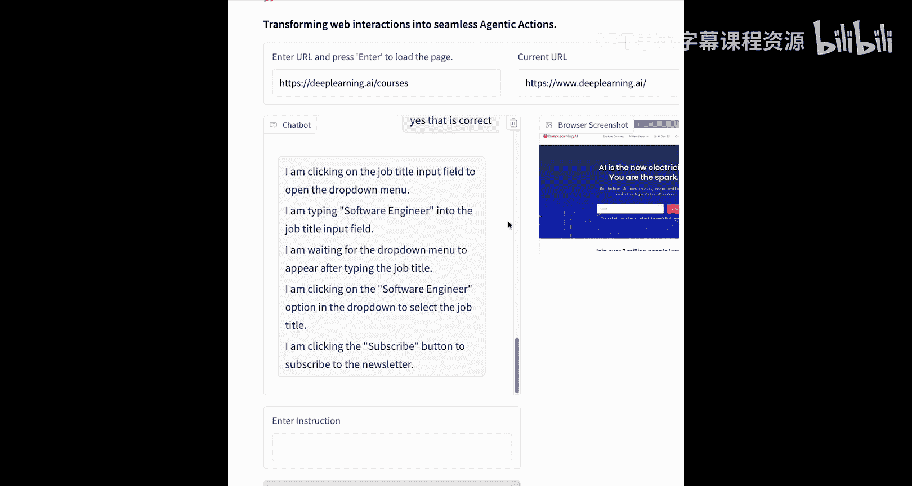

# 004：构建一个自主的网络智能体 🚀





在本节课中，我们将学习如何构建一个能够同时执行多项任务的自主网络智能体。我们将引导智能体完成诸如导航、执行操作、总结网页内容，甚至填写表单和注册新服务等任务。

## 概述

上一节我们介绍了智能体的基础概念，本节中我们将深入实践，使用Multion Web Agent来创建一个能够自主浏览网页并执行复杂任务的智能体。我们将从初始化客户端开始，逐步完成一系列任务。

## 初始化Multion客户端

首先，我们需要导入Multion客户端并初始化它。我们已准备了一些辅助函数，使实验过程更易于可视化。

以下是初始化步骤：

1.  **导入客户端**：从环境变量加载Multion API密钥。
2.  **创建客户端实例**：使用API密钥初始化一个简化的Multion API客户端。
3.  **创建新会话**：为智能体创建一个新会话，并指定起始URL。我们还可以选择是否包含截图。
4.  **定义核心功能**：我们定义了关闭会话、导航到特定URL以及在当前会话中执行任务的功能。

执行任务的函数 `execute_task` 是关键，其核心逻辑可以概括为以下伪代码：

```python
def execute_task(instruction, max_steps=10):
    for step in range(max_steps):
        # 智能体分析当前页面
        # 根据指令决定下一步操作（点击、输入、滚动等）
        action = agent.decide_next_action(instruction, current_page)
        # 执行操作并获取新页面状态
        new_page_state = perform_action(action)
        # 检查任务是否完成
        if task_completed(instruction, new_page_state):
            return result
    return "达到最大步数，任务可能未完成。"
```

我们给智能体的指令包括：不应向用户提问，应利用页面上的所有必要信息，并尽最大努力完成任务。

## 示例一：获取课程列表

现在，让我们开始第一个示例：让智能体获取DeepLearning.AI网站上的所有课程列表。

我们首先创建一个新会话，然后执行任务。我们将最大步数限制为10步，并使用可视化函数来观察会话过程。

智能体创建会话后，开始执行任务。第一步通常是滚动页面以加载更多内容。它会持续滚动，直到到达页面底部或完成指令。

任务完成后，我们查看最终响应。智能体成功地找到了DeepLearning.AI网站上的所有课程，并以对话形式给出了详细列表。如果我们需要结构化输出（如JSON或Markdown），可以在指令中明确要求。

## 创建自定义浏览器界面并执行复杂任务

接下来，我们将创建一个自定义的浏览器用户界面，并使用我们初始化的Multion客户端作为会话管理器。

我们将给智能体一系列更复杂的指令：
1.  找到关于特定主题（如RAG）的课程并打开它。
2.  总结该课程的内容。
3.  获取该课程的详细课时大纲。
4.  导航到DeepLearning.AI主页。
5.  使用指定的姓名和邮箱订阅新闻简报，并填写其他必填字段（如国家、职位）。
6.  确保正确选择下拉菜单的值，并在看到订阅按钮后点击它。

我们定义了课程主题、姓名和邮箱等变量。

我们的Multion浏览器界面加载完成后，从DeepLearning.AI课程页面开始。

**执行查找课程任务**：智能体在搜索栏输入“RAG课程”，等待结果加载，并滚动页面寻找目标课程。当看到多个相关课程时，它会请求更具体的标题。根据浏览器界面显示，我们指定了“Multimodal RAG”课程，智能体随后成功打开该课程页面。







**执行总结课程任务**：智能体阅读课程页面后，给出了课程内容的总结。

**执行获取详细课时任务**：我们要求智能体提供更详细的课程大纲。它改进了输出格式，列出了课程涵盖的不同主题。经核实，智能体准确地获取了“Multimodal RAG with LlamaIndex”课程的信息，该课程包含8节课和6个编码示例。

这展示了自主AI智能体的强大能力。

**执行订阅新闻简报任务**：现在，我们进行更激动人心的尝试——让智能体自动订阅新闻简报。

智能体导航到DeepLearning.AI主页，开始填写表单：输入姓名“Theo”，邮箱“theo@company.com”。在达到最大步数限制后，我们指示它继续。它选择了国家为“美国”，但遗漏了填写职位。我们进行澄清后，智能体通过下拉菜单选择了“软件工程师”作为职位，并最终点击了订阅按钮，成功完成了注册流程。

## 总结与挑战

在本节课中，我们一起学习了如何创建自主网络智能体。我们看到了如何通过简单的指令让智能体遵循并执行任务，也看到了如何获得结构化的响应，而无需我们手动编写代码。

智能体能够以多步骤的方式与浏览器进行完全自主的交互。然而，我们也观察到了一些挑战：智能体有时可能会忘记某些步骤，或者需要更多的澄清和指导才能正确执行。尽管如此，自主智能体在自动化复杂网络任务方面展现出了巨大潜力。



我鼓励你与这个强大的浏览器界面进行互动。如果你还没有订阅DeepLearning.AI的新闻简报，不妨尝试让智能体帮你完成订阅，看看效果如何。