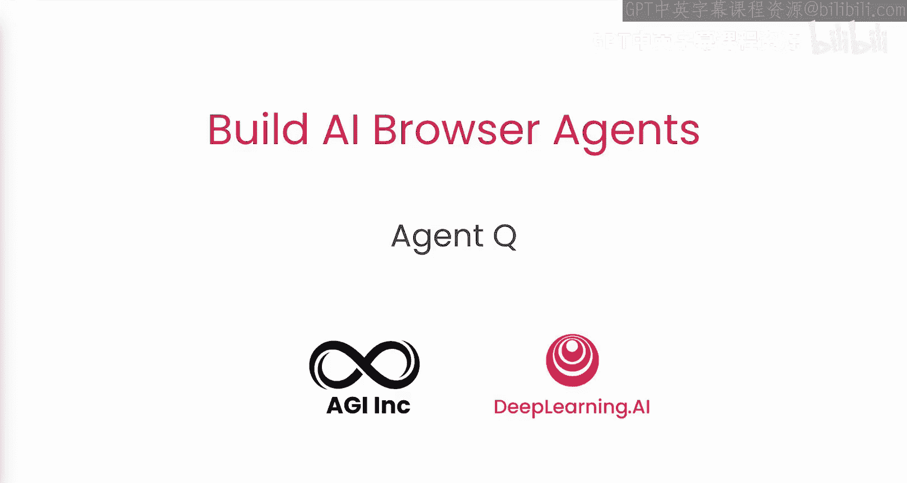
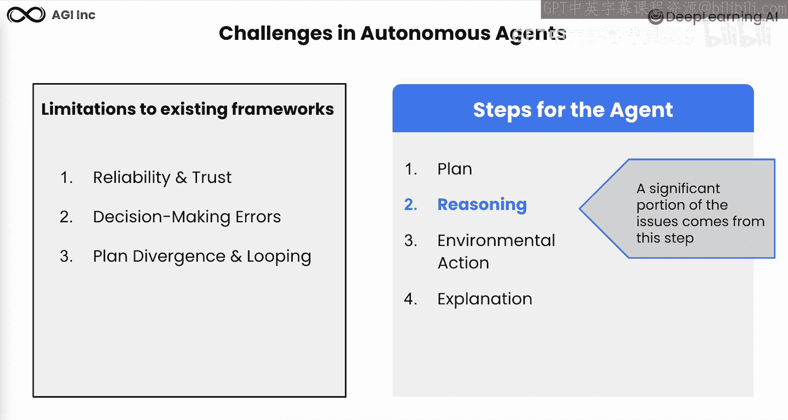
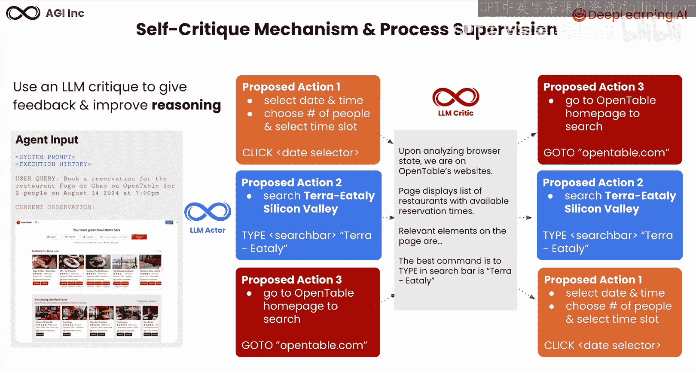
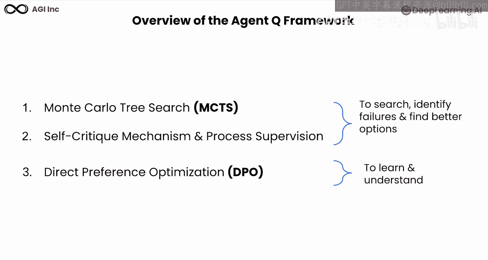
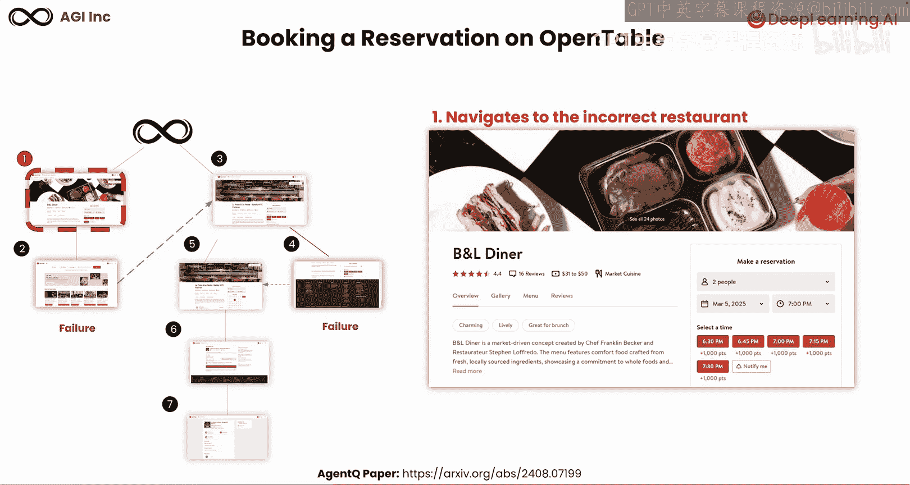
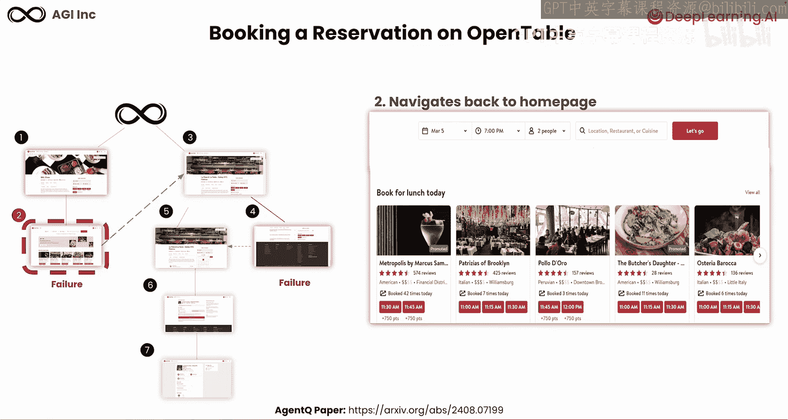
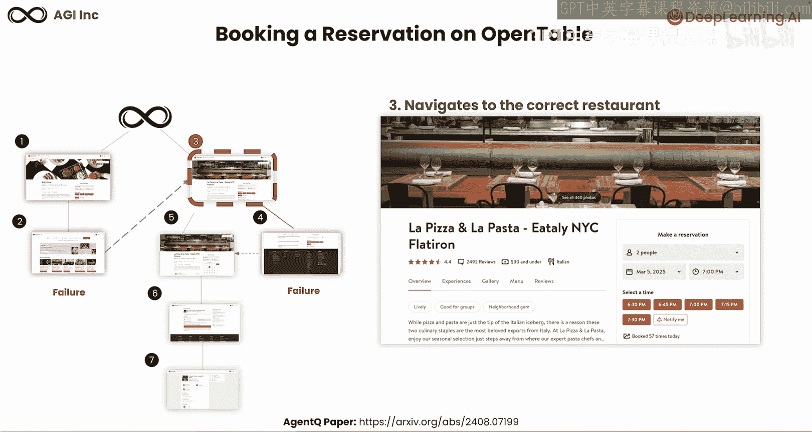
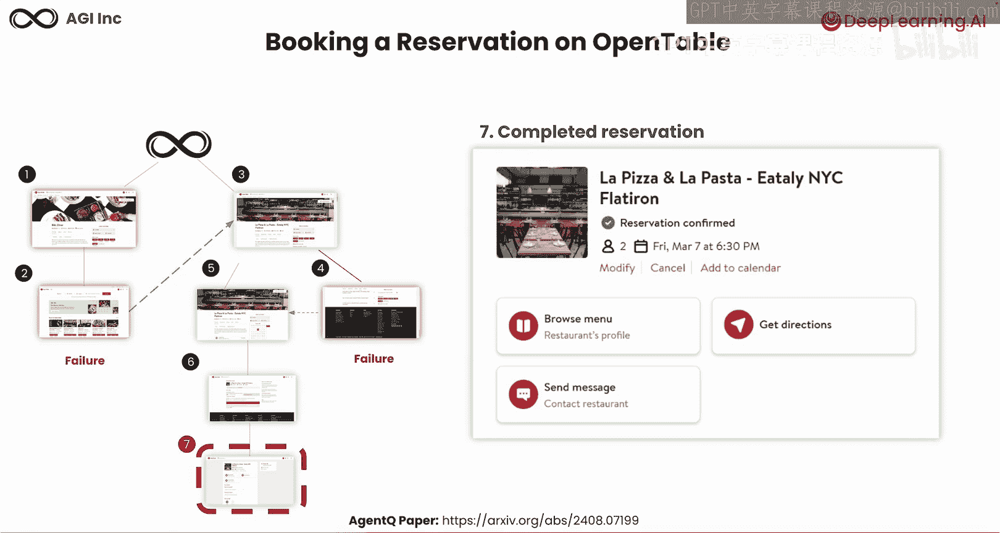
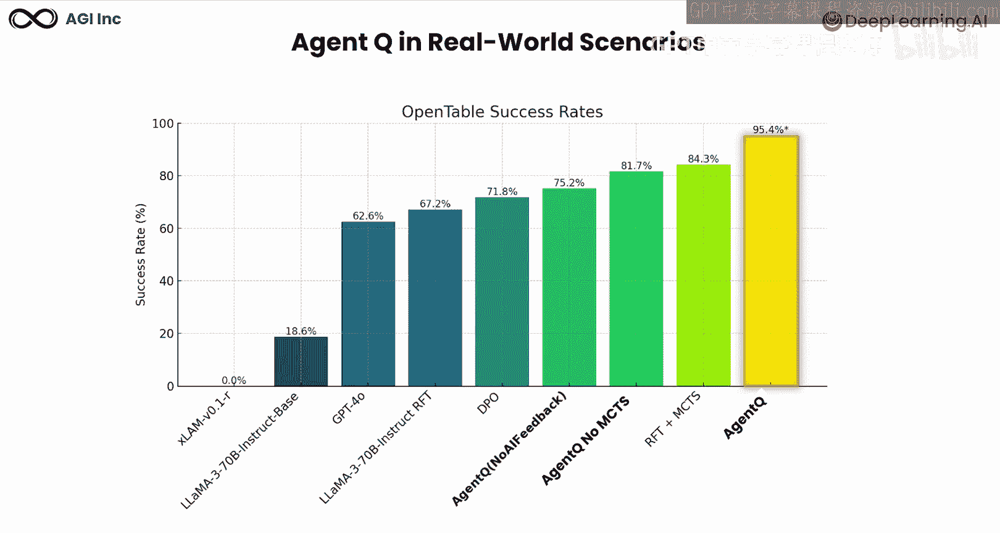

# 005：Agent Q框架详解

在本节课中，我们将学习Agent Q框架。这是一个旨在教导AI智能体如何通过多种技术进行自我纠正的框架。我们将深入探讨AI研究人员用于提升智能体性能的关键方法，全面概述Agent Q框架，并研究它如何有效解决常见的AI智能体挑战。

## 回顾现有框架的局限性

上一节我们介绍了现有框架的局限性。这些局限性主要来自智能体执行过程中的推理环节。具体包括：
1.  可靠性问题。
2.  容易出错。
3.  计划偏离和循环。

智能体执行通常包含四个步骤：**规划**、**推理**、**行动**、**观察**。其中，推理部分是导致执行问题的主要来源，而这正是本节课要重点解决的问题。

## 引入Agent Q框架

现在，让我们来认识Agent Q。这是一个先进的算法，旨在解决上述问题并改进网页任务中的推理能力。

Agent Q通过结合以下方法论来教导智能体自我纠正：
*   **蒙特卡洛树搜索**：用于高效探索搜索空间。
*   **自我批判机制与过程监督**：为持续改进提供自我纠正机制，使智能体能够接收实时反馈。
*   **直接偏好优化**：这是一种强化学习算法，能够基于当前经验进行改进。

我们将学习这些方法如何协同工作，共同构建一个强大的、用于自主智能体推理的框架，即Agent Q。我们的研究团队已将相关成果发表在论文中，您可以在arXiv上找到。在接下来的实验中，您将有机会探索其中的一些概念。

## 第一步：理解蒙特卡洛树搜索

首先，我们来了解蒙特卡洛树搜索的工作原理。MCTS是一种用于回溯和探索的搜索方法，它允许我们在决策时提前规划多个步骤。

在MCTS中，我们从**根节点**开始，这代表当前状态。算法会根据目前已知的信息，沿着它认为的最佳路径前进。通过**利用策略**，算法在树中持续选择看起来最有希望的节点，直到到达一个需要进一步探索的节点。

此时，算法会通过添加新的可能性来**扩展树**，并探索这片未知区域。当我们到达一个**终端节点**（即无法再前进的节点）时，算法会预测继续沿着这条路径的预期未来奖励，作为节点估值。这就像快速推演一个“假设”场景，以评估这个选择可能带来的结果。

在获得未来奖励估值后，MCTS会**反向传播**更新它访问过的所有节点。本质上，这是在告诉算法：“这条路径导致了那个结果”，并据此更新知识。

MCTS的神奇之处在于，这个过程会重复多次。随着迭代次数的增加，算法会变得更“聪明”，更专注于有希望的部分，减少在无益部分的探索。这就像你通过思考不同走法及其后果来提高棋艺一样。

## 第二步：理解自我批判与过程监督

接下来，我们看看Agent Q的第二步：自我批判机制和过程监督。这是一种为AI提供反馈以改进其推理能力的方法。

当用户提出类似“预订餐厅”的请求时，AI会收到请求以及之前交互的任何上下文或历史记录。AI必须从多个可能的操作中选择一个，例如：是先选择日期和时间，还是先选择餐厅，或者先进入OpenTable主页从头开始。

这时，**批判组件**开始工作。你可以将其视为AI的内部顾问，它分析当前浏览器显示的内容、用户的实际需求以及当前最相关的信息。基于此分析，批判组件可以确定哪些操作最合理，并为每个选项提供详细的反馈。

在我们的餐厅预订例子中，与其随机尝试操作，不如构思一个更好的操作序列：首先，进入OpenTable主页；然后，搜索餐厅名称；最后，选择日期和时间。批判组件对操作进行排序，指导AI做出更好的选择。这就像你在解决问题前，会在心里考虑不同方法，然后决定最佳路径一样。

## 第三步：理解基于人类反馈的强化学习

现在，我们进入Agent Q的第三步：基于人类反馈的强化学习。这种方法通过融入人类关于“什么最有效”的判断，让AI系统学会做出更好的决策。这就像通过持续的反馈和指导来训练一个助手。

我们通过一个在OpenTable上预订餐厅的具体例子，来理解所有这些如何结合在一起。当智能体运行蒙特卡洛树搜索和自我批判过程时，它会生成所谓的**偏好数据**。这些是来自同一用户查询的不同结果之间的比较，告诉我们哪个结果更好（例如，结果1优于结果2）。

这些偏好数据对于改进系统至关重要，用于构建**奖励模型**。奖励模型为不同的操作分配奖励值，例如给好的行为打+1分，给用处不大的行为打-1分。这些奖励有助于指导AI智能体做出更好的决策。

然后，系统生成样本输出，并将其反馈给奖励模型进行评估。这就形成了一个持续的学习循环：AI尝试、获得反馈、从中学习、然后改进。这个循环是强化学习的核心，就像我们人类从经验和随时间推移的反馈中学习一样。

## 第四步：理解直接偏好优化

最后，我们学习Agent Q的第四步：直接偏好优化。这是RLHF的一种更快捷的方法。

DPO通过直接更新模型（而无需创建单独的奖励模型）来简化AI从偏好中学习的过程。它通过直接的反馈循环来优化AI的决策，本质上是在学习过程中创建了一条捷径。DPO获取偏好数据，并直接对AI模型本身进行微调。

这种强大的方法与我们之前的技术相辅相成：蒙特卡洛树搜索探索可能性，自我批判评估选项。您可以在本幻灯片底部引用的研究论文中阅读更多关于DPO的内容。这种方法显著加快了学习速度，同时保持甚至提高了响应质量。

## Agent Q框架总结与效果演示

总结一下，Agent Q框架包含三种方法：
1.  **蒙特卡洛树搜索**：一种用于在搜索中进行结构化探索的方法。
2.  **自我批判机制与过程监督**：融入AI反馈以做出更好决策的方法，也是搜索过程的一部分。
3.  **直接偏好优化**：一种基于智能体先前所见进行优化的强化学习算法。

前两种方法结合，用于搜索、识别失败并找到更好的选项。这三种方法共同解决了我们之前提到的主要AI挑战。

让我们看一个在OpenTable上预订座位的例子：
1.  智能体首先错误地导航到了错误的餐厅。
2.  Agent Q识别出这个失败，并导航回主页。
3.  然后它纠正路线，前往正确的餐厅。
4.  接着，它意外选择了错误的日期，但可以通过打开日期选择器然后选择正确日期来纠正。
5.  最后，完成座位选择并成功预订。

我们在OpenTable预订场景中测试了Agent Q。基准测试显示，GPT-4o的成功率仅为62.6%。不包含任何AI反馈的Agent Q准确率达到75.2%。不包含MCTS的Agent Q准确率达到81.7%。而我们最终的、包含上述全部三种方法的Agent Q算法，在此场景中取得了惊人的95.4%的成功率。

## 课程总结

本节课中，我们一起学习了Agent Q及其三个核心要素：蒙特卡洛树搜索、自我批判机制和直接偏好优化。在下一课中，您将亲身体验MCTS和Agent Q的实际应用。