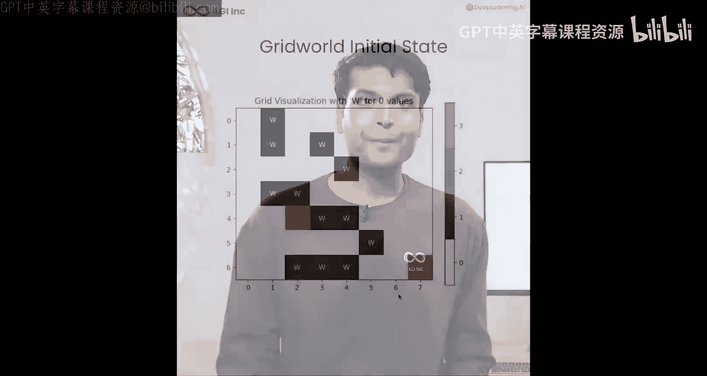
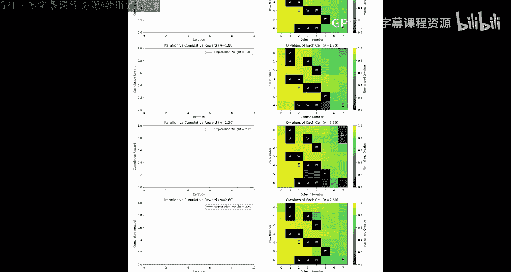
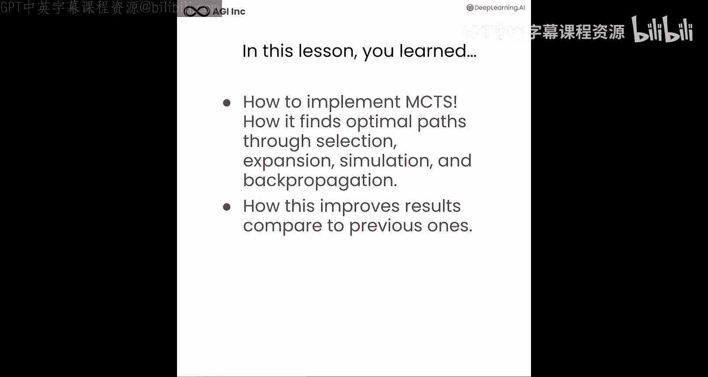

# 006：深入探索AgentQ与MCTS 🧠


在本节课中，我们将深入探索蒙特卡洛树搜索算法，这是一种在复杂设计空间中寻找最优解的强大算法。随后，我们将探讨AgentQ框架中Amias的方法，以创建能够完成网页任务的自主浏览器智能体。



---

## 概述

我们将首先在一个网格世界示例中实现MCTS，观察不同参数如何影响算法的探索与收敛。之后，我们会将MCTS应用到浏览器环境中，看看AgentQ如何利用它来寻找完成任务的最优路径。

---

## 网格世界中的MCTS实现

上一节我们介绍了MCTS的基本概念，本节中我们来看看如何在一个具体的网格世界环境中实现它。

首先，我们导入必要的包并创建初始网格状态。在代码中，`0`代表可通行路径，`1`代表障碍物，`2`是起始位置，`3`是目标终点状态。

```python
# 示例：创建初始网格状态
grid = [
    [0, 0, 1, 0, 0],
    [0, 2, 1, 0, 0],
    [0, 0, 0, 0, 3],
    [1, 1, 0, 1, 0],
    [0, 0, 0, 0, 0]
]
```

我们定义网格边界并绘制地图。在地图中，绿色单元格（如位置7,6）是起点，红色单元格（如位置2,4）是终点，标记为`W`的单元格是障碍墙。智能体的目标是找到从起点到终点的最短路径，且只能向**北、南、东、西**四个方向移动。

---

## 探索权重的影响

接下来，我们运行MCTS并比较不同探索权重对结果的影响。我们设置了低权重（1.0）和高权重（3.0），并进行五次探索模拟，总共运行约1000次迭代。

以下是MCTS的核心选择公式，它平衡了探索与利用：

**公式：** `UCT(node) = Q(node)/N(node) + c * sqrt(ln(N(parent)) / N(node))`

其中，`c`是探索权重，`Q`是节点累计奖励，`N`是访问次数。



我们使用提供的`MCTS grid wrapper`来触发算法并收集最优路径。完成后，通过`Compare_exploration_weight`函数可视化结果。

---

## 可视化与分析

在结果热力图中，我们可以看到不同探索权重下的最终状态。颜色越深（如深绿色），代表该状态的Q值越高，路径越优；颜色越浅（如亮黄色），则代表Q值较低，路径次优。

*   在权重为1.8的示例中，算法从初始状态出发，最终收敛到终点状态，路径颜色较深，表明找到了较优解。
*   同时，算法会避开Q值最低的状态（图中颜色最浅的区域），这些是智能体不应选择的不优路径。

为了让问题更具挑战性，我们可以增加更多障碍物或扩大网格，以观察MCTS在不同权重和模拟次数下，如何快速收敛到最短路径。但需确保为智能体留出一条从起点到终点的可行路径。

---

## 在浏览器环境中应用MCTS

完成了网格世界的探索后，现在我们将MCTS应用到浏览器环境中的AgentQ框架里。

在AgentQ中，世界模型由浏览器状态表示。状态包括DOM元素、URL和页面摘要。可执行的动作包括点击、输入和导航。MCTS的整个过程遵循以下步骤：
1.  初始化世界模型和搜索配置。
2.  运行MCTS算法，为后续的**直接偏好优化**生成Q奖励值。

---

## 可视化MCTS决策树

我们可以使用`plot_tree`和`DFS_browser_node`函数来可视化MCTS生成的决策树。

决策树中的节点代表了不同的状态（URL、消息、动作和响应），并附有Q值。终端节点标志着任务完成。

现在，让我们可视化这棵树。我们可以看到一棵复杂的MCTS决策树。将其缩放后，可以看清整棵树及其选择的路径。

*   算法从初始状态（`good accomplish`）开始，并分配了一个Q值。
*   它探索了第一个节点，发现不是最优路径后便放弃了。
*   随后探索的第二个节点同样被放弃。
*   第三个节点被选中，因为它具有更高的Q值，是一个更优的路径。
*   最终，节点4被赋予了最高的Q值，并被确定为终端状态（即达到了目标页面“Building Evaluating Advanced Rack”）。算法判定这是从可能路径中到达目标的最短路线。
*   在其他分支上，智能体曾导航到“社区深度学习AI”页面，甚至到了“社区课程排序”页面。但当它发现这些页面是关于课程的讨论而非课程本身时，便放弃了这些路径。
*   同样，在寻找关于“Rack”的课程时，它遇到了关于“多模态Rack搜索”或“知识图谱”的讨论页面，判定为错误页面后，便回退到初始状态。

通过这个过程，智能体确定节点4是最短且最优的路线，成功找到了目标课程列表页面。

---

## 总结



本节课中，我们一起学习了如何实现蒙特卡洛树搜索算法，并观察了它在网格世界中的行为。更重要的是，我们看到了MCTS如何被应用于真实的浏览器环境中，帮助AgentQ智能体寻找完成任务的最短最优路径，并有效提升了其决策效果。