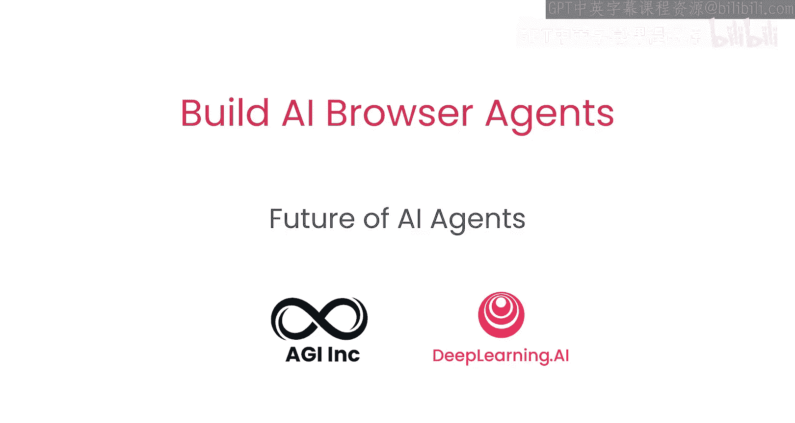
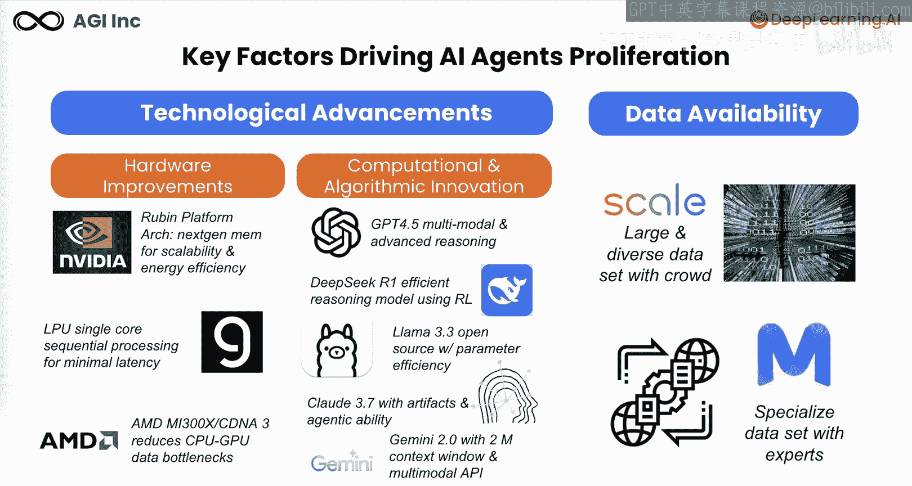
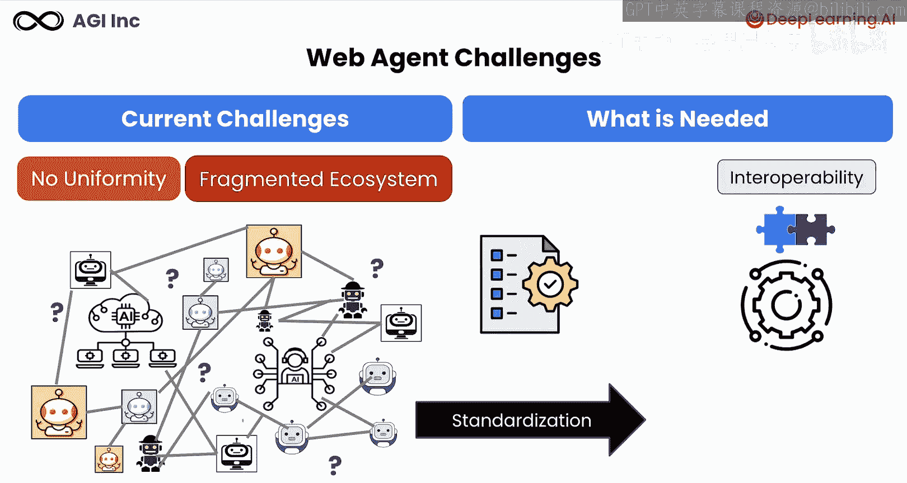
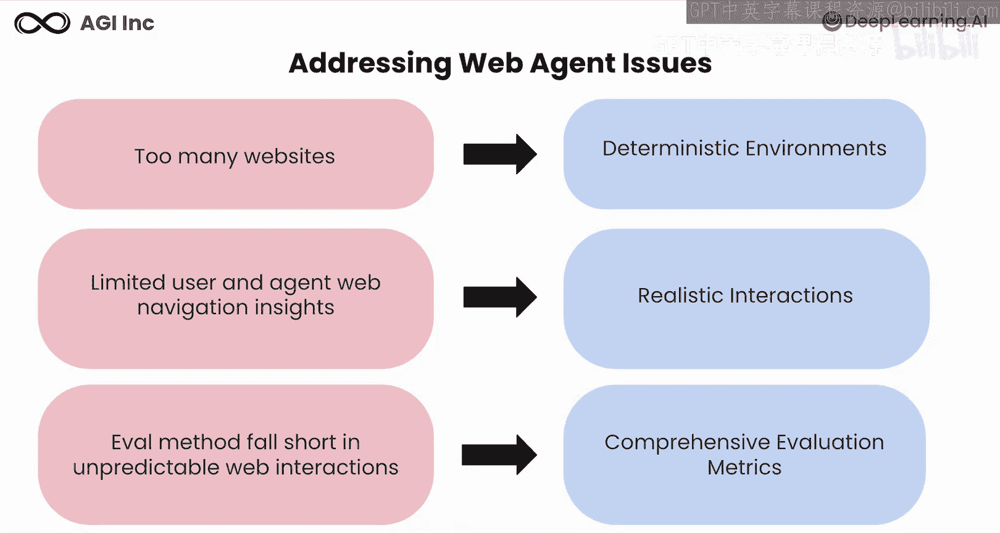
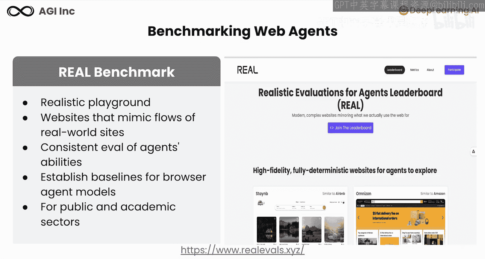
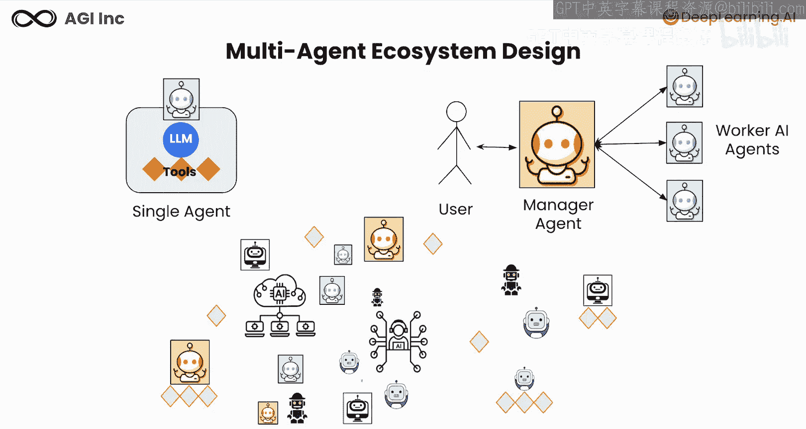
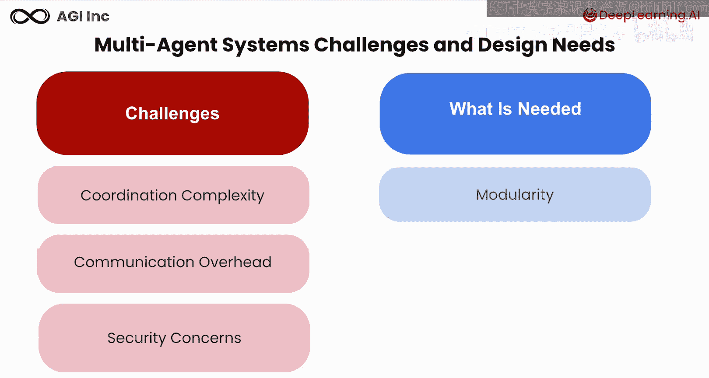
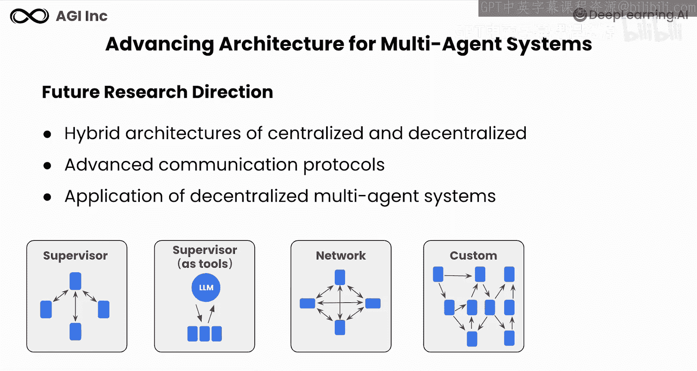
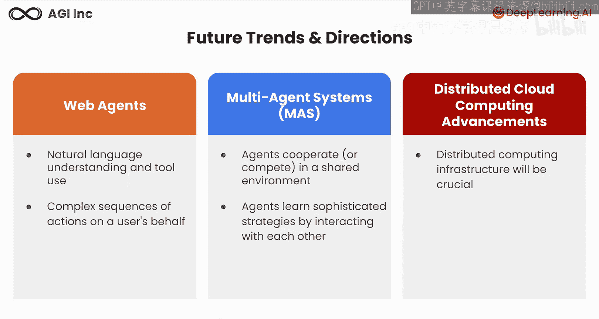

# 007：AI智能体的未来 🚀

在本节课中，我们将探讨驱动AI智能体发展的关键因素及其演变。你将了解当前AI智能体技术的局限性，并探索其未来可能的发展方向，以及这些发展将如何塑造AI领域的格局。

## 驱动AI智能体发展的关键因素 🔑

上一节我们介绍了课程主题，本节中我们来看看推动AI智能体普及的几个核心驱动力。

以下是两个主要驱动因素：

1.  **技术进步**：专用硬件（如GPU）和云计算能力的提升，使得大型模型和更复杂的智能体能够在更短的时间内运行。同时，计算和算法创新为智能体自主规划和行动提供了基础。
2.  **数据可用性**：如今，通过开放数据计划和大规模数据平台，我们拥有庞大的数据集，使智能体能够学习用于决策的复杂模式。

## AI智能体面临的挑战 ⚠️

尽管前景广阔，但AI智能体领域仍面临重大挑战。首先，它们缺乏统一性。

以下是当前生态系统中的主要问题：

*   **框架与实现多样化**：存在多种不同的框架和实现方式，但缺乏让它们协同工作的标准方法。
*   **生态系统碎片化**：当前生态系统中活动很多，但互操作性非常困难。

因此，需要某种**标准化**来实现互操作性、可扩展性和协作。

## 评估挑战与解决方案 🎯

随着AI智能体在公共网络导航方面越来越熟练，在模拟真实条件的可控环境中评估其性能变得至关重要。

传统的评估方法往往难以模拟实际网络交互的动态和不可预测性。我们看到了太多网站，需要确定性的环境来确保每次评估条件一致，消除可能影响性能评估的变量。

对用户行为和智能体在网络导航中表现的洞察有限，可以通过模拟真实交互来纠正，包括加载错误、延迟和中断，以测试智能体的韧性和适应性。

最后，评估方法在应对不可预测的交互方面存在不足，需要全面的评估指标，不仅要衡量交互的最终结果，还要衡量其有效导航复杂网络场景的能力。

## 新基准：REALBench 🌐

为了应对这些挑战，我们正在构建一个新的基准测试：**REALBench**。

REALBench通过提供一个确定性的、启发式的“游乐场”来应对先前的挑战，该游乐场模拟了真实的浏览器体验。这种设置允许一致地评估AI智能体执行任务（如信息检索和交易操作）的能力，并为浏览器智能体模型建立了基线。

这种集体方法旨在为最先进的智能体建立强大的基线和排行榜，使公众和学术界受益。我们鼓励你通过提供反馈、分享见解以及为完善评估场景做出贡献来参与这个项目。通过协作，我们可以增强AI智能体的评估框架，确保它们能够很好地处理现实世界网络导航任务的复杂性。

## 从单智能体到多智能体系统 🤖

到目前为止，我们讨论的是单个AI智能体。现在，作为一个用户，你可以拥有一个多智能体系统，其中一个管理智能体监督多个专业的工作智能体。

然而，随着每个人都在创建自己的智能体，这可能导致一个混乱的生态系统。

## 多智能体系统的挑战与考量 🧩

让我们探讨多智能体系统面临的挑战和考量。

以下是三个主要挑战：

1.  **协调复杂性**：确保自主智能体之间行为一致，在没有集中监督的情况下可能具有挑战性。
2.  **通信开销**：这些分散的智能体可能需要更复杂的通信协议来促进有效协作。
3.  **安全考量**：在开放的去中心化环境中维护系统完整性并防止恶意行为，需要强大的安全措施。

因此，未来需要的是**模块化**、**专业化**和**控制**。

以下是未来的一些研究方向：

*   探索结合集中式和去中心化元素的混合架构，以利用两种方法的优势。
*   开发更有效、允许更好协调的先进通信协议。
*   研究去中心化多智能体系统在不同领域的应用，如协作机器人、传感和模拟。

以下是一些需要进一步探索的多智能体架构，例如使用监督者、基于网络的架构、自定义多智能体工作流以及层级结构。

## 未来趋势与方向 📈

现在，我们来看看未来的趋势和方向。

**按页面推进能力**：通过更好的自然语言理解和使用，深度学习将使智能体能够在线执行复杂的操作序列，例如代表用户预订约会、研究和总结信息、跨网站协调。

**多智能体系统**：智能体在共享环境中协作，并通过相互交互学习复杂的策略。

**分布式与云计算**：分布式和云计算的进步将支持其他发展，并有助于构建可部署在现实世界中的、更具可扩展性的系统。

## 总结 📝

在本节课中，我们一起探讨了当前生态系统中的一些挑战，以及未来如何通过标准化和改进来支持大规模部署的趋势。我们了解了驱动AI智能体发展的技术因素，识别了评估和互操作性方面的关键问题，并展望了从单智能体到复杂多智能体系统演进的未来方向。