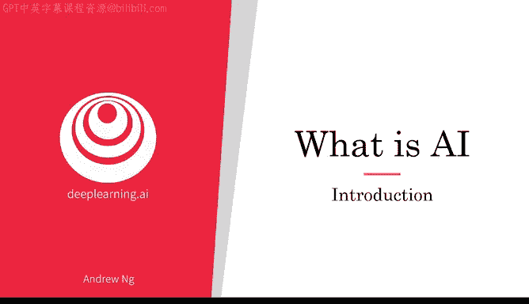
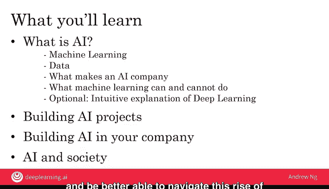

# 001：课程介绍

欢迎来到《AI for everyone》。人工智能正在改变我们的工作和生活方式。这门非技术性课程将教你如何驾驭人工智能的崛起。无论你是想了解流行语背后的真相，还是希望自己使用人工智能——无论是个人用途，还是在公司或其他组织中——本课程都将教你方法。如果你想了解人工智能如何影响社会以及如何应对，你也将从本课程中学到。在第一周，我们将从破除炒作开始，为你提供一个关于人工智能真实面貌的现实视角。让我们开始吧。

## 概述

在本节课中，我们将要学习人工智能的基本概念、其创造价值的方式、不同类型的人工智能（如狭义AI与通用AI），以及本课程的整体结构。我们还将探讨机器学习作为核心驱动技术的作用。

## 人工智能的价值与影响

许多专家一致认为，人工智能将创造巨大的价值。例如，麦肯锡全球研究所的一项研究表明，到2033年，人工智能每年将创造**13万亿至22万亿美元**的额外价值。在这13至22万亿美元中，预计有**3至4万亿美元**将来自所谓的生成式人工智能。这是一种相对较新的人工智能技术，能够生成高质量的文本、图像和音频等内容。

但更大一部分价值将来自其他形式的人工智能。例如，本课程将更侧重于监督学习等其他更成熟的人工智能技术。人工智能已经在软件行业创造了巨大的价值，而麦肯锡研究指出，未来将创造的很多价值存在于软件行业之外。例如，在零售、旅游、交通、汽车、材料、制造等行业。我很难想象在未来几年内，有哪个行业不会受到人工智能的巨大影响。

## 人工智能的类型：从狭义AI到通用AI

目前围绕人工智能有很多兴奋点，但也存在大量不必要的炒作。原因之一是人工智能实际上包含两个独立的概念。

我们今天看到的大部分价值来自**人工狭义智能**。这些AI只做一件事，例如智能音箱、自动驾驶汽车、网络搜索AI，或应用于农业、工厂的AI。这些类型的AI是“一招鲜”。但当你找到合适的应用场景时，它可以变得极具价值。

随着生成式人工智能的兴起，像ChatGPT这样的工具，我们开始看到功能更通用的AI。例如，ChatGPT可以充当文案编辑、头脑风暴伙伴、文本总结器，并协助完成许多其他任务。这些模型是一个令人兴奋的发展，进一步扩展了我们目前能用AI做的事情。

此外，人工智能也指**AGI**的概念，即**人工通用智能**。其目标是构建能够完成人类所能做的任何智力任务的AI，甚至可能是超级智能，完成比任何人能做的更多的事情。我在人工狭义智能和生成式人工智能方面看到了巨大的进步，感觉AI研究正在向AGI缓慢地迈出婴儿般的步伐，这令人兴奋。

但现实地看，我们距离AGI或人工通用智能仍然非常遥远。不幸的是，在极具价值的狭义AI和生成式AI方面取得的快速进展，导致人们得出结论认为人工智能整体进步巨大（这确实是真的），但这反过来又导致人们错误地认为我们可能也即将实现AGI，从而引发了一些关于邪恶的有知觉的机器人即将接管人类的过度夸大和不必要的恐惧。

我认为AGI是一个令人兴奋的研究目标。但在我们实现它之前，还需要多项技术突破，这可能需要数十年，甚至数百年。我希望如此，但我不确定我们是否能在有生之年看到它。但鉴于AGI距离我们还很遥远，我认为没有必要为此过度焦虑。

## 本周学习内容

在本周，你将学习人工智能能做什么，以及如何将其应用于你的问题。在本课程中，你还将看到一些案例研究，了解这些“一招鲜”的狭义AI如何被用于构建真正有价值的应用，如智能音箱和自动驾驶汽车。

具体来说，在本周你将学习：
*   **什么是人工智能**。你可能听说过机器学习，下一个视频将教你什么是机器学习。
*   **什么是数据**，以及哪些类型的数据有价值，哪些类型的数据没有价值。
*   是什么让一家公司成为**人工智能公司**或**AI优先公司**，以便你或许可以开始思考如何提升你公司或其他组织使用AI的能力。
*   同样重要的是，你还将在本周学习**机器学习能做什么和不能做什么**。在我们的社会中，报纸和研究论文往往只谈论机器学习和AI的成功案例，我们几乎看不到任何失败的故事，因为它们报道起来不那么有趣。但为了让你对人工智能和机器学习能做什么和不能做什么有一个现实的看法，我认为让你看到成功和失败的例子都很重要，这样你才能更准确地判断你可能应该或不应该尝试将这些技术用于哪些方面。

最后，机器学习近期的崛起很大程度上是由**深度学习**（有时也称为**神经网络**）的兴起推动的。在本周最后两个可选视频中，你也可以看到对深度学习的直观解释，以便你更好地理解它们能做什么，特别是对于一组狭义的AI任务。

这就是你本周要学习的内容。到本周末，你将了解AI技术以及它们能做什么和不能做什么。

## 课程整体结构

在介绍了第一周的内容后，让我们来看看整个课程的结构安排。

**第二周**，你将学习这些AI技术如何被用于构建有价值的项目。你将了解构建一个AI项目是什么感觉，以及你应该做什么来确保你选择的项目在技术上可行，并且对你、你的业务或其他组织有价值。

**第三周**，在学习了构建AI项目需要什么之后，你将学习如何在你的公司中构建AI。特别是，如果你希望采取措施让你的公司擅长AI，你将看到AI转型手册，并学习如何构建AI团队以及复杂的AI产品。

**第四周**，也是最后一周，人工智能正在对社会产生巨大影响。你将学习AI系统如何可能存在偏见，以及如何减少或消除这些偏见。你还将了解人工智能如何影响发展中经济体，以及人工智能如何影响就业，从而能够更好地为你自己和你的组织驾驭这次AI崛起。

在这为期四周的课程结束时，在对AI技术的理解以及帮助你或你的公司或其他组织驾驭AI崛起的能力方面，你将比大多数大公司的CEO更有见识、更有资格。因此，我希望在这门课程之后，你也能在他人应对这些问题时提供领导力。

## 总结与过渡

本节课中，我们一起学习了人工智能的概述、其创造价值的潜力、不同类型AI（ANI vs. AGI）的区别，以及本课程的教学大纲。我们明确了当前AI发展的重点在于解决特定任务的狭义AI和生成式AI，而通用人工智能仍是一个长远目标。

现在，驱动近期人工智能崛起的一项主要技术是**机器学习**。但是，什么是机器学习呢？让我们在下一个视频中一探究竟。