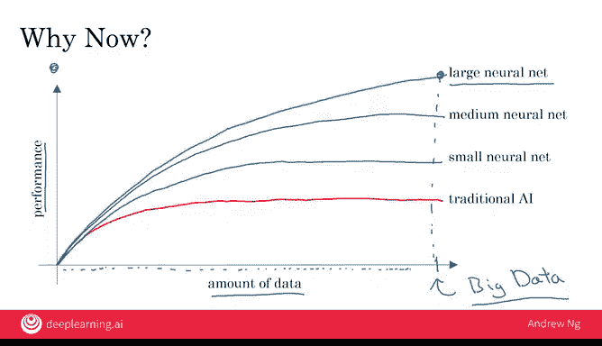

# 002：机器学习 🧠

在本节课中，我们将要学习人工智能（AI）的核心驱动力——机器学习。我们将了解什么是机器学习，以及它如何通过学习输入到输出的映射关系来工作。课程结束时，你将能够开始思考如何将机器学习应用到你的公司或行业中。

## 什么是机器学习？

AI的崛起很大程度上是由一个名为“机器学习”的AI子领域驱动的。机器学习中最常用的类型是一种学习从输入（A）到输出（B）映射关系的AI，这被称为**监督学习**。

## 监督学习实例

以下是监督学习在不同场景中的应用实例：

*   **垃圾邮件过滤**：输入（A）是一封电子邮件，期望的输出（B）是判断该邮件是否为垃圾邮件（是/否）。这是构建垃圾邮件过滤器的核心AI技术。
*   **语音识别**：输入（A）是一段音频剪辑，AI的任务是输出（B）对应的文本转录。
*   **机器翻译**：输入（A）是英语，期望的输出（B）是另一种语言，如中文或西班牙语。
*   **在线广告**：这是目前可能最具盈利性的监督学习应用。大型在线广告平台的AI会输入关于广告的信息和关于你的信息，并尝试预测你是否会点击该广告。通过向你展示你最可能点击的广告，这带来了巨大的经济效益。
*   **自动驾驶汽车**：其中一个关键的AI组件是输入图像和来自雷达或其他传感器的信息，输出其他汽车的位置，以便自动驾驶汽车能够避开它们。
*   **制造业视觉检测**：输入（A）是刚制造出的产品（如手机）的图片，期望的输出（B）是判断产品是否存在划痕或其他缺陷。这有助于制造商减少或预防产品缺陷。

## 生成式AI与监督学习

监督学习也是生成式AI系统（如ChatGPT等聊天机器人）的核心。这些系统通过从互联网下载的大量文本中学习来工作。当给定几个词作为输入时，模型可以预测接下来的词。这些被称为**大语言模型（LLM）** 的模型，通过反复预测下一个应该输出的词来生成新文本。

鉴于LLM受到的广泛关注，让我们在下一部分更详细地看看它们是如何工作的。

## 大语言模型如何工作？

大语言模型是通过使用监督学习训练一个模型来反复预测下一个词而构建的。

例如，如果一个AI系统在互联网上读到这样一个句子：“我最喜欢的饮料是珍珠奶茶”，那么这个句子会被转化为许多A到B的数据点供模型学习。

具体来说，给定这个句子，我们现在有一个数据点：输入短语“我最喜欢的饮料”，模型需要预测下一个词。在这个例子中，正确答案是“是”。接着，输入“我最喜欢的饮料是”，模型需要预测下一个词，正确答案是“珍珠”，依此类推，直到用完句子中的所有词。

因此，这一个句子被转化为多个输入（A）和输出（B），让模型学习：给定几个词作为输入，下一个词是什么？当你用大量数据（例如数千亿甚至上万亿个词）训练一个非常大的AI系统时，你就会得到一个像ChatGPT这样的大语言模型。给定一段初始文本（称为**提示**），它非常擅长生成一些额外的词作为回应。

这里的描述省略了一些技术细节，例如模型如何学会遵循指令而不仅仅是预测在互联网上找到的下一个词，以及开发者如何降低模型生成不当输出（如表现出偏见或有害指令）的可能性。如果你感兴趣，可以在课程《面向所有人的生成式AI》中了解更多细节。但其核心仍然是这项技术：它使用监督学习从大量数据中学习，以预测下一个词是什么。

## 监督学习为何现在兴起？

监督学习的概念已经存在了几十年，但它在最近几年才真正兴起。这是为什么呢？

当朋友们问我这个问题时，我会画一张图给他们看。现在我也想向你展示这张图，你也可以用它来回答别人提出的同样问题。

假设横轴代表你为某项任务拥有的数据量。例如，对于语音识别，这可能就是你拥有的音频数据和转录文本的数量。在许多行业中，由于互联网和计算机的兴起，过去许多以纸张形式记录的信息现在被数字化了，因此我们能够获取的数据量在过去几十年里确实大幅增长。

假设纵轴代表AI系统的性能。事实证明，如果你使用传统的AI系统，其性能增长曲线是这样的：随着你喂给它更多数据，性能会有所提升，但超过某个点后，提升就不那么明显了。就好像你的语音识别系统不会因为数据更多而准确度大幅提升，或者你的在线广告系统在展示最相关广告方面也不会因为数据更多而准确度大幅提升。

AI最近真正兴起的原因在于神经网络和深度学习的崛起。我们将在后面的视频中更精确地定义这些术语，现在不必过于担心它们的含义。使用现代AI（即神经网络和深度学习）时，我们看到的情况是：如果你训练一个小型神经网络，其性能曲线大致如此，随着数据增多，性能会在更长时间内持续提升。如果你训练一个稍大的神经网络（例如中型网络），性能曲线可能像那样。如果你训练一个非常大的神经网络，性能似乎就能持续变得更好。对于语音识别、在线广告、自动驾驶等应用来说，拥有高性能、高准确度的系统非常重要。这使得这些AI系统变得更好，也让相关产品对用户更具吸引力，对公司更具价值。

## 图表带来的启示

这张图带来了几个启示。如果你想达到最佳性能水平，你需要两样东西：
1.  拥有大量数据确实很有帮助。这就是为什么你有时会听到“大数据”的说法——拥有更多数据几乎总是有益的。
2.  你需要能够训练一个非常大的神经网络。因此，快速计算机（包括摩尔定律）的兴起，以及专用处理器（如图形处理器单元或GPU，我们将在后面的视频中更多提及）的兴起，使得许多公司（不仅仅是大型科技公司）能够基于足够大量的数据训练大型神经网络，从而获得非常好的性能并驱动商业价值。

事实上，正是这种**规模化**——增加数据量和模型大小——对于最近在训练生成式AI系统（包括我们刚刚讨论的大语言模型）方面取得突破至关重要。

## 总结

本节课中，我们一起学习了AI中最重要的概念——机器学习，特别是**监督学习**，它意味着从A到B或从输入到输出的映射。使其真正有效工作的关键是**数据**。在下一个视频中，让我们来看看什么是数据，你可能已经拥有哪些数据，以及如何考虑将这些数据输入到AI系统中。让我们继续观看下一个视频。