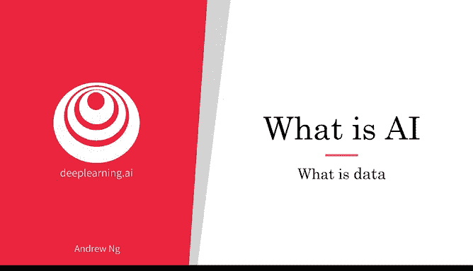
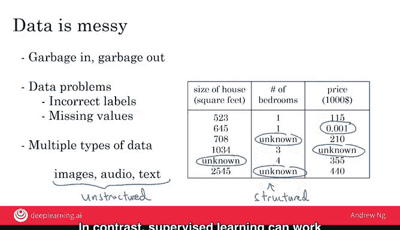

# 003：什么是数据 📊

在本节课中，我们将要学习人工智能（AI）系统中的核心要素——数据。我们将探讨数据的本质、如何获取数据、常见的误解以及数据的类型，帮助你建立对数据在AI中作用的基本理解。

---

你可能听说过数据对于构建AI系统非常重要，但数据究竟是什么？

让我们来看一个例子。这是一个数据表，我们也称之为**数据集**。如果你试图为买卖房屋定价，你可能会收集一个像这样的数据集。它可以只是一个电子表格，比如一个Excel表格。其中一列是房屋的面积（以平方英尺或平方米为单位），第二列是房屋的价格。

因此，如果你想构建一个AI系统或机器学习系统来帮助你为房屋定价或判断价格是否合理，你可能会决定将房屋面积定义为 **A**，将房屋价格定义为 **B**，并让AI系统学习这个从A到B的**输入-输出映射**。

现在，如果不仅仅根据面积定价，你可能会说，让我们也收集这间房屋的卧室数量数据。在这种情况下，**A** 可以是前两列（面积和卧室数），而 **B** 仍然是房屋价格。

所以，给定一个数据表或数据集，实际上是由你根据业务用例来决定什么是 **A** 和什么是 **B**。

数据通常是你业务所特有的。这是一个房地产中介在尝试为房屋定价时可能拥有的数据示例。由你来决定什么是A和B，以及如何选择这些定义，使其对你的业务有价值。

作为另一个例子，如果你有特定的预算，并想决定你能负担多大的房子，那么你可能会决定输入 **A** 是某人的花费金额，而 **B** 只是房屋的面积（平方英尺）。这将是一个完全不同的A和B选择，它告诉你，在给定预算下，你应该寻找多大面积的房子。

---

以下是另一个数据集的例子。假设你想构建一个AI系统来识别图片中的猫。你可能会收集一个数据集，其中输入 **A** 是一组不同的图像，输出 **B** 是标签，标明第一张图是猫，第二张不是，第三张是，第四张不是。然后让AI系统输入图片A，输出B（是猫或不是猫），这样你就可以在你的照片流或移动应用上标记所有猫的图片。

在机器学习传统中，实际上有很多关于猫的例子。我想这始于我领导谷歌大脑团队时，我们发布了一个有些“臭名昭著”的谷歌猫结果，当时一个AI系统通过观看YouTube视频学会了检测猫。自那以后，在谈论机器学习时，使用猫作为贯穿始终的例子就成了一种传统。

---

数据很重要，但你如何获取数据呢？

以下是几种获取数据的主要方式：

**1. 手动标注**
例如，你可能收集一组像上面那样的图片，然后自己或请他人浏览这些图片并为每张图片贴上标签。通过手动标注每张图像，你现在就拥有了一个用于构建猫检测器的数据集。实际上，你需要的不止四张图片，可能需要成千上万张。手动标注是一种经过验证的、可靠的获取数据集（包含A和B）的方法。

**2. 观察用户行为或其他行为**
例如，假设你运营一个在线销售商品的网站。你可以观察用户是否购买你的产品。仅仅通过购买或不购买的行为，你就能收集到类似这样的数据：存储用户ID、用户访问网站的时间、你向用户展示的产品价格以及他们是否购买。因此，仅仅通过使用你的网站，用户就能为你生成这些数据。

我们也可以观察其他事物的行为，比如机器。如果你在工厂运行一台大型机器，并想预测机器是否即将发生故障，那么通过观察机器的行为，你可以记录像这样的数据集：机器ID、机器温度、机器内部压力，以及机器是否发生故障。如果你的应用是预防性维护，你可以选择这些作为输入 **A**，选择那个作为输出 **B**，来尝试判断机器是否即将故障。

**3. 从网站下载或从合作伙伴处获取**
得益于开放的互联网，你可以免费下载大量数据集，范围从计算机视觉或图像数据集，到自动驾驶汽车数据集、语音识别数据集、医学影像数据集等等。如果你的应用需要某种类型的数据，直接从网上下载（注意许可和版权）可能是一个很好的开始方式。最后，如果你与合作伙伴合作，比如与一家工厂合作，他们可能已经收集了大量关于机器、温度、压力以及机器是否故障的数据，并可以交给你。

---

数据很重要，但它也有些被过度炒作，有时会被误用。让我向你描述两种最常见的误用或错误的思考方式。

上一节我们介绍了获取数据的方法，本节中我们来看看关于数据的常见误区。

**误区一：先囤积数据，再考虑AI**
当我与一些大公司的高管交谈时，他们中有些人实际上对我说：“嘿，吴恩达，给我三年时间来建立我的IT团队，我们正在收集大量数据，三年后我将拥有完美的数据，然后我们再做AI。” 事实证明，这是一个非常糟糕的策略。相反，我建议每家公司，一旦开始收集一些数据，就立即开始将其展示或提供给AI团队。因为通常AI团队可以给你的IT团队反馈，告诉他们应该收集什么类型的数据，以及应该继续构建什么类型的IT基础设施。

**误区二：认为只要有数据，AI就能创造价值**
不幸的是，我看到一些CEO在新闻中读到数据的重要性，然后说：“嘿，我有这么多数据。AI团队肯定能让它变得有价值。” 不幸的是，这并不总是奏效。更多数据通常比更少数据好，但我不会想当然地认为，仅仅因为你拥有许多TB或GB的数据，AI团队就一定能使其变得有价值。所以我的建议是，不要只是把数据扔给AI团队，就假设它会变得有价值。

事实上，在一个极端案例中，我看到一家公司收购了一系列其他医疗公司，其论点是假设它们的数据会非常有价值。据我所知，几年过去了，工程师们还没有弄清楚如何利用所有这些数据来真正创造价值。所以有时有效，有时无效。我不会过度投资于仅仅为了数据而获取数据，除非你也让AI团队看一看，因为他们可以帮助指导你思考哪些数据实际上最有价值。

---

最后，数据是混乱的。你可能听说过“垃圾进，垃圾出”这句话。如果你有糟糕的数据，AI将学到不准确的东西。

以下是数据问题的一些例子。假设你有这个关于房屋面积、卧室数量和价格的数据集。你可能有错误的标签或错误的数据。例如，这栋房子可能不会只卖1美元。数据也可能有缺失值，比如我们这里有一堆未知值。因此，你的AI团队需要弄清楚如何清理数据，或如何处理这些错误标签和/或缺失值。

---

此外，数据也有多种类型。例如，有时你会听到图像、音频和文本，这些是人类很容易解释的数据类型。这有一个术语，称为**非结构化数据**。有一些特定的AI技术可以处理图像来识别猫，处理音频来识别语音，或处理文本来理解电子邮件。

然后，还有像右边这样的数据集，这是**结构化数据**的一个例子。这基本上意味着存在于大型电子表格中的数据。处理非结构化数据的技术与处理结构化数据的技术略有不同。今天的生成式AI主要用于生成非结构化数据，如文本、图像和音频，而不是结构化数据。相比之下，监督学习对这两种类型的数据（非结构化数据和结构化数据）都能很好地工作。

---

在本节课中，我们一起学习了什么是数据。你看到了如何获取数据，例如通过手动标注、观察行为和下载。你也了解了如何不误用数据，例如，不要过度投资于IT基础设施，寄希望于它将来对AI有用，但实际上却没有验证它是否真的对你想构建的AI应用有用。最后，你看到了数据是混乱的，但一个好的AI团队将能够帮助你处理所有这些问题。

现在，AI有一个复杂的术语体系，人们经常抛出诸如AI、机器学习、数据科学等术语。在下一个视频中，我想与你分享这些术语的实际含义，以便你能够自信而准确地与他人讨论这些概念。让我们继续下一个视频。