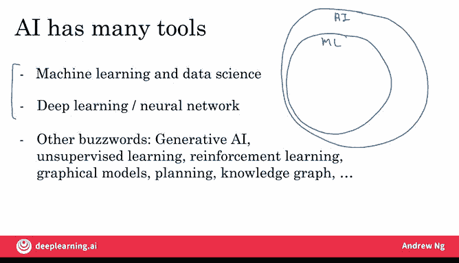

# 004：人工智能术语解析 🧠

在本节课中，我们将要学习人工智能领域中的几个核心术语：机器学习、数据科学、神经网络与深度学习。理解这些概念是您与他人讨论AI以及思考如何将其应用于业务的基础。

## 概述

您可能听说过诸如机器学习、数据科学、神经网络或深度学习等术语。这些术语具体指什么？本视频将解析AI中最重要的概念术语，以便您能就此与他人交流，并开始思考如何将这些技术应用于您的业务。

## 机器学习与数据科学

上一节我们介绍了课程目标，本节中我们来看看两个核心概念：机器学习与数据科学。

假设您有如下所示的房屋数据，包含房屋面积、卧室数量、浴室数量、是否新装修以及价格。

| 面积 | 卧室 | 浴室 | 新装修 | 价格 |
| :--- | :--- | :--- | :--- | :--- |
| ... | ... | ... | ... | ... |

如果您想构建一个移动应用来帮助人们评估房价，那么这些属性（面积、卧室数等）就是**输入A**，而价格则是**输出B**。这便是一个**机器学习**系统。具体来说，它是一种学习从输入A到输出B映射关系的机器学习系统。

机器学习通常会产生一个持续运行的AI系统。这是一款软件，可以在任何时间自动输入房屋属性A，并输出价格B。如果您有一个为成千上万甚至数百万用户服务的AI系统，那通常就是一个机器学习系统。

相比之下，您可能还想做另一件事：让一个团队分析您的数据集以获得洞察。以下是团队可能得出的结论示例：

*   您是否知道，在面积相似的情况下，三居室的房屋比两居室的房屋价格高得多？
*   您是否知道，新装修的房屋有15%的溢价？

这些洞察可以帮助您做出商业决策，例如：在面积相似的情况下，为了最大化价值，您应该建造两居室还是三居室的房屋？或者，投资装修房屋以期提高售价是否值得？这些都是**数据科学**项目的例子。数据科学项目的输出是一系列洞察，可帮助您做出商业决策。

这两个术语——机器学习和数据科学——之间的界限实际上有些模糊，即使在当今业界，这些术语的使用也不完全一致。但这里给出的可能是最常用的定义。不过，您会发现并非所有人都严格遵守这些定义。

为了更正式地定义这两个概念：
*   **机器学习**是让计算机无需明确编程即可学习的研究领域。这是Arthur Samuel几十年前提出的定义。一个机器学习项目通常会产生一个软件，给定输入A即可输出B。
*   **数据科学**是从数据中提取知识和洞察的科学。因此，数据科学项目的输出通常是一份演示文稿，用于向高管总结结论以采取商业行动，或向产品团队总结结论以决定如何改进网站。

让我举一个在线广告行业中机器学习与数据科学的例子。如今，大型广告平台都拥有人工智能，能快速判断您最可能点击哪个广告。这是一个**机器学习系统**。它输入关于您和广告的信息，输出您是否会点击。这些系统全天候运行，是为公司带来广告收入的机器学习系统。

相比之下，我也参与过在线广告行业的**数据科学项目**。例如，数据分析可能显示旅游业购买的广告不多，但如果派遣更多销售人员向旅游公司推销广告，可以说服他们使用更多广告。这就是一个数据科学项目的例子，其结论是让销售团队花更多时间联系旅游业。

因此，即使在同一个公司，您也可能有不同的机器学习和数据科学项目，两者都可能非常有价值。

## 深度学习与神经网络

上一节我们区分了机器学习与数据科学，本节中我们来看看当前最强大的机器学习工具：深度学习与神经网络。

您也听说过深度学习。那么什么是深度学习？假设您想预测房价。您有一个输入，告诉您房屋的面积、卧室和浴室数量以及是否新装修。给定这个输入A，要输出价格B，最有效的方法之一就是将其输入到这里这个东西中。

中间这个大家伙被称为**神经网络**，有时也称为**人工神经网络**，以区别于您大脑中的神经网络。人脑由神经元组成。因此，当我们说人工神经网络时，只是为了强调这不是生物大脑，而是一个软件。人工神经网络的作用是接收这四项输入A，然后输出B，即房屋的估计价格。

在本周稍后的可选视频中，我将向您展示更多关于人工神经网络的内容。但简而言之，当我们在纸上绘制人工神经网络的图示时，它与大脑有一个非常松散的类比。这些小圆圈被称为人工神经元或简称神经元，它们也相互传递信息。这个大的人工神经网络只是一个庞大的数学方程，它告诉系统给定输入A，如何计算价格B。如果这里看起来有很多细节，请不要担心，我们稍后会详细讨论。

但关键要点是：**神经网络是一种非常有效的技术，用于学习从A到B或从输入到输出的映射**。如今，神经网络和深度学习这两个术语几乎可以互换使用，它们本质上指的是同一事物。几十年前，这类软件被称为神经网络，但近年来我们发现“深度学习”听起来更酷，因此这个术语最近流行起来。

那么，神经网络或人工神经网络与大脑有什么关系呢？事实证明，几乎没什么关系。神经网络最初受到大脑的启发，但其工作原理的细节几乎与生物大脑的工作方式完全无关。因此，我今天非常谨慎地对待人工神经网络和生物大脑之间的任何类比，尽管存在一些松散的灵感来源。

## 术语关系总结

本节课中我们一起学习了机器学习、数据科学和深度学习的核心概念。现在我们来总结一下这些术语之间的关系。

AI拥有许多不同的工具。在本视频中，您了解了什么是机器学习和数据科学，以及什么是深度学习和神经网络。您可能还会在媒体上听到其他流行词，如生成式AI、无监督学习、强化学习、大语言模型、规划、知识图谱等。您不需要知道所有这些其他术语的含义，它们只是让计算机智能行动的其他工具。

如果我们要绘制一个维恩图来展示所有这些概念如何组合在一起，它可能看起来像这样：

**AI**是让计算机智能行事的庞大工具集。在AI中，最大的子集是**机器学习**的工具，但AI确实还有其他非机器学习的工具，例如底部列出的一些流行词。在机器学习中，目前最重要的部分是**神经网络**或**深度学习**，这是一套非常强大的工具，用于执行监督学习或A到B的映射以及其他一些任务。但也存在其他非深度学习的机器学习工具。

那么数据科学如何融入这幅图景呢？术语的使用存在不一致性。有些人会告诉您数据科学是AI的一个子集，有些人会告诉您AI是数据科学的一个子集。这取决于您问谁。但我想说，数据科学可能是所有这些工具的一个交叉子集，它使用了许多来自AI、机器学习和深度学习的工具，但也拥有一些独立的工具，用于解决推动商业洞察的一系列重要问题。

## 总结

在本视频中，您了解了什么是机器学习、什么是数据科学以及什么是深度学习和神经网络。我希望这能让您了解使用AI时最常见和最重要的术语，并且您可以开始思考如何将这些技术应用到您的公司。

现在，一家公司擅长AI意味着什么？让我们在下一个视频中讨论。