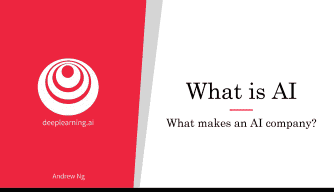
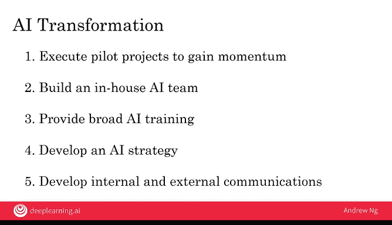

# 005：4_人工智能公司的核心要素 🏢

在本节课中，我们将探讨是什么让一家公司擅长运用人工智能，以及你的公司如何能成为人工智能领域的佼佼者。我们将借鉴互联网时代的经验，并了解构建优秀人工智能公司的核心要素与系统化转型路径。

## 从互联网时代汲取的教训

上一节我们提到了借鉴互联网发展经验的重要性。本节中，我们来看看一个具体的例子：为什么仅仅拥有一个网站，并不能让一家传统商场变成一家真正的互联网公司。

一个真正的互联网公司，其核心在于充分利用互联网技术所赋予的优势。以下是互联网公司通常会做好的几件事：

*   **进行广泛的A/B测试**：互联网公司可以轻松地同时上线两个不同版本的网页，快速测试哪个版本效果更好，从而加速学习过程。
*   **拥有极短的迭代周期**：得益于技术特性，互联网公司可以每周甚至每天发布新产品或更新。
*   **推动决策权下放**：决策权从CEO下放到工程师、产品经理等一线专业人员手中，因为他们最了解技术、产品和用户。

这些做法使得互联网公司能够充分发挥互联网的潜力。那么，对于人工智能时代，情况又是怎样的呢？

## 定义优秀的人工智能公司

与互联网时代类似，仅仅在业务中引入几个神经网络或深度学习算法，并不能自动将一家公司转变为人工智能公司。

一家优秀的人工智能公司，其关键在于**系统性地做好那些人工智能技术使之成为可能的事情**。以下是这类公司的几个核心特征：

*   **擅长战略数据获取**：许多领先的科技公司会推出不直接盈利的免费产品，其战略目的就是为了获取数据，并在其他业务中实现数据变现。
*   **建立统一的数据仓库**：将分散在不同部门数据库中的数据整合到一个统一的数据仓库中，便于工程师连接数据点、发现规律。当然，这需要在遵守隐私法规（如欧洲的GDPR）的前提下进行。
*   **敏锐识别自动化机会**：善于发现业务流程中可以通过监督学习算法实现“从A到B映射”的环节，从而用自动化替代人工任务。
*   **设立新角色与新分工**：例如设立机器学习工程师等新职位，并采用新的团队任务分工方式。

因此，让公司擅长人工智能，意味着要从公司架构上进行调整，以充分发挥人工智能的优势。

## 人工智能转型路线图

对于一家公司而言，成为人工智能领域的强者需要一个过程。十年前，谷歌、百度等公司也并非像今天这样是人工智能巨头。成为人工智能强企并非神秘魔法，而是有一套系统的方法。

以下是我推荐给希望有效运用人工智能的公司的**五步人工智能转型路线图**：

1.  **执行试点项目以获取动力**：先开展几个小型人工智能项目，切身感受人工智能能做什么、不能做什么，以及运作一个人工智能项目是怎样的体验。这可以由内部团队或外包团队完成。
2.  **建立内部人工智能团队并提供广泛培训**：在试点项目后，需要组建内部的人工智能团队，并为工程师、经理、部门领导和高管提供广泛的人工智能思维培训。
3.  **制定人工智能战略**：在对人工智能有更深入的理解后，为公司制定全面的人工智能发展战略。
4.  **发展内部与外部沟通**：确保所有利益相关者，包括员工、客户和投资者，都理解并认同公司拥抱人工智能发展的方向。

人工智能已经在软件行业创造了巨大价值，并将持续如此。如果你能帮助你的公司掌握人工智能，它也有望在软件行业之外创造巨大价值。

## 总结与展望

本节课中，我们一起学习了优秀人工智能公司的核心特征，并简要了解了帮助企业转型的系统化路线图。在后续课程中，我们将对这个路线图进行更深入的探讨。

进行人工智能项目（如路线图中的试点项目）的一个挑战在于，准确理解人工智能的能力边界。在下一个视频中，我将通过具体示例向大家展示人工智能能做什么和不能做什么，以帮助你为公司更有效地选择人工智能项目。