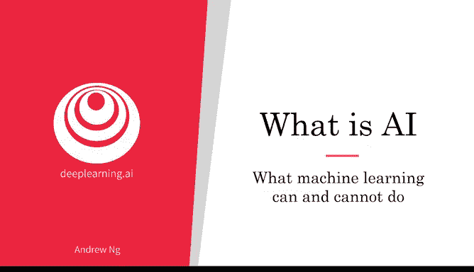
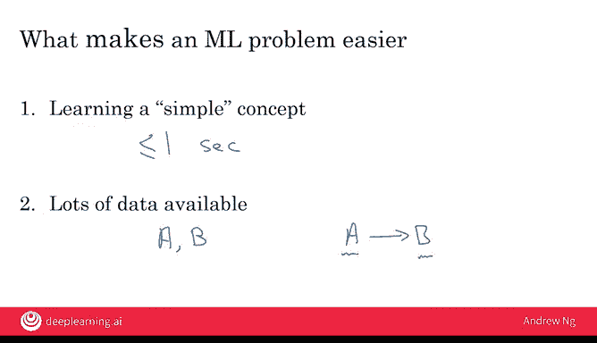

# 006：机器学习的能力与局限 🧠

在本节课中，我们将探讨机器学习在实践中的能力与局限。我们将通过具体例子，帮助你建立对人工智能可行项目的直觉判断，避免选择那些当前技术无法实现的目标。

上一节我们了解了人工智能的广泛应用。本节中，我们来看看如何判断一个任务是否适合用机器学习来解决。

一个不完美但实用的经验法则是：**任何你可以在“一秒思考”内完成的任务，现在或不久的将来都可能通过监督学习实现自动化**。这里的“一秒思考”指的是人类能快速、直观完成的任务。

以下是几个符合“一秒思考”法则的例子：
*   **自动驾驶中识别其他车辆的位置**：人类驾驶员可以瞬间完成。
*   **判断手机屏幕是否有划痕**：看一眼就能得出结论。
*   **语音转录**：听懂并转述一句话不需要长时间的思考。

然而，这个法则也有其局限性。与之相对，有些事情是当前人工智能难以做到的。

## 一个典型的局限案例：预测股价 📉

现在，让我们深入分析一个机器学习难以胜任的任务：**仅根据某只股票的历史价格，来准确预测其未来的价格**。

假设我们的任务是：
*   **输入 A**：股票近期的价格。
*   **输出 B**：预测未来某个时间点（例如一个月后）的价格。

如果我们尝试应用机器学习，一个简单的算法可能会尝试用一条直线来拟合数据。但问题在于，股票过去的价格对未来价格的预测能力非常弱。未来的股价受太多随机因素影响，这使得准确预测变得极其困难。

**公式表示**： 假设我们试图用线性回归拟合：`未来价格 ≈ w * 历史价格 + b`。但由于股价波动本质上是随机的，这个模型的预测误差会非常大，导致 `w` 和 `b` 的值极不稳定，预测结果不可靠。

因此，仅基于单一历史价格序列的预测项目，目前来看是不可行的。不过，如果有其他复杂且难以获取的数据（如合法的网络流量或客流量数据来估算公司销售额），结合历史价格，算法或许能具备一定的预测能力。但这仍然无法完全克服股市内在的随机性。

## 判断项目可行性的经验法则 ⚖️

为了帮助你快速筛选可行与不可行的项目，这里有两个关于机器学习问题可行性的经验法则。

以下是两个关键考量因素：
1.  **概念的简单性**：学习一个“简单概念”更可能成功。“简单概念”没有严格定义，但通常指那些人类只需极短时间（如一秒或几秒）思考就能得出结论的任务。例如，识别图像中的汽车是相对简单的概念；而构思预测公司销量的巧妙信号则复杂得多。
2.  **数据的丰富性**：如果你拥有大量可用数据，机器学习问题更可能可行。这里的“数据”指的是输入A和期望的输出B的配对集合。例如，要训练一个检测手机划痕的系统，你需要成千上万张带有“有划痕”或“无划痕”标签的手机图片。数据越多，构建准确系统的可能性就越高。

人工智能是新时代的电力，正在变革各行各业，但它并非魔法，无法做到世间万物。希望本视频能帮助你初步形成对人工智能能做什么、不能做什么的直觉，从而提高你为团队选择可行且有价值项目的成功率。

为了帮助你继续深化这种直觉，我将在下一个视频中展示更多关于人工智能能与不能做的例子。让我们进入下一讲。