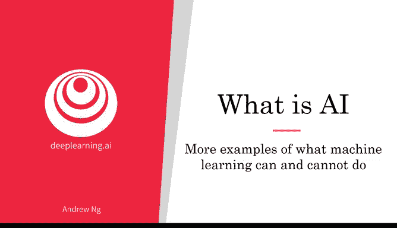
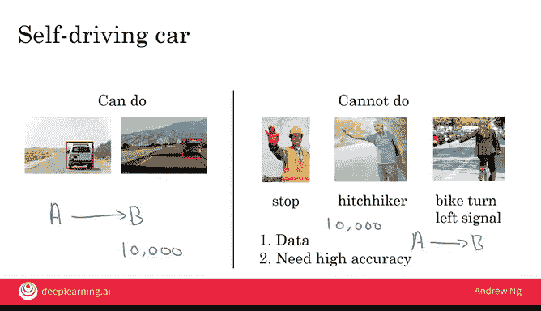
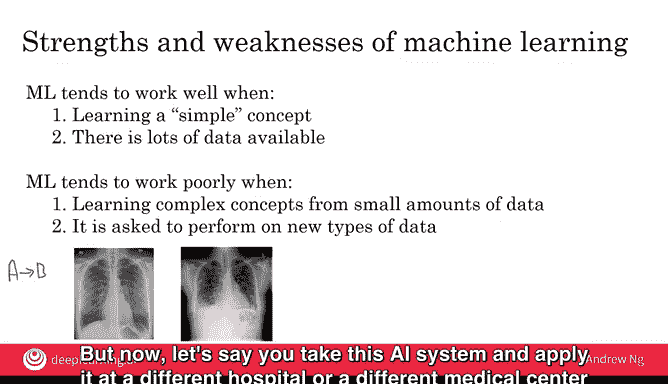

# 007：机器学习能力与局限的更多示例 🧠

在本节课中，我们将通过更多具体示例，深入探讨机器学习的能力与局限。理解AI能做什么和不能做什么，对于选择有价值的项目至关重要。通过分析成功与失败的案例，我们可以更快地培养出对AI项目可行性的直觉。

## 自动驾驶中的AI能力 🚗

上一节我们讨论了识别AI能力边界的重要性，本节中我们来看看更多具体例子。首先，让我们以构建自动驾驶汽车为例。

AI目前可以很好地完成一项任务：识别汽车前方的物体。具体来说，系统可以输入一张汽车前方的图片（可能结合摄像头、雷达或激光雷达等传感器数据），然后输出其他车辆的位置信息。

*   **输入A**：汽车前方的图片，以及雷达等其他传感器读数。
*   **输出B**：其他车辆的位置。

目前，自动驾驶行业已经掌握了如何收集足够的数据，并拥有相当好的算法来相当可靠地完成这项任务。因此，**识别其他车辆的位置是当今AI能够做到的事情**。

## 自动驾驶中的AI局限 🛑

然而，有些事情是当今AI无法做到，或者至少非常难以做到的。例如，根据人类的姿势或手势判断其意图。

设想一些场景：一名建筑工人伸出手要求你的汽车停下；一个搭便车的人挥手示意车辆靠边；一名自行车骑手举起左手表示要左转。如果你试图构建一个系统来学习从A到B的映射：

*   **输入A**：一段人类向你的汽车做手势的短视频。
*   **输出B**：这个人想要表达的意图。

这在今天是非常困难的。原因主要有两点：

1.  **数据多样性极大**：人们向你做手势的方式极其繁多。想象所有可能用于表示“减速”、“通行”或“停止”的手势，其变化方式非常多。因此，很难收集到足够的数据，涵盖成千上万人以各种不同方式做手势的情况，以捕捉人类手势的丰富性。
2.  **安全要求极高**：这是一个安全关键型应用。我们需要AI能极其准确地判断，建筑工人是让你停下还是让你通过。这种高精度要求使得构建AI系统更加困难。

因此，即使你能收集到1万张其他汽车的照片，许多团队都能构建出具备基本车辆检测能力的AI系统。相比之下，即使你收集了1万人向你的汽车挥手的图片或视频，以目前的技术，要构建一个能从手势中识别人类意图、并达到安全驾驶所需高精度的AI系统，仍然非常困难。这就是为什么当今许多自动驾驶团队具备检测其他车辆的组件，并依赖该技术来安全驾驶，但很少有团队试图完全依靠AI系统来识别人类手势的巨大多样性，并仅凭此来安全地绕开行人。

## 医疗诊断中的AI示例 🏥

让我们再看一个例子。假设你想构建一个AI系统，通过查看X光图像来诊断肺炎。

以下是AI可以做到的事情：
*   **输入A**：胸部X光图像。
*   **输出B**：诊断结果（患者是否患有肺炎）。

以下是AI难以做到的事情：仅凭医学教科书章节中解释肺炎的10张图片来诊断肺炎。人类可以通过查看少量图像（也许只有几十张）并阅读医学教科书中的几段文字，就开始形成概念。但如果你只有10张图片和几段解释肺炎及胸部X光表现的文本，目前还不知道如何将其表述为一个AI问题（即定义什么是A，什么是B），也不知道如何编写软件来解决它。相比之下，一位年轻的医生通过阅读医学教科书和查看可能几十张图像就能学得很好，但目前的AI系统还无法做到这一点。

## 机器学习的优势与局限总结 📊

综上所述，以下是机器学习的一些优势和弱点：

**机器学习在以下情况往往表现良好：**
*   当你试图学习一个**简单的概念**（例如，一个你可以在不到一秒的思考时间内完成的任务）。
*   当有**大量数据**可用时。

**机器学习在以下情况往往表现不佳：**
*   当你试图从**少量数据**中学习一个**复杂的概念**时。

AI另一个未被充分认识的弱点是：当处理的数据类型与其在数据集中见过的数据**不同**时，其表现往往会变差。让我用一个例子来解释。

假设你构建了一个监督学习系统，使用A到B的映射来学习从类似下图的图像中诊断肺炎。这些是质量相当高的胸部X光图像。

但现在，假设你将这个AI系统应用到一个不同的医院或医疗中心，那里的X光技师可能总是让患者以某种角度躺着，或者图像中存在一些伪影（如图中的细小划痕或其他放置在患者身上的物体）。

如果AI系统是从左侧（来自高质量医疗中心）的数据中学习的，而你将其应用到生成右侧图像的医疗中心，那么它的性能也会相当差。一个优秀的AI团队能够缓解或减少其中一些问题，但做到这一点并不容易。这是AI实际上比人类弱得多的一个方面。如果一个人类从左侧的图像中学习，他们更有可能适应右侧那样的图像，因为他们能判断出患者只是以一个角度躺着。但AI系统在泛化或处理此类新型数据时，可能远不如人类医生稳健。

## 培养直觉与展望 🔮

我希望这些例子能帮助你磨练关于AI能做什么和不能做什么的直觉。如果你觉得它与不能做的界限仍然模糊，请不要担心，这完全正常。事实上，即使是今天，我也不能立即审视一个项目就断定其是否可行，通常仍然需要数周的技术评估才能形成坚定的判断。

但我希望这些例子至少能帮助你开始想象，在你的公司里有哪些事情可能是可行的，值得进一步探索。

本节课中，我们一起学习了更多关于机器学习能力与局限的具体示例，包括在自动驾驶和医疗诊断中的应用。我们总结了机器学习在简单概念与大数据下表现良好，而在复杂概念、小数据或数据分布变化时面临挑战。理解这些边界是有效规划和实施AI项目的关键。