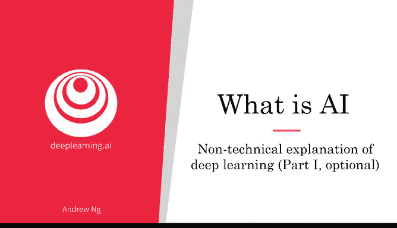
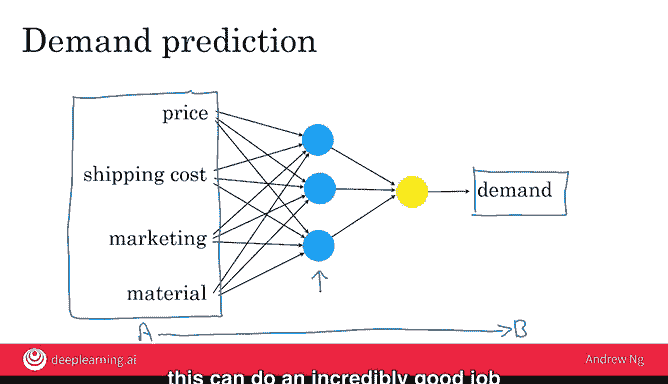

# 008：深度学习的非技术性解释（第一部分）🎯

在本节课中，我们将学习深度学习与神经网络的基本概念。我们将通过一个简单的需求预测例子，来理解神经网络如何工作，以及它如何自动从数据中学习复杂的模式。

---

在人工智能领域，“深度学习”和“神经网络”这两个术语几乎可以互换使用。尽管它们在机器学习中表现出色，但也常常伴随着一些炒作和神秘色彩。本视频旨在揭开深度学习的神秘面纱，让你真正理解深度学习和神经网络是什么。

让我们用一个需求预测的例子来说明。假设你经营一个销售T恤的网站，你想知道基于不同的定价，你预计能卖出多少件T恤。

你可能会创建类似下图的数据：T恤价格越高，需求量越低。因此，你可以用一条直线来拟合这些数据，表明随着价格上涨，需求下降。然而，需求永远不会低于0。所以，你可能会说，需求在某个价格点之后会趋近于0，超过这个点，几乎没有人会购买任何T恤。

事实证明，这条蓝线可能是你能构建的最简单的神经网络。你有一个输入：**价格A**，你希望它输出：**预估需求量B**。

在神经网络中，你会这样绘制：价格被输入到这个圆形的东西里，而这个圆形的东西输出预估的需求量。在人工智能术语中，这个圆形的东西被称为一个**神经元**，有时也称为**人工神经元**。它的全部工作就是计算我在左边绘制的这条蓝色曲线。

这可能是最简单的神经网络，只有一个输入价格并输出预估需求的人工神经元。

如果你把这个橙色的圆圈，也就是人工神经元，想象成一块乐高积木，那么神经网络就是：如果你拿很多这样的乐高积木，把它们堆叠在一起，直到你得到一个由这些神经元组成的强大网络。

---

上一节我们看了一个最简单的单神经元网络，本节中我们来看看一个更复杂的例子。

假设你不仅知道T恤的价格，还知道顾客需要支付的运费。也许你在某一周的营销投入有多有少。此外，你还可以选择用厚实、昂贵的高支棉或更便宜、更轻薄的材质来制作T恤。这些是你认为会影响T恤需求的一些因素。

让我们看看一个更复杂的神经网络可能是什么样子。

你知道你的顾客非常关心**可负担性**。假设我们有一个神经元（我用蓝色绘制），它的工作是估算T恤的可负担性。因为可负担性主要是T恤价格和运费的函数。

第二个会影响T恤需求的因素是**知名度**，即消费者对你销售这款T恤的知晓程度。影响知名度的主要因素将是你的**营销投入**。所以，让我在这里绘制第二个人工神经元，它输入你的营销预算，输出消费者对你的T恤的知晓程度。

最后，产品的**感知质量**也会影响需求。感知质量会受到营销的影响（如果营销试图说服人们这是一件高质量的T恤），有时价格也会影响感知质量。因此，我将在这里绘制第三个人工神经元，它输入价格、营销和材质，并尝试估算你的T恤的感知质量。

最终，当这三个蓝色神经元已经计算出可负担性、消费者知名度和感知质量后，你可以在这里再添加一个神经元，它以上述三个因素作为输入，并输出需求量。

这就是一个神经网络，它的工作是学习如何从这四个输入（即输入A）映射到输出B（需求量）。因此，它学习这种输入到输出，或A到B的映射关系。

这是一个相当小的神经网络，只有四个人工神经元。实际上，今天使用的神经网络要大得多，轻松拥有数千、数万甚至更多的神经元。

---

现在，关于这个描述，还有一个最后的细节需要澄清。

在描述神经网络的方式中，看起来好像你必须自己弄清楚关键因素是“可负担性”、“知名度”和“感知质量”。但使用神经网络的一个美妙之处在于：要训练一个神经网络（换句话说，就是使用神经网络构建一个机器学习系统），你只需要给它输入A和输出B，它就能自己弄清楚中间的所有事情。

所以，要构建一个神经网络，你需要做的就是给它提供大量数据。输入A，并有一个看起来像这样的神经网络（几个蓝色神经元连接到一个黄色的输出神经元），然后你还需要提供带有需求B的数据。软件的任务就是弄清楚这些蓝色神经元应该计算什么，以便它能完全自动地学习从输入A到输出B的最准确的映射函数。

事实证明，如果你提供足够的数据并训练一个足够大的神经网络，它可以在从输入A映射到输出B方面做得非常出色。

**总结来说，神经网络是一组人工神经元，每个神经元都计算一个相对简单的函数。但当你像堆叠乐高积木一样将足够多的神经元堆叠在一起时，它们就能计算极其复杂的函数，为你提供从输入A到输出B的非常准确的映射。**

---

在本视频中，你看到了一个将神经网络应用于需求预测的例子。让我们进入下一个视频，看看一个将神经网络应用于人脸识别的更复杂例子。😊