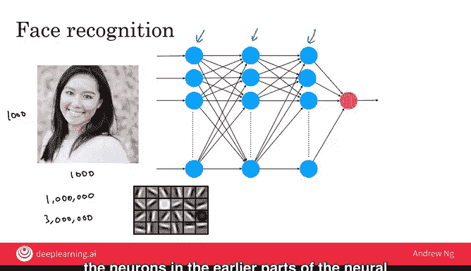

# 009：深度学习非技术性解释（第二部分）

在本节课中，我们将继续探索深度学习的工作原理，特别是神经网络如何识别图像中的内容，例如进行人脸识别。我们将通过一个具体的例子，了解计算机如何“看到”并理解图片。

在上一节中，我们了解了神经网络如何应用于需求预测。本节中，我们来看看一个更复杂的应用：人脸识别。

## 计算机如何“看”图片

假设你想构建一个系统，通过像素来识别人。软件如何看着这张图片并判断出图中人物的身份呢？

为了理解计算机如何看待图片，让我们放大一个小方块区域。当你和我看到一只人眼时，计算机看到的却是一个由像素亮度值组成的网格。这个网格告诉计算机图像中每个像素的亮度。

*   如果是一张黑白或灰度图像，每个像素对应一个数字，表示该像素的亮度。
*   如果是一张彩色图像，每个像素实际上对应三个数字，分别表示该像素中红色、绿色和蓝色的亮度。

因此，神经网络的任务就是以大量这样的数字作为输入，并输出图片中人物的姓名。

## 神经网络的输入与输出

在上一节的例子中，神经网络以四个数字（价格、运费、营销额、布料材质）作为输入，并输出需求预测。在这个人脸识别的例子中，神经网络需要输入多得多的数字，它们对应着这张图片所有像素的亮度值。

如果这张图片的分辨率是1000像素 x 1000像素，那么就有100万个像素。

*   对于黑白或灰度图像，神经网络需要输入100万个数字，对应图像中所有100万个像素的亮度。
*   对于彩色图像，则需要输入300万个数字，对应这100万个像素中每个像素的红、绿、蓝三个通道的值。

与之前类似，网络中会有许多人工神经元计算各种数值。你无需操心这些神经元具体应该计算什么，神经网络会自行学习。

## 神经网络的学习过程

通常，当你给神经网络输入一张图像时，网络前部的神经元会学习检测图片中的边缘。

稍后一些的神经元会学习检测物体的组成部分，例如眼睛、鼻子、脸颊的形状和嘴巴的形状。

再往后，更靠右的神经元会学习检测不同形状的人脸。

最终，网络会将所有这些信息整合起来，输出图像中人物的身份。神经网络的神奇之处在于，你无需担心中间层在做什么。你只需要提供大量带有正确身份标签的图片数据（A作为输入，B作为正确输出），学习算法就会自行找出中间每个神经元应该计算的内容。

## 总结

恭喜你完成本周的所有视频学习。现在你已经了解了机器学习和数据科学的基本工作原理。在接下来的课程中，你将学习如何构建自己的机器学习或数据科学项目。期待下周与你再见。