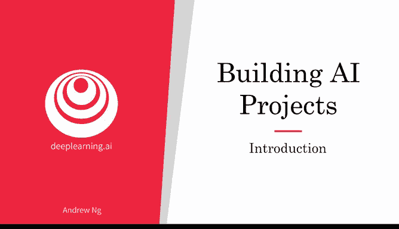
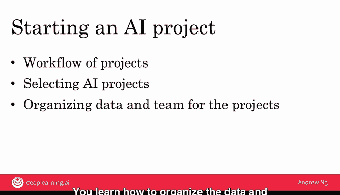

# 010：课程介绍 🎯

在本节课中，我们将要学习如何将人工智能技术应用于实际项目。无论你是在自家车库进行个人项目，还是在大型公司内推动与企业战略相符的举措，理解AI项目的执行流程都至关重要。

上一周我们介绍了人工智能和机器学习技术的基础知识。本节中，我们来看看如何将这些技术付诸实践。

## 本周学习目标 📋

以下是本周课程将涵盖的三个核心部分：

1.  **AI项目的工作流程**：与筹办生日派对有一系列可预测的步骤（如确定宾客名单、寻找场地、订购蛋糕）类似，AI项目也有一套可遵循的流程。你将学习这个标准的工作流，并感受参与AI项目是怎样的体验。
2.  **如何选择AI项目**：面对众多可能性，如何筛选出有潜力的方向？本周你将学习一个用于头脑风暴和筛选潜在优质项目的框架。这个框架适用于个人、小团队或大型公司的项目发起。
3.  **如何组织数据与团队**：项目的成功执行离不开良好的组织。你将学习如何为AI项目组织和准备数据，以及如何组建团队（团队规模可以小到仅你一人，也可以是大公司的专业团队）。

到本周末，你将了解构建一个AI项目的整体感受与方法，并可能开始与朋友一起探索一些有前景的创意进行尝试。

让我们继续观看下一个视频，深入探索这些内容。

---

本节课中我们一起学习了第2周的核心目标：理解AI项目从构思到执行的全过程，包括其标准工作流、项目筛选框架以及数据与团队的组织方法。掌握这些是开启任何AI实践的第一步。