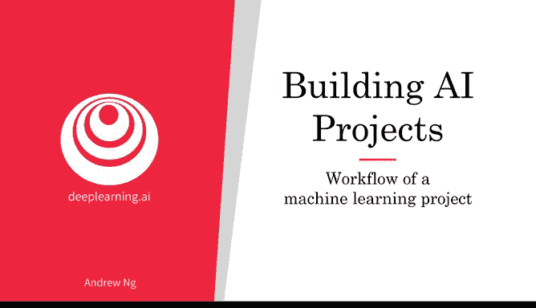
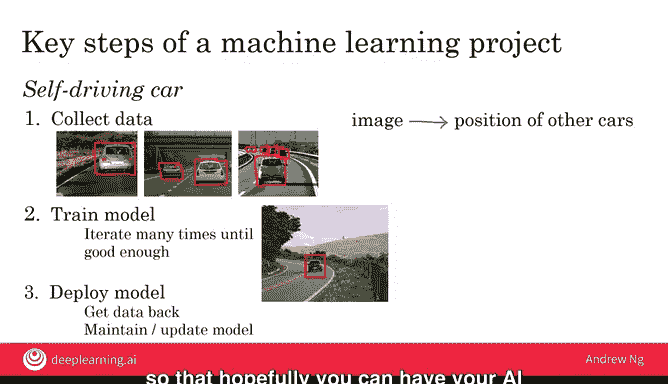

# 011：10_机器学习项目工作流程

在本节课中，我们将要学习构建一个机器学习项目的标准工作流程。我们将通过两个具体的例子——语音识别和自动驾驶汽车——来详细说明每个步骤，确保初学者能够清晰地理解整个过程。

机器学习算法能够学习从输入到输出，或者说从A到B的映射关系。那么，如何构建一个机器学习项目呢？本节视频将介绍机器学习项目的工作流程。

## 概述：三步核心流程 🎯

一个典型的机器学习项目主要包含三个核心步骤：**收集数据**、**训练模型**和**部署模型**。在整个过程中，团队通常需要进行多次迭代，以优化模型性能。接下来，我们将通过一个运行示例来详细讲解这些步骤。

## 运行示例：语音识别系统 🗣️

为了便于理解，我们将以构建一个类似亚马逊Echo的语音唤醒词（例如“Alexa”）识别系统作为贯穿始终的例子。

### 第一步：收集数据

构建任何机器学习系统的第一步都是收集数据。对于语音识别系统，这意味着你需要录制大量的音频片段。

以下是数据收集的具体内容：
*   录制许多人说“Alexa”这个词的音频。
*   同时，也需要录制人们说其他各种词语（例如“hello”）的音频作为对比数据。

### 第二步：训练模型

在收集到足够的数据后，下一步是训练模型。这一步的目标是使用机器学习算法，学习从输入音频到输出文本的映射关系。

这个过程可以表示为公式：`f(A) = B`，其中：
*   **A** 是输入的音频片段。
*   **B** 是模型预测出的文本（例如“Alexa”或“hello”）。

当AI团队开始训练模型时，第一次尝试的结果通常不会很理想。因此，团队需要**迭代多次**，不断调整算法和参数，直到模型的性能达到令人满意的水平。

### 第三步：部署与维护模型

当模型训练得足够好之后，第三步就是将其部署到实际产品中，例如集成到智能音箱里，并分发给测试用户或广大用户。

然而，部署后往往会遇到新问题。例如，如果你的模型主要基于美式口音训练，当产品在英国使用时，可能会难以准确识别英式口音的用户指令。

这时，就需要进入**维护和更新**阶段。你可以收集这些新情况下的数据（如英式口音的“Alexa”），并用这些新数据来更新模型，使其性能不断提升。

### 总结：语音识别项目流程

上一节我们介绍了机器学习项目的三个核心步骤。在语音识别的例子中，我们具体应用了它们。现在，让我们用一个不同的项目来巩固理解。

## 另一个案例：自动驾驶汽车 🚗

现在，让我们看看这三个步骤如何应用于构建自动驾驶汽车的一个关键组件：车辆检测系统。这个系统的目标是识别前方图像中其他车辆的位置。

### 第一步：收集数据（应用于自动驾驶）

构建车辆检测系统的第一步同样是收集数据。这里需要的数据是成对的“输入-输出”。

以下是需要收集的数据类型：
*   **输入A**：汽车前方拍摄的大量图片。
*   **输出B**：每张图片中，其他车辆的精确位置（通常用矩形框标注）。

在实践中，工程师会使用专门的软件工具来精确地绘制这些标注框。

### 第二步：训练模型（应用于自动驾驶）

有了标注好的数据，就可以开始训练模型了。模型的任务是学习从图片（A）到车辆位置框（B）的映射。

和之前一样，初始训练的模型效果通常不佳。例如，模型可能无法准确定位车辆。只有通过**多次迭代**优化，模型才能逐渐学会准确地检测出车辆。

### 第三步：部署与维护（应用于自动驾驶）

最后一步是将训练好的模型部署到自动驾驶汽车中进行测试。安全必须是首要考虑因素，因此测试必须在可控的安全环境下进行。

部署后，系统可能会遇到训练数据中未出现过的新情况，例如某种特定型号的高尔夫球车。这时，就可以收集这些新场景的数据，并用它们来**维护和更新模型**，使车辆检测能力变得越来越强。

## 课程总结 📝

本节课中，我们一起学习了构建机器学习项目的关键工作流程。我们通过语音识别和自动驾驶两个案例，详细阐述了每个步骤：

1.  **收集数据**：获取带有标注的输入-输出对。
2.  **训练模型**：使用算法学习 `A -> B` 的映射关系，此过程需要多次迭代。
3.  **部署与维护模型**：将模型投入实际使用，并根据反馈的新数据持续优化模型。

这个“收集-训练-部署”的循环是大多数机器学习项目的核心。下一节视频，我们将探讨数据科学项目的工作流程有何异同。