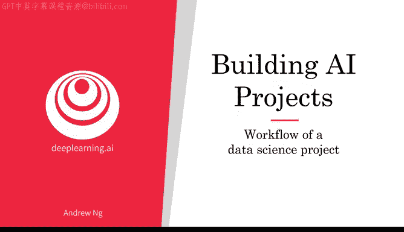
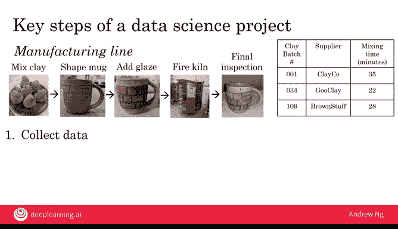

# 012：数据科学项目工作流程

在本节课中，我们将学习数据科学项目的工作流程。与机器学习项目不同，数据科学项目的输出通常是一系列可执行的见解。这些见解可能会促使你改变现有的做法。因此，数据科学项目拥有与机器学习项目不同的工作流程。让我们来看看数据科学项目的具体步骤。

## 数据科学项目示例：优化销售漏斗

作为贯穿始终的示例，假设你想优化一个销售漏斗。比如，你运营一个销售咖啡杯的电子商务网站。用户从你这里购买咖啡杯通常需要遵循一系列步骤：首先访问你的网站，浏览不同的咖啡杯；然后进入产品页面；接着将商品加入购物车，进入购物车页面；最后完成结账。如果你想优化这个销售漏斗，确保尽可能多的人完成所有这些步骤，你该如何利用数据科学来解决这个问题呢？

让我们看看数据科学项目的关键步骤。

### 第一步：收集数据

在我们看到的这类网站上，你可能拥有一个数据库，记录着不同用户访问不同网页的时间。在这个简单的例子中，我假设你可以通过查看用户计算机的地址（称为IP地址）并判断其来源国家，来识别用户来自哪里。但在实践中，你通常可以获得比用户国籍更多的数据。

### 第二步：分析数据

你的数据科学团队可能对影响销售漏斗性能的因素有很多想法。例如，他们可能认为海外客户被国际运费吓退，导致很多人进入结账页面但最终没有完成购买。如果这是真的，你可能会考虑是否将部分运费成本计入产品实际价格中。或者，你的数据科学团队可能注意到每当节假日时数据会出现波动。也许节假日期间购物的人更多，因为要买礼物；也可能更少，因为人们待在家里，而不是有时从工作电脑上购物。在某些国家，一天中的特定时段也可能出现波动。例如，在实行午休（siesta）的国家，下午休息时段在线购物者可能减少，从而导致销售额下降。他们可能会建议你在午休时段减少广告支出，因为那时上网购物的人更少。

一个好的数据科学团队会有很多想法，因此他们会尝试很多想法，或者说进行多次迭代，以获得有价值的见解。

### 第三步：提出假设与行动建议

最终，数据科学团队会将这些见解提炼成数量较少的假设，说明可能存在的问题，以及数量较少的行动建议，例如将运费成本纳入产品成本，而不是在结账时将其作为单独项目列出。

当你采纳其中一些建议并将这些更改部署到你的网站后，随着用户因你的广告策略或结账流程改变而产生不同的行为，你开始获得新的数据。然后，你的数据科学团队可以继续收集数据，并定期重新分析新数据，看看是否能随着时间的推移提出更好的假设或行动方案。

因此，数据科学项目的关键步骤是：**收集数据 -> 分析数据 -> 提出假设和行动建议**，然后持续获取新数据并定期重新分析。

## 应用框架：优化生产线

现在，让我们将这个框架应用到一个新问题上：优化生产线。我们将在下一页幻灯片上同样使用这三个步骤。

假设你运营一家工厂，每月生产数千个咖啡杯用于销售，你想优化这条生产线。以下是制造咖啡杯的关键步骤：
1.  混合黏土：确保加入适量的水。
2.  塑形：将黏土塑造成杯子形状。
3.  上釉：添加着色和保护层。
4.  烧制：将杯子加热，我们称之为窑炉烧制。
5.  检查：检查杯子是否有裂缝，确保质量合格后再发货给客户。

制造业中的一个常见问题是优化生产线的良品率，确保尽可能少地生产出有缺陷的咖啡杯，因为这些杯子必须被丢弃，导致时间和材料浪费。

### 第一步：收集数据

数据科学项目的第一步是什么？我希望你还记得上一张幻灯片的内容，第一步是**收集数据**。例如，你可以保存关于不同批次混合黏土的数据，比如黏土供应商是谁、混合了多长时间，或者黏土中的湿度是多少、加了多少水。你也可以收集关于所制造的不同批次杯子的数据，比如该批次的湿度是多少、窑炉温度是多少、在窑炉中烧制了多长时间。

### 第二步：分析数据

在获得所有这些数据后，你会要求数据科学团队分析数据。和之前一样，他们会进行多次迭代以获得有价值的见解。例如，他们可能发现，每当湿度过低且窑炉温度过高时，杯子就容易开裂。或者他们可能发现，由于下午气温较高，你需要根据一天中的时间调整湿度和温度。

### 第三步：提出假设与行动建议

基于数据科学团队的见解，你会获得关于如何改变生产线操作以提高生产力的假设和行动建议。当你部署这些更改后，你将获得新的数据，可以定期重新分析，从而持续优化生产线的性能。

## 总结

本节课中，我们一起学习了数据科学项目的关键步骤：**收集数据、分析数据、提出假设和行动建议**。在本视频和上一个视频中，你看到了一些机器学习和数据科学项目的例子。事实证明，机器学习和数据科学正在影响几乎每一个工作岗位。在下一个视频中，我想向你展示这些理念如何影响许多岗位职能，其中可能包括你的岗位，当然也包括你许多同事的岗位。让我们继续观看下一个视频。