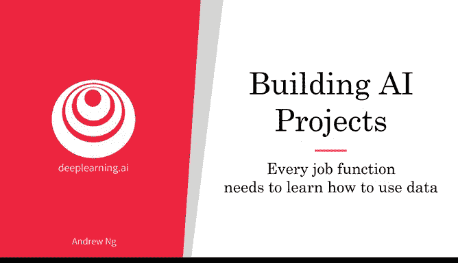
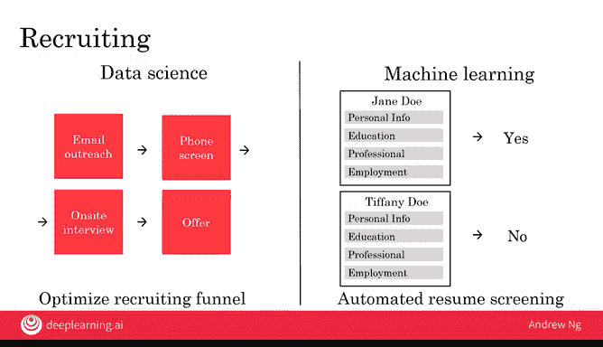
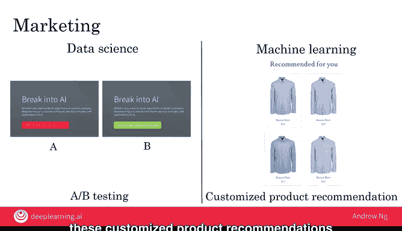
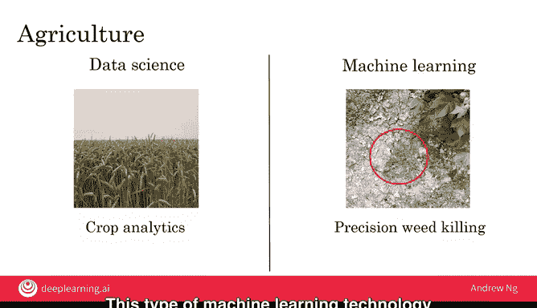

# 013：每个职能部门都需要学习数据应用




在本节课中，我们将探讨数据如何改变各个职能部门的工作方式。无论你从事招聘、销售、市场营销、制造还是农业，数据都在重塑你的工作。过去几十年，社会数字化进程加速，纸质调查问卷被数字形式取代，医生的手写记录也越来越多地转为电子档案。这种数据的普及意味着，数据科学或机器学习等工具很可能为你的工作带来帮助。接下来，我们将逐一审视不同职能部门，讨论数据科学和机器学习如何影响这些工作。

## 销售部门的数据应用

上一节我们介绍了数据科学如何优化销售漏斗。本节中我们来看看机器学习在销售中的具体应用。

销售人员通常有一份潜在客户名单，需要联系他们以促成交易。机器学习可以帮助你**对这些潜在客户进行优先级排序**。例如，系统可能建议你优先联系大公司的首席执行官，而不是小公司的实习生。这种自动化的线索排序能显著提升销售人员的工作效率。

以下是机器学习在销售中的一个应用示例：
*   **自动线索排序**：算法根据潜在客户的规模、职位、互动历史等数据，预测其成交可能性，并自动排序，让销售人员优先跟进高价值线索。

## 制造部门的数据应用

我们已经了解数据科学如何帮助优化生产线。现在，让我们看看机器学习能做什么。

许多制造流程的最后一步是**最终检验**。目前，成百上千的工人依靠肉眼检查产品（如咖啡杯）是否有划痕或凹痕。机器学习可以改变这一现状。

通过输入像这样的数据集，机器学习模型可以学会自动判断一个咖啡杯是否合格：
```python
# 伪代码示例：使用图像识别模型进行缺陷检测
if model.predict(coffee_mug_image) == "defective":
    send_to_rework()
else:
    send_to_packaging()
```
通过自动发现划痕或凹痕，这项技术既能降低劳动力成本，也能提高工厂的产品质量。我认为，这种自动化的视觉检测技术将对制造业产生重大影响。

## 人力资源（招聘）部门的数据应用

招聘流程通常有一套可预测的步骤：发送邮件、电话沟通、现场面试、发放录用通知等。与优化销售漏斗类似，数据科学也可以用来**优化招聘漏斗**。

事实上，许多招聘机构已经在这样做了。例如，如果数据分析发现很少有人能从电话筛选阶段进入现场面试阶段，那么你可能需要反思：是进入电话筛选阶段的人太多，还是筛选标准过于严格，应该让更多人进入现场面试。

以下是数据科学和机器学习在招聘中的应用：
*   **优化招聘漏斗**：通过分析各环节转化率数据，定位瓶颈，优化招聘流程。
*   **自动简历筛选**：机器学习开始应用于自动筛选大量简历，以决定联系哪些候选人。但这引发了重要的伦理问题，例如必须确保AI软件不会产生不良偏见，并公平对待所有人。在本课程的最后一章，你将了解更多关于AI公平与伦理的问题。

## 市场营销部门的数据应用

在市场营销中，优化网站表现的常见方法是**A/B测试**。例如，同时上线两个版本的网站：A版本使用红色按钮，B版本使用绿色按钮，然后测量哪个版本能带来更多的用户点击。


基于这类数据，数据科学团队可以帮助你获得洞察，并提出优化网站的假设或行动建议。



那么机器学习在营销中如何应用呢？如今，许多网站会提供**个性化的产品推荐**，向你展示你最可能想购买的商品，这实际上显著提升了网站的销售额。

例如，一个服装网站在分析我的购物行为后，可能会只向我推荐蓝色衬衫，因为这是我唯一会买的类型。当然，其他顾客可能会收到更多样、更有趣的推荐。目前，这种个性化的产品推荐驱动了许多大型电商网站很大比例的销售额。

## 农业部门的数据应用

最后，让我们看一个完全不同领域的例子。假设你从事农业，可能是一个大型工业化农场的农场主。




数据科学如何提供帮助？如今，农民已经在使用数据科学进行**作物分析**。通过收集土壤条件、天气状况、市场上不同作物的价格等数据，数据科学团队可以提出建议，指导种什么、何时种，从而在保持农场土壤状况的同时提高产量。这类数据科学正在并将继续在农业中扮演越来越重要的角色。

再来看看机器学习的例子。我认为农业最令人兴奋的变化之一是**精准农业**。

下图是我在农场用手机拍摄的，右上角是一株棉花，中间显示的是杂草。



借助机器学习，我们开始看到一些产品能进入农场，拍摄这样的图片，然后以非常精确的方式只对杂草喷洒除草剂。这样既能清除杂草，又无需过量使用除草剂。这类机器学习技术既帮助农民提高了作物产量，也有助于保护环境。

## 总结


本节课中我们一起学习了数据、数据科学和机器学习如何影响从销售、招聘、市场营销到制造、农业等众多职能部门的工作。数据驱动的洞察和自动化工具正在提升效率、优化决策并创造新的可能性。

看起来AI有很多事情可以做，但如何实际选择一个有前景的项目来开展呢？我们将在下一个视频中讨论这个问题。