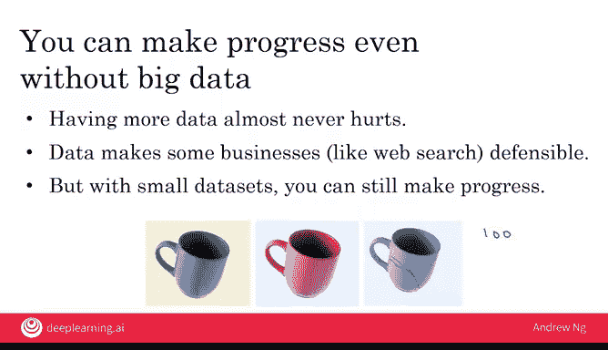

# 014：如何选择人工智能项目 第1部分 🎯

在本节课中，我们将学习如何为你的业务构思和筛选有价值的人工智能项目。我们将介绍一个实用的头脑风暴框架，帮助你找到既在技术上可行，又能为业务创造价值的项目。

如果你想要尝试一个人工智能项目，如何选择一个值得投入的项目呢？不要指望一个想法会在一夜之间出现。有时确实如此，但有时也需要几天甚至几周才能想出一个值得追求的想法。在本视频中，你将看到一个用于构思潜在人工智能项目的框架。

假设你想为你的业务构建一个人工智能项目。你已经知道人工智能并非无所不能。因此，存在一个特定集合的事情是人工智能能够完成的，让我们用一个圆圈来表示这个集合。同时，也存在一个特定集合的事情对你的业务是有价值的。让我们用第二个圆圈来表示这个集合。

你的目标是尝试选择位于这两个集合交集处的项目，即选择那些既可行（可以用人工智能完成）又对你的业务有价值的项目。人工智能专家通常能很好地判断左边集合（AI能做什么）的边界，而你的业务领域专家（如销售、市场营销或农业等）则能更好地判断什么对你的业务真正有价值。

因此，在构思人工智能能做且对业务有价值的项目时，我通常会组建一个团队，包括既懂人工智能又懂业务领域的专家，让他们一起头脑风暴，共同找出位于这两个集合交集处的项目。我们有时也称之为跨职能团队，即一个同时包含人工智能专家和领域专家（业务专家）的团队。

在构思项目时，有一个我与许多公司合作时发现非常有用的框架。以下是你可以让团队用来构思项目的三个原则或思路。

首先，尽管有很多新闻报道关于人工智能自动化取代工作，这是一个需要解决的重要社会问题，但在思考具体的人工智能项目时，我发现思考自动化任务比思考自动化工作更有用。

以呼叫中心运营为例。呼叫中心里有很多任务，包括接听电话、回复邮件、执行特定操作（如应客户要求处理退款）等。员工在呼叫中心执行的所有这些任务中，可能有一个任务（如呼叫路由或邮件路由）特别适合用机器学习实现自动化。通过审视这群员工执行的所有任务，并选择其中一个，可以帮助你在近期选择出最具成效的自动化项目。

让我们看另一个例子，放射科医生的工作。有很多报道称人工智能可能自动化放射科医生的工作。但放射科医生实际上做很多事情：他们阅读X光片（这很重要），但他们也参与继续教育、与其他医生会诊、指导年轻医生，有些人还直接与患者沟通。因此，通过审视放射科医生所做的所有这些任务，你可能会识别出其中一项（例如，用AI辅助或自动化阅读X光片），从而选择出最具成效的项目来推进。

所以，我们建议的方法是：审视你的业务，思考人们执行的任务，看看是否能识别出其中一项或几项，可能可以通过机器学习实现自动化。

当我与大型公司的CEO会面，为公司构思人工智能项目时，我经常问的另一个问题是：业务价值的主要驱动因素是什么？有时，寻找人工智能或数据科学解决方案来增强这些驱动因素会非常有价值。

最后，第三个有时能引出有价值项目想法的问题是：你业务中的主要痛点是什么？其中一些可能无法用AI解决，但通过理解业务中的主要痛点，可以为构思人工智能项目提供一个有用的起点。

关于构思人工智能项目，我还有最后一条建议：即使没有大数据，即使没有海量数据，你仍然可以取得进展。请不要误解，拥有更多数据几乎总是有益的（除了可能需要支付更多存储或网络带宽费用来传输和处理数据）。我本人也喜欢拥有大量数据。数据确实使一些业务（如网络搜索）具有防御性。网络搜索是一个长尾业务，意味着存在大量非常罕见的搜索查询。因此，了解人们在搜索所有这些罕见查询时点击了什么，确实有助于领先的搜索引擎提供更好的搜索体验。

所以，大数据很棒，当你能够获取时。但我认为大数据有时也被过度炒作。即使只有少量数据，你通常仍然可以取得进展。

这里有一个例子。假设你正在为咖啡杯构建一个自动视觉检测系统，你想自动检测出右边的咖啡杯是有缺陷的。如果你有一百万张好咖啡杯和坏咖啡杯的图片，那当然很好，可以为你的AI系统提供这么多示例。但我希望你没有生产出一百万个有缺陷的咖啡杯，因为那意味着要扔掉的东西非常昂贵。

所以，有时仅用100张图片，或者10张，有时甚至可能少至10张，你就可以启动一个机器学习项目。你需要的数据量非常依赖于具体问题，与人工智能工程师或专家交流可以帮助你获得更好的判断。

有些问题可能需要一万张图片都不够，确实需要大数据才能获得良好性能。但我的建议是，不要仅仅因为一开始没有大量数据就放弃。即使只有一个小数据集，你通常仍然可以取得进展。

在本视频中，你看到了一个头脑风暴框架，并设定了尝试构思项目的标准，这些项目有望既可以用人工智能实现，又对你的业务有价值。

现在，在构思出项目列表之后，如何从中选择一个或少数几个来真正投入并开展工作呢？让我们在下一个视频中讨论这个问题。

**本节课总结**：我们一起学习了如何为业务构思人工智能项目。核心方法是寻找**AI可行性**与**业务价值**的交集，并组建跨职能团队进行头脑风暴。我们介绍了三个实用的构思切入点：**自动化具体任务**、**增强业务价值驱动因素**以及**解决业务痛点**。最后，我们了解到项目启动**不一定需要大数据**，从小数据开始往往也能取得进展。