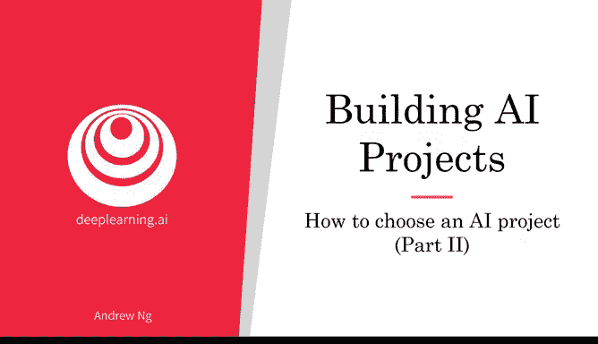
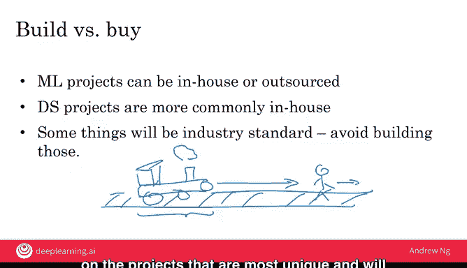

# 015：项目尽职调查与构建决策 🧐

在本节课中，我们将学习如何对一个潜在的人工智能项目进行深入的可行性评估，并探讨是自行构建还是购买解决方案的决策框架。

也许你有很多关于人工智能项目的想法，但在决定投入一个项目之前，如何确保这是一个真正有价值的项目？对于可能只需几天的快速项目，或许可以直接尝试。但有些人工智能项目可能需要数月才能完成。在本视频中，我将带你了解我用来复核一个项目是否值得投入数月精力的过程。

在投入一个大型人工智能项目之前，我通常会对其进行尽职调查。尽职调查在法律领域有特定含义，但非正式地说，它意味着你需要花时间确保你所期望的事情是真实的。

你已经了解到，最好的人工智能项目是那些既**可行**又**有价值**的项目。我们真正希望选择的是这两个集合交集处的项目。

因此，为了确保项目可行，我通常会进行**技术尽职调查**。为了确保项目有价值，我通常会进行**商业尽职调查**。让我详细介绍一下这两个步骤。

## 技术尽职调查 🔧

技术尽职调查是确保你希望构建的人工智能系统确实可行、确实可以完成的过程。

以下是技术尽职调查需要回答的几个关键问题：

*   **性能可行性**：与人工智能专家讨论，了解人工智能系统是否真的能达到期望的性能水平。例如，如果你希望构建一个准确率达到 **95%** 的语音系统，咨询人工智能专家或阅读行业文献可以帮助你判断这是否可行。
*   **数据需求**：达到设计性能水平需要多少数据？你是否有办法获取这些数据？
*   **工程时间线**：尝试估算构建你想要的系统需要多长时间，以及需要多少人手。

## 商业尽职调查 📈

除了技术尽职调查，我通常还会进行商业尽职调查，以确保你设想的项目确实对业务有价值。

许多人工智能项目通过降低成本（例如自动化某些任务或提高系统效率）或增加收入（例如推动更多人在购物车中结账）来创造价值。你也可能正在构建一个AI系统来帮助你推出新产品或新业务线。

商业尽职调查是仔细思考的过程：对于你正在构建的人工智能系统（例如准确率为 **95%** 的语音识别系统或准确率为 **99.9%** 的视觉检测系统），它是否能帮助你实现商业目标？无论你的商业目标是改善现有业务，还是在公司内创造全新的业务。

在进行商业尽职调查时，我通常会建立电子表格财务模型来定量估算价值，例如估算实际能节省多少美元，或对收入增长的合理假设进行建模，从而在投入数月精力之前，分析项目的经济效益。

## 道德尽职调查 ⚖️

尽管幻灯片上没有明确列出，但我希望你也考虑进行第三种尽职调查：**道德尽职调查**。我认为人工智能可以做很多事情，甚至能赚很多钱，但未必能让社会变得更好。因此，除了技术和商业尽职调查，我希望你也进行道德尽职调查，确保你所做的事情实际上是在让人类和社会变得更好。我们将在本课程的最后一周更详细地讨论这一点。

## 构建还是购买？🤔

在规划人工智能项目时，你还必须决定：是自行构建还是购买解决方案？这是IT世界中的一个经典问题，我们在人工智能领域也面临同样的问题。

例如，如今几乎没有公司会自己制造电脑，他们购买别人的电脑；也几乎没有公司会自己制造Wi-Fi路由器，只是购买商用路由器。

那么，机器学习和数据科学项目呢？机器学习项目可以在内部完成，也可以外包。我见过这两种模式都成功应用。有时，如果你外包一个机器学习项目，可以更快地获得人才并更快地启动项目。当然，最终建立自己的内部人工智能团队并在内部完成这些项目也很好。下周我们详细讨论人工智能转型手册时，你会听到更多关于这方面的内容。

与机器学习项目不同，数据科学项目更常见的是在内部完成。外包并非不可能，但根据我的观察，数据科学项目通常与你的业务紧密相连，需要非常深入的日常业务知识才能完成最好的数据科学项目。因此，从比例上看，我看到的内部数据科学项目多于机器学习项目。

最后，在每个行业中，有些东西会成为行业标准，你应该避免构建这些。对于“构建还是购买”这个问题，一个常见的答案是：构建那些对你来说非常专业化、完全定制化，或者能让你建立独特防御优势的东西。但对于那些将成为行业标准的东西，可能其他公司会构建，对你来说，直接购买比内部构建更高效。

我的一个团队有一个非常诗意的说法：“不要在火车前面冲刺”。这意味着，如果这是一列在铁轨上运行的火车，你不想成为那个试图在火车前面越跑越快的人或工程师。火车就是行业标准的解决方案。因此，如果有一家公司（可能是初创公司、大公司或开源项目）正在构建一个行业标准的解决方案，那么你可能要避免试图越跑越快以保持领先，因为尽管短期内你可能跑得更快，但最终火车会追上并碾压试图在火车前面冲刺的人。所以，当存在一个正在构建的行业标准解决方案的巨大力量时，你最好拥抱行业标准或拥抱别人的平台，而不是试图在内部完成所有事情。

我们都生活在一个资源有限的世界里：时间有限、数据有限、工程资源有限。因此，我希望你能将这些资源集中到那些对你公司最独特、能产生最大影响的项目上。

## 总结 📝

本节课中，我们一起学习了如何通过技术尽职调查和商业尽职调查来评估人工智能项目的可行性与价值。我们了解到，技术尽职调查关注性能、数据和工程可行性，而商业尽职调查则通过财务模型量化项目价值。此外，我们还引入了道德尽职调查的重要性，以确保项目对社会有益。最后，我们探讨了“构建还是购买”的决策框架，强调应将有限资源投入到能为公司创造独特优势的项目上，而非与行业标准解决方案竞争。

通过技术尽职调查和商业尽职调查的过程，我希望你能开始识别出对你的业务有潜在价值或前景的项目。如果项目是一个重大的承诺，可能需要数月才能完成，那么在投入项目之前花几周时间进行此类尽职调查对我来说并不罕见。

现在，假设你已经找到了一些有前景的项目，你如何与人工智能团队合作，如何与人工智能团队协作来完成这些项目？让我们在下一个视频中讨论这个问题。